<h1>Table of Contents<span class="tocSkip"></span></h1>
<div class="toc"><ul class="toc-item"><li><span><a href="#Module-4-Project" data-toc-modified-id="Module-4-Project-1"><span class="toc-item-num">1&nbsp;&nbsp;</span>Module 4 Project</a></span><ul class="toc-item"><li><ul class="toc-item"><li><span><a href="#Introduction" data-toc-modified-id="Introduction-1.0.1"><span class="toc-item-num">1.0.1&nbsp;&nbsp;</span>Introduction</a></span></li></ul></li></ul></li><li><span><a href="#Methodology" data-toc-modified-id="Methodology-2"><span class="toc-item-num">2&nbsp;&nbsp;</span>Methodology</a></span></li><li><span><a href="#Obtain" data-toc-modified-id="Obtain-3"><span class="toc-item-num">3&nbsp;&nbsp;</span>Obtain</a></span></li><li><span><a href="#Exploring-and-Scrubbing" data-toc-modified-id="Exploring-and-Scrubbing-4"><span class="toc-item-num">4&nbsp;&nbsp;</span>Exploring and Scrubbing</a></span><ul class="toc-item"><li><span><a href="#RECOMMENDATION:" data-toc-modified-id="RECOMMENDATION:-4.1"><span class="toc-item-num">4.1&nbsp;&nbsp;</span>RECOMMENDATION:</a></span><ul class="toc-item"><li><span><a href="#Creating-Baseline-Model" data-toc-modified-id="Creating-Baseline-Model-4.1.1"><span class="toc-item-num">4.1.1&nbsp;&nbsp;</span>Creating Baseline Model</a></span></li></ul></li></ul></li><li><span><a href="#Modeling-&amp;-Exploring" data-toc-modified-id="Modeling-&amp;-Exploring-5"><span class="toc-item-num">5&nbsp;&nbsp;</span>Modeling &amp; Exploring</a></span><ul class="toc-item"><li><ul class="toc-item"><li><span><a href="#Augmenting-our-training-data" data-toc-modified-id="Augmenting-our-training-data-5.0.1"><span class="toc-item-num">5.0.1&nbsp;&nbsp;</span>Augmenting our training data</a></span></li></ul></li><li><span><a href="#RECOMMENDATION:" data-toc-modified-id="RECOMMENDATION:-5.1"><span class="toc-item-num">5.1&nbsp;&nbsp;</span>RECOMMENDATION:</a></span><ul class="toc-item"><li><span><a href="#Computing-the-Weights-for-our-Classes" data-toc-modified-id="Computing-the-Weights-for-our-Classes-5.1.1"><span class="toc-item-num">5.1.1&nbsp;&nbsp;</span>Computing the Weights for our Classes</a></span></li></ul></li><li><span><a href="#RECOMMENDATION:" data-toc-modified-id="RECOMMENDATION:-5.2"><span class="toc-item-num">5.2&nbsp;&nbsp;</span>RECOMMENDATION:</a></span><ul class="toc-item"><li><span><a href="#Increasing-the-complexity-of-our-model" data-toc-modified-id="Increasing-the-complexity-of-our-model-5.2.1"><span class="toc-item-num">5.2.1&nbsp;&nbsp;</span>Increasing the complexity of our model</a></span></li></ul></li><li><span><a href="#Making-and-Adding-Callbacks" data-toc-modified-id="Making-and-Adding-Callbacks-5.3"><span class="toc-item-num">5.3&nbsp;&nbsp;</span>Making and Adding Callbacks</a></span></li><li><span><a href="#RECOMMENDATION:" data-toc-modified-id="RECOMMENDATION:-5.4"><span class="toc-item-num">5.4&nbsp;&nbsp;</span>RECOMMENDATION:</a></span><ul class="toc-item"><li><span><a href="#Loading-in-Best-Models-(256x256)" data-toc-modified-id="Loading-in-Best-Models-(256x256)-5.4.1"><span class="toc-item-num">5.4.1&nbsp;&nbsp;</span>Loading in Best Models (256x256)</a></span></li></ul></li><li><span><a href="#Training-Models-on-a-Smaller-image-size" data-toc-modified-id="Training-Models-on-a-Smaller-image-size-5.5"><span class="toc-item-num">5.5&nbsp;&nbsp;</span>Training Models on a Smaller image size</a></span><ul class="toc-item"><li><span><a href="#Loading-in-Best-Models-(64x64)" data-toc-modified-id="Loading-in-Best-Models-(64x64)-5.5.1"><span class="toc-item-num">5.5.1&nbsp;&nbsp;</span>Loading in Best Models (64x64)</a></span></li></ul></li><li><span><a href="#RECOMMENDATION:" data-toc-modified-id="RECOMMENDATION:-5.6"><span class="toc-item-num">5.6&nbsp;&nbsp;</span>RECOMMENDATION:</a></span><ul class="toc-item"><li><span><a href="#Using-ReduceLROnPlateau" data-toc-modified-id="Using-ReduceLROnPlateau-5.6.1"><span class="toc-item-num">5.6.1&nbsp;&nbsp;</span>Using ReduceLROnPlateau</a></span></li></ul></li><li><span><a href="#Applying-Transfer-Learning-Models" data-toc-modified-id="Applying-Transfer-Learning-Models-5.7"><span class="toc-item-num">5.7&nbsp;&nbsp;</span>Applying Transfer Learning Models</a></span></li></ul></li><li><span><a href="#Interpretation" data-toc-modified-id="Interpretation-6"><span class="toc-item-num">6&nbsp;&nbsp;</span>Interpretation</a></span><ul class="toc-item"><li><span><a href="#Conclusion" data-toc-modified-id="Conclusion-6.1"><span class="toc-item-num">6.1&nbsp;&nbsp;</span>Conclusion</a></span></li><li><span><a href="#Further-Research" data-toc-modified-id="Further-Research-6.2"><span class="toc-item-num">6.2&nbsp;&nbsp;</span>Further Research</a></span></li></ul></li><li><span><a href="#Citations" data-toc-modified-id="Citations-7"><span class="toc-item-num">7&nbsp;&nbsp;</span>Citations</a></span></li></ul></div>

# Module 4 Project

### Introduction 
 Our data was gathered from retrospective cohorts of pediatric patients of one to five years old from Guangzhou Women and Children’s Medical Center, Guangzhou. All chest X-ray imaging was performed as part of patients’ routine clinical care.

For the analysis of chest x-ray images, all chest radiographs were initially screened for quality control by removing all low quality or unreadable scans. The diagnoses for the images were then graded by two expert physicians before being cleared for training the AI system. In order to account for any grading errors, the evaluation set was also checked by a third expert.

While chest x-rays are the primary source of diagnosis for this disease, it can still be difficult even for an experienced and well trained radiologist to correctly detect pneumonia with their eyes alone. The goal of this project is to be able to produce a model that can identify whether or not a pedriatric patient has pneumonia based off of their chest x-ray image with an accuracy greater than 90%.

According to Dadonaite from Our World in Data, over 800,000 children died from pneumonia in 2017 - which was dubbed as the leading cause of death for children under 5 years old. Countries that accounted for more than half the deaths included: India, Nigeria, Pakistan, Ethiopia, and the Democratic Republic of Congo. These countries currently lack any real access to diagnostic imaging via x-rays. However, if they were able to gain access to that technology, our model could immediately help with diagnosing patients and potentially preventing hundreds of thousands of easily preventable deaths. 

# Methodology

In this project we are going to be using the **OSEMN** Process:

**Obtain**: Our dataset came from Kaggle. Since we used Google Colab for this project, we had to "jump through more hoops" to load our dataset instead of simply opening and reading a csv file like in Jupyter Notebooks.  

**Inspecting, Scrubbing, & Exploring**: There's not so much scrubbing since we retrieved a dataset that was looked over by multiple experts for any error or low quality images. Instead, we will be making sure that our train, test, and validation sets are stocked with an appropriate amount of images. We will also explore the proportions of our classes within the data along with what the images look like normally and with augmentation.

**Modeling & Exploring**: This section will also involve a side of Exploring - We will then create Sequential models using different layers, image sizes, and activation functions to try and get our models to have an accuracy of 90%. We will also be using transfer models to get a feel of how they work, along with the pros and cons of using them.

**Interpretion**: Here we will give our results and conclusion of our models.

# Obtain

#### Mounting our google drive and viewing the GPU
In order to use Google Colab, we must mount our drive so that Google Colab has access to our files in our Google Drive.


```python
from google.colab import drive
drive.mount('/content/drive') #, force_remount=True)
```

    Drive already mounted at /content/drive; to attempt to forcibly remount, call drive.mount("/content/drive", force_remount=True).
    


```python
# Allows us to see the type of GPU we are given

gpu_info = !nvidia-smi
gpu_info = '\n'.join(gpu_info)
if gpu_info.find('failed') >= 0:
  print('Select the Runtime → "Change runtime type" menu to enable a GPU accelerator, ')
  print('and then re-execute this cell.')
else:
  print(gpu_info)
```

    Sat Dec  5 16:04:30 2020       
    +-----------------------------------------------------------------------------+
    | NVIDIA-SMI 455.45.01    Driver Version: 418.67       CUDA Version: 10.1     |
    |-------------------------------+----------------------+----------------------+
    | GPU  Name        Persistence-M| Bus-Id        Disp.A | Volatile Uncorr. ECC |
    | Fan  Temp  Perf  Pwr:Usage/Cap|         Memory-Usage | GPU-Util  Compute M. |
    |                               |                      |               MIG M. |
    |===============================+======================+======================|
    |   0  Tesla P100-PCIE...  Off  | 00000000:00:04.0 Off |                    0 |
    | N/A   42C    P0    29W / 250W |      0MiB / 16280MiB |      0%      Default |
    |                               |                      |                 ERR! |
    +-------------------------------+----------------------+----------------------+
                                                                                   
    +-----------------------------------------------------------------------------+
    | Processes:                                                                  |
    |  GPU   GI   CI        PID   Type   Process name                  GPU Memory |
    |        ID   ID                                                   Usage      |
    |=============================================================================|
    |  No running processes found                                                 |
    +-----------------------------------------------------------------------------+
    

Importing Necessary Libraries


```python
#Setting seeds first in order to achieve better consistency in scoring
import numpy as np
import tensorflow as tf

np.random.seed(321)
tf.random.set_seed(321)
```


```python
import pandas as pd
import seaborn as sns
import matplotlib.pyplot as plt
%matplotlib inline
import os, sys, glob, shutil
import datetime as dt
from sklearn import metrics
from sklearn.dummy import DummyClassifier
from sklearn.utils import class_weight
import time
from IPython.display import Image, display
from PIL import Image as Im
```


```python
from tensorflow.keras.preprocessing.image import ImageDataGenerator
from tensorflow.keras.preprocessing.image import array_to_img, img_to_array, load_img
from tensorflow.keras.models import Sequential, save_model, load_model
from tensorflow.keras.layers import Conv2D, MaxPooling2D, Flatten, Dense
from tensorflow.keras import models, layers, optimizers, regularizers
from tensorflow.keras.applications import VGG19, InceptionV3, DenseNet121
from tensorflow.keras.callbacks import EarlyStopping, ModelCheckpoint, ReduceLROnPlateau
from tensorflow.keras.wrappers.scikit_learn import KerasClassifier
```

#### Finding the Location of our Train, Test, and Validation Sets

Viewing our file location


```python
os.path.abspath(os.curdir)
```


    '/content'


```python
%cd ~
%cd ..
```

    /root
    /
    

Here we create a small function that allows us to easily see the contents within the folder we specify. We will use this to locate our zipped folder containing all of our x-ray images. Our target folder's name is 'archive.zip'


```python
def folder_contents(source_folder=os.path.abspath(os.curdir)): # '/content/drive/My Drive'):
    """
    Definition:
    Displays the contents within a source folder.

    Parameter:
    source_folder: default = os.path.abspath(os.curdir) -- when a folder is set to
    this parameter, the function will display everything within that folder.

    Returns:
    Prints the address of the source_folder and displays the contents within.
    """

    print(f"Contents of {source_folder}:\n")
    display(os.listdir(source_folder))
```


```python
folder_contents('/content/drive/My Drive')
```

    Contents of /content/drive/My Drive:
    
    


    ['Getting started.pdf',
     'Colab Notebooks',
     'Microsoft Movies.gslides',
     'King County Presentation.gslides',
     'CVD Classification.gslides',
     'archive.zip',
     'gdrive',
     'Copy of Thrombosis: Prevention by Slidesgo.gslides',
     'pneumonia_proj.gslides']


#### Unzipping the target file from our google drive

Since our target folder in google drive is in a zipped folder (target folder name = 'archive.zip'), we have to manually unzip the folder in order to retrieve our dataset. The cell below does just this for us. If we unzipped the folder before loading it into our google drive, it would take much longer for google colab to process the data within. By unzipping it within google colab, we are saving a significant amount of time.


```python
# file source copied from left side of screen
start = time.time()
zipped_folder = '/content/drive/My Drive/archive.zip'

fname = zipped_folder.split('/')[-1]

!cp "{zipped_folder}" .
!unzip -q "{fname}" 
!rm "{fname}"
end = time.time()
print(f"Total time to run this cell: {round((end - start) / 60, 2)} minutes")
```

    Total time to run this cell: 1.36 minutes
    

After unzipping the folder, the contents within that folder can now be seen by using our `folder_contents()` function.

# Exploring and Scrubbing

Since the images were initially screened for quality control by removing all low quality or unreadable scans and then graded by two expert physicians before being cleared for training the AI system, along with accounting for any grading errors by using a third expert to check the previous two experts' gradings, we don't need to worry too much about any errors within the file itself. Our primary concern will be making sure the train, test, and validation folders are stocked with an appropriate amount of images. We will also want to get a view of our images, along with the count for both classes.


```python
folder_contents()
```

    Contents of /:
    
    


    ['dev',
     'opt',
     'srv',
     'sbin',
     'root',
     'media',
     'etc',
     'home',
     'run',
     'sys',
     'lib',
     'lib64',
     'usr',
     'mnt',
     'bin',
     'var',
     'proc',
     'tmp',
     'boot',
     'chest_xray',
     'content',
     '.dockerenv',
     'tools',
     'datalab',
     'swift',
     'tensorflow-1.15.2',
     'lib32']


Our target file is the 'chest_xray' file.

#### Defining and viewing the number of images within our train, test, and validation subfolders.


```python
base_folder = 'chest_xray/'
folder_contents(base_folder)
```

    Contents of chest_xray/:
    
    


    ['chest_xray', 'test', 'train', '__MACOSX', 'val']


Out of the subfolders within our 'chest_xray' file, we only want the 'test', 'val', and 'train' subfolders.


```python
train_folder = base_folder + 'train/'
test_folder = base_folder + 'test/'
val_folder = base_folder + 'val/'
```


```python
for  folder in [train_folder, test_folder, val_folder]:
  folder_contents(folder)
  print('\n')
```

    Contents of chest_xray/train/:
    
    


    ['NORMAL', 'PNEUMONIA']


    
    
    Contents of chest_xray/test/:
    
    


    ['NORMAL', 'PNEUMONIA']


    
    
    Contents of chest_xray/val/:
    
    


    ['NORMAL', 'PNEUMONIA']


    
    
    


```python
def num_images(folder, targets=['NORMAL/', 'PNEUMONIA/']):
  """
  Definition:
  Adds up the number of files within each target folder and prints out the target
  folder name along with the total number of images in the folder. Also prints 
  the folder's directory path.

  Args:
  folder: Requires a filepath
  targets: default = ['NORMAL/', 'PNEUMONIA/']. Specify the target
  folders you wish to see how many files are contained within each.

  Returns:
  Prints out directory path, target folder names, and total number of images
  within each folder. Returns the num_images variable.
  """
  num_images = 0
  print(folder)
  for target in targets:
      num_in_target = len(os.listdir(folder+target))
      num_images += num_in_target
      print(f"Number of images in {target}: {num_in_target}")
  print(f"Total number of images: {num_images}")
  return num_images
```


```python
for  folder in [train_folder, test_folder, val_folder]:
  num_images(folder)
  print('\n')
```

    chest_xray/train/
    Number of images in NORMAL/: 1341
    Number of images in PNEUMONIA/: 3875
    Total number of images: 5216
    
    
    chest_xray/test/
    Number of images in NORMAL/: 234
    Number of images in PNEUMONIA/: 390
    Total number of images: 624
    
    
    chest_xray/val/
    Number of images in NORMAL/: 8
    Number of images in PNEUMONIA/: 8
    Total number of images: 16
    
    
    

Within our three folders, we see that our train folder contains 5216 images, our test folder contains 624 images, and our validation folder contains 16 images.

While 16 images to use as our validation set is better than nothing, we would prefer to have more images to validate our model with (preferably an 80/20 split between our test set and validation set). 

So we are going to take the NORMAL validation images from `chest_xray/val/NORMAL/` and move those into our `chest_xray/test/NORMAL/` folder, and do the same thing with the PNEUMONIA validation images and place them in our PNEUMONIA test folder. After that, we can set, split, and create our own validation set.

#### Absorbing validation folder images into our test folder images


```python
# Viewing the contents within our validation NORMAL and PNEUMONIA folders
folder_contents(val_folder)
print('\n')
val_normal = val_folder + 'NORMAL/'
val_pneumonia = val_folder + 'PNEUMONIA/'
folder_contents(val_normal)
print()
folder_contents(val_pneumonia)
```

    Contents of chest_xray/val/:
    
    


    ['NORMAL', 'PNEUMONIA']


    
    
    Contents of chest_xray/val/NORMAL/:
    
    


    ['NORMAL2-IM-1442-0001.jpeg',
     'NORMAL2-IM-1431-0001.jpeg',
     'NORMAL2-IM-1437-0001.jpeg',
     'NORMAL2-IM-1430-0001.jpeg',
     'NORMAL2-IM-1440-0001.jpeg',
     'NORMAL2-IM-1436-0001.jpeg',
     'NORMAL2-IM-1427-0001.jpeg',
     'NORMAL2-IM-1438-0001.jpeg']


    
    Contents of chest_xray/val/PNEUMONIA/:
    
    


    ['person1946_bacteria_4874.jpeg',
     'person1947_bacteria_4876.jpeg',
     'person1949_bacteria_4880.jpeg',
     'person1954_bacteria_4886.jpeg',
     'person1946_bacteria_4875.jpeg',
     'person1952_bacteria_4883.jpeg',
     'person1950_bacteria_4881.jpeg',
     'person1951_bacteria_4882.jpeg']


```python
def image_move(source='', move=''):
  """
  Definition:
  Takes files from the source variable and transports them into the move variable.

  Args:
  source: default = ''. The file you want to move items from.
  move: default = ''. The file you want to move items to.

  Returns:
  A print statement if source or move variables are not specified. Otherwise, it
  does not return anything.
  """
  
  if len(source) > 0:
    target_files = []
    #Appending the images within the 'source' folder to a list called target_files
    for file in os.listdir(source):
      target_files.append(file)
  else:
    print('You must provide a source location!')
  if len(move) > 0:
    #Using shutil, we move the images from the source directory into the selected
    #variable defined as 'move'.
    for f in target_files:
      shutil.move(source+f, move)
  else:
    print('You must provide the directory location for the files to go!')

```


```python
# moving images from our NORMAL file in val to our NORMAL file in test
image_move(source=val_normal, 
           move='/chest_xray/test/NORMAL')
```


```python
# moving images from our PNEUMONIA file in val to our PNEUMONIA file in test
image_move(source=val_pneumonia, 
           move='/chest_xray/test/PNEUMONIA')
```

#### Setting batch sizes for our train, test, and val sets


```python
TRAIN_BATCH_SIZE = num_images(train_folder)
TEST_VAL_BATCH_SIZE = num_images(test_folder)

VAL_SPLIT = 0.2
TEST_BATCH_SIZE = round((1-VAL_SPLIT) * TEST_VAL_BATCH_SIZE)
VAL_BATCH_SIZE = round(VAL_SPLIT * TEST_VAL_BATCH_SIZE)
print()
print(f"Train batch size: {TRAIN_BATCH_SIZE}\nTest batch size: {TEST_BATCH_SIZE}")
print(f"Val batch size: {VAL_BATCH_SIZE}")
```

    chest_xray/train/
    Number of images in NORMAL/: 1341
    Number of images in PNEUMONIA/: 3875
    Total number of images: 5216
    chest_xray/test/
    Number of images in NORMAL/: 242
    Number of images in PNEUMONIA/: 398
    Total number of images: 640
    
    Train batch size: 5216
    Test batch size: 512
    Val batch size: 128
    

Now that we've successfully moved our images into the correct folders, we can create ImageDataGenerators to have our data flow from these generators. We can take advantage of the Datagenerators by specifiying our batch sizes to be equal to the number of images in their respective folders!


```python
# Setting the image size to 256 x 256 pixels
IMG_SIZE = (256, 256)
```

We've set our image size to be quite large, but this will give our model more pixels == more data to look at. Notice below we are rescaling both of the ImageDataGenerators by `1./255`. The denominator (255) is not a random number, it is the maximum value of pixel intensity in an image, regardless of color. Also notice our numerator - we've put a 1 with a decimal. This means that the output will be a float. So by doing this, all our pixel values will be within a range of 0 to 1.

Since we are no longer using our validation folder as a source to gather data from, notice the `test_val_datagen` variable. Within this variable, we've set the parameter called `validation_split` equal to `VAL_SPLIT`. What this does is it allows us to generate our own validation set from a percentage (VAL_SPLIT) of our test set. We've defined our `VAL_SPLIT = 0.2`


```python
#Creating Image Data Generators without any augmentation
train_datagen = ImageDataGenerator(rescale = 1./255)
test_val_datagen = ImageDataGenerator(rescale = 1./255, 
                                      validation_split=VAL_SPLIT)
```

By setting the `batch_size` of the DataGenerators to the total number of data for train, test, and validation, (5216, 512, and 640 respectively) we can create our train, test, and validation sets from these generators!

Our `class_mode = 'binary'` because we are dealing with a binary classification task. Notice within the test_set_full and val_set_full variables there is another parameter we've set called `subset`. 

test_set_full is considered the `'training'` subset while val_set_full is the `'validation'` subset. This is merely because we are pulling out a percentage of the test data to use as our validation data. 


```python
train_set_full = train_datagen.flow_from_directory(train_folder, 
                                                   target_size=IMG_SIZE,
                                                   batch_size=TRAIN_BATCH_SIZE,
                                                   class_mode='binary')

test_set_full = test_val_datagen.flow_from_directory(test_folder, 
                                                     target_size=IMG_SIZE,
                                                     batch_size=TEST_BATCH_SIZE,
                                                     class_mode='binary', 
                                                     subset='training')

val_set_full = test_val_datagen.flow_from_directory(test_folder, 
                                                    target_size=IMG_SIZE,
                                                    batch_size=VAL_BATCH_SIZE,
                                                    class_mode='binary', 
                                                    subset='validation')
```

    Found 5216 images belonging to 2 classes.
    Found 513 images belonging to 2 classes.
    Found 127 images belonging to 2 classes.
    


```python
train_set_full.class_indices
```


    {'NORMAL': 0, 'PNEUMONIA': 1}


Now we will define our train, test, and validation sets by using the `next()` function on our ImageDataGenerators. Since we specified the `batch_size` as the total number of images for each of the sets, the ImageDataGenerators will pass through all images into our respective sets.


```python
start = time.time()
X_train, y_train = next(train_set_full)
X_test, y_test = next(test_set_full)
X_val, y_val = next(val_set_full)
end = time.time()
print(f"Total time to run this cell: {round((end - start) / 60, 2)} minutes")
```

    Total time to run this cell: 1.06 minutes
    

## RECOMMENDATION:

It is extremely important to set appropriate sizes for train, test, and validation sets. While we received a validation set with only 16 images to test on, we managed to increase our validation's size significantly which will allow us to better identify how well our model is performing in terms of certain scoring (which we will define later on). Our validation set is used to tune the parameters for optimal selection. If our validation set is too small, we run the risk of overfitting our model.


```python
# We will save this shape to later insert into our model as the input shape
INPUT_SHAPE = X_train.shape[1:]
print(INPUT_SHAPE)
```

    (256, 256, 3)
    

Here we create a function that shows us a random x-ray image within our data. We can see that the image is relatively high quality, with not much blur and relatively centered.


```python
def random_image(X, y):
  """
  Definition:
  Selects a random number (i) within the range of the length of X. Then prints 
  the class label associated with that random number (i) along with the image
  associated with the specific X[i] array.

  Args:
  X: an np.array
  y: labels associated with the np.array

  Returns:
  Prints the class along with the y label, and displays the randomly selected image.
  """
  i = np.random.choice(range(len(X)))
  if y[i] == 0:
    print(f"Normal Class --> {y[i]}")
  else:
    print(f"Pneumonia Class --> {y[i]}")
  display(array_to_img(X[i]))
```


```python
random_image(X_train, y_train)
```

    Pneumonia Class --> 1.0
    


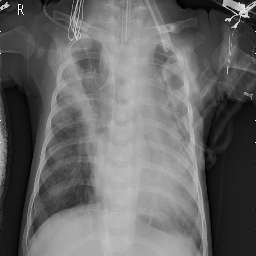


```python
def count_class(y):
  """
  Definition:
  Turns our y-label into a series, then plots the count of our y-series value
  counts. 

  Args:
  y: Requires a y-label.

  Returns:
  Plots the count of the y-label series values
  """
  with plt.style.context('seaborn'):
    fig, ax = plt.subplots()
    ax = pd.Series(y).value_counts().plot(kind='barh', color=['red', 'green'])
    ax.set_ylabel('Classes', fontsize=15)
    ax.set_title('Normal = 0.0        Pneumonia = 1.0', fontsize=20)
    ax.set_xlabel('Count',fontsize=15)
    plt.show()
```


```python
count_class(y_train)
```


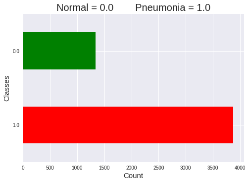


Above we can see that within our dataset, our classes are not balanced. Here we see that there are more images classified as having '**pneumonia**' when compared to those classifed as '**normal**'. This is not uncommon in the medical field, and there are some techniques that we can utilize to help prevent this imbalance from skewing our results. 

### Creating Baseline Model

Because our classes are imbalanced, we will be using the balanced_accuracy_score with a dummy classifier.
According to sklearn, "The balanced accuracy in binary and multiclass classification problems to deal with imbalanced datasets. It is defined as the average of recall obtained on each class."
In the medical field, depending on the circumstances and the severity of the disease/infection, will determine whether we want to avoid false positives or false negatives more. 

for example: say a person has skin cancer but doesn't know it, and is going in to get tested. The doctor takes a few pictures of potentially malignant melonamas and then feeds it into our model. If our model has relatively great accuracy but not so great recall, it may tell the person they do not have a malignant when in fact they do. This is a false negative, and can be dangerous in that type of circumstance because the patient was misdiagnosed, and now the melanoma may spread to other organs before they get tested again.

By setting our dummy classifier to calculate the average recall for each class, we are avoiding the false negatives and false positives equally. 


```python
from sklearn.metrics import balanced_accuracy_score

dummy = DummyClassifier(strategy='stratified')
dummy.fit(X_train, y_train)
y_pred = dummy.predict(X_test)
print(metrics.classification_report(y_test, y_pred))
score = balanced_accuracy_score(y_test, y_pred)
print(f"Balanced accuracy score of our dummy classifier: {(score*100):.2f}%")
```

                  precision    recall  f1-score   support
    
             0.0       0.32      0.24      0.27       193
             1.0       0.60      0.69      0.64       319
    
        accuracy                           0.52       512
       macro avg       0.46      0.46      0.46       512
    weighted avg       0.49      0.52      0.50       512
    
    Balanced accuracy score of our dummy classifier: 46.40%
    

Our dummy classifier had a balanced accuracy score of about 50% when it came to classifying chest xray images correctly. We need to be able to build a model that can get a higher accuracy than this - however, we must be careful because our data is unbalanced; technically our models could score higher by just guessing the majority class all the time.

# Modeling & Exploring

For our first model we won't be doing anything too complex. We are going to define a function that creates a Sequential model, add 3 layers to it, and then define its output layer. The metrics we will want to look at will be: accuracy, precision, and recall. Loss will also be included, but we do not need to define it within the metrics parameter.

-------------------------------------------------------------------
**Accuracy** is the ratio of all correct predictions divided by all predictions our model has made, both correct and incorrect. 

(TP + TN) / (TP + TN + FP + FN)

While this is generally a good metric to look at, we need to be careful because our dataset is unbalanced. We could achieve a better accuracy score than our Dummy Classifier if our model were to only guess the majority class.

-------------------------------------------------------------------
**Precision** is the ratio of True Positives divided by all predicted positives. TP / (TP + FP)

Precision allows us to answer "Out of all the images marked positive, how many are actually positive?" 

-------------------------------------------------------------------
**Recall** is the ratio of True Positives divided by all actual positives. TP / (TP + FN)

Recall allows us to answer "Out of all the images marked positive, how many images were correctly marked positive?"


The function below builds and compiles a basic Sequential CNN model.


```python
def create_basic_cnn(shape='',
                     metrics=['acc', tf.keras.metrics.Precision(name='precision'),
                              tf.keras.metrics.Recall(name='recall')]):
  """
  Definition:
  Creates a basic cnn model consisting of three layers and an output layer.

  Args:
  shape: this function requires an input shape in order for the model to be created.

  Returns:
  Returns a compiled model.
  """
  if len(shape) < 1:
    print('Please define input shape!')
  else:
    # Input layer
    model = Sequential()
    model.add(layers.Conv2D(32, (3,3), activation='relu', input_shape=shape))
    model.add(MaxPooling2D((2, 2)))

    # Second layer
    model.add(layers.Conv2D(64, (3,3), activation='relu'))
    model.add(MaxPooling2D((2, 2)))
      
    # Third layer
    model.add(Flatten())
    model.add(layers.Dense(128, activation='relu'))
      
    # Output layer
    model.add(layers.Dense(1, activation='sigmoid'))
    model.compile(loss='binary_crossentropy', optimizer='adam', metrics=metrics)
    print(model.summary())
    return model
```

The plot_history() function plots each of the metrics within our metric list, and plots training and validation lines for each to compare to see if there is any overfitting (particularly in the accuracy and loss metrics).


```python
def plot_history(history, metric_list=['acc', 'loss', 'precision', 'recall']):
  """
  Definition:
  Creates a dataframe with a model.history variable. Then plots columns within the 
  dataframe if the column contains a metric within the metric list.

  Args:
  history: requires a model.history variable.
  metric_list: default = ['loss', 'acc']. Based on the metric's used in the model's 
  compiled metrics. 

  Returns:
  plots the columns that contain the metric within the metric list
  """
  # creating a dataframe of the model.history variable
  history_df = pd.DataFrame(history.history)

  with plt.style.context('seaborn'):    
    for metric in metric_list:
      history_df[[col for col in history_df.columns if metric in col]].plot(figsize=(8, 4), 
                                                                            marker='o')

      # Setting the title for each plot to be be the focused metric
      plt.title(metric.title())
      plt.grid(True)
      #sets the vertical range to [0-1]
      plt.gca().set_ylim(0, 1)
    plt.show()
```

The class_report() function takes our model and creates a classification report for us to view the scores for each class, and makes a confusion matrix to view the the percentage of each True Positive, False Positive, True Negative, and False Negative the model guessed.


```python
def class_report(model,X_test,y_test, class_indices=train_set_full.class_indices):
  """
  Definition:
  Prints out a classification report by predicting y_pred using model.predict() 
  and plots a heatmap of a confusion matrix using seaborn's heatmap() function. 

  Args:
  model: Requires a model.
  X_test: Requires a test set of features.
  y_test: Requires a test set of labels.
  class_indices: default = train_set_full.class_indices. Pass through a dictionary
  that defines the classes. Must match up with the y_test labels.

  Returns:
  Prints out a classification report and a confusion matrix.  
  """
    
  # creating a title using the class_indices.items()
  title = ''
  for key, val in class_indices.items():
        title += key + ' = ' + str(val) + '    '
    
  # defining our prediction and rounding since we are dealing with binary classification
  y_pred = model.predict(X_test)
  y_pred = y_pred.round()

  # Printing a classification report to see accuracy, recall, precision, f1-score
  dashes = '---'*19
  print(dashes)  
  print('                  Classification Report\n')
  print(metrics.classification_report(y_test, y_pred))
  print(dashes)
    
  # plots a normalized confusion matrix
  conf_mat = metrics.confusion_matrix(y_test, y_pred, normalize='true')
  ax = sns.heatmap(conf_mat, cmap='Reds', annot=True, square=True)
  ax.set(xlabel='Predicted Class', ylabel='True Class')
  ax.set_ylim(2, 0)
  ax.set(title=title)
  plt.show()
```

The fit_cnn() function fits our model to our training data, and trains on it for a number of specified epochs. It then calls on the previously created functions plot_history() and class_report() to activate and display final results of the model.


```python
def fit_cnn(model, X_train, y_train, X_val, y_val, X_test, y_test, 
            epochs=10, batch_size=32, plot_hist=1):
  """
  Definition:
  Fits a passed in model saved in a variable 'history'. Then activates the 
  class_report function which returns a classification report and a confusion
  matrix. Finally, plots the history using the plot_history() function.

  Args:
  model: Requires a model.
  X_train: Requires a train set of features.
  y_train: Requires a train set of labels.
  X_val: Requires a validation set of features.
  y_val: Requires a validation set of labels.
  X_test: Requires a test set of features.
  y_test: Requires a test set of labels.
  epochs: default = 10. Defines the number of passes the ML algorithm will complete.
  batch_size: default = 32. Defines the number of training examples utilized in
  one iteration before updating internal parameters.
  plot_hist: default = 1. Defines whether or not the plot_history() function will
  be executed. 

  Returns:
  history, prints classification report, confusion matrix, and plots history metrics.
  """
  start = time.time()
  history = model.fit(X_train, y_train, epochs=epochs, batch_size=batch_size, 
             validation_data=(X_val, y_val))
    
  class_report(model, X_test, y_test)
    
  if plot_hist:
      plot_history(history) 

  dashes = '---'*20
  print(dashes)
  eval_scores = model.evaluate(X_test, y_test)
  metric_list=['loss', 'accuracy', 'precision', 'recall']
  for i, score in enumerate(eval_scores):
    print(f"{metric_list[i]} score: {score}")
    
  end = time.time()
  print(f"\nTotal time to complete: {round((end-start)/60, 2)}minutes")
  return history
```

Throughout the process we will be using these 3 functions to iterate through many models, along with adding some extra elements to our fit_cnn() function (it will also be known as fit_cnn_gen())


```python
cnn01 = create_basic_cnn(shape=INPUT_SHAPE)
history01 = fit_cnn(cnn01, X_train, y_train, X_val, y_val, X_test, y_test, epochs=10)
```

    Model: "sequential"
    _________________________________________________________________
    Layer (type)                 Output Shape              Param #   
    =================================================================
    conv2d (Conv2D)              (None, 254, 254, 32)      896       
    _________________________________________________________________
    max_pooling2d (MaxPooling2D) (None, 127, 127, 32)      0         
    _________________________________________________________________
    conv2d_1 (Conv2D)            (None, 125, 125, 64)      18496     
    _________________________________________________________________
    max_pooling2d_1 (MaxPooling2 (None, 62, 62, 64)        0         
    _________________________________________________________________
    flatten (Flatten)            (None, 246016)            0         
    _________________________________________________________________
    dense (Dense)                (None, 128)               31490176  
    _________________________________________________________________
    dense_1 (Dense)              (None, 1)                 129       
    =================================================================
    Total params: 31,509,697
    Trainable params: 31,509,697
    Non-trainable params: 0
    _________________________________________________________________
    None
    Epoch 1/10
    163/163 [==============================] - 6s 37ms/step - loss: 0.4392 - acc: 0.8963 - precision: 0.9161 - recall: 0.9471 - val_loss: 0.3966 - val_acc: 0.8189 - val_precision: 0.7745 - val_recall: 1.0000
    Epoch 2/10
    163/163 [==============================] - 6s 34ms/step - loss: 0.0793 - acc: 0.9693 - precision: 0.9786 - recall: 0.9801 - val_loss: 1.4706 - val_acc: 0.6929 - val_precision: 0.6695 - val_recall: 1.0000
    Epoch 3/10
    163/163 [==============================] - 6s 34ms/step - loss: 0.0530 - acc: 0.9827 - precision: 0.9894 - recall: 0.9874 - val_loss: 1.3318 - val_acc: 0.7008 - val_precision: 0.6752 - val_recall: 1.0000
    Epoch 4/10
    163/163 [==============================] - 6s 34ms/step - loss: 0.0383 - acc: 0.9860 - precision: 0.9910 - recall: 0.9902 - val_loss: 1.7063 - val_acc: 0.6850 - val_precision: 0.6639 - val_recall: 1.0000
    Epoch 5/10
    163/163 [==============================] - 6s 34ms/step - loss: 0.0257 - acc: 0.9900 - precision: 0.9928 - recall: 0.9938 - val_loss: 1.4679 - val_acc: 0.7165 - val_precision: 0.6870 - val_recall: 1.0000
    Epoch 6/10
    163/163 [==============================] - 6s 34ms/step - loss: 0.0117 - acc: 0.9962 - precision: 0.9969 - recall: 0.9979 - val_loss: 0.8943 - val_acc: 0.8031 - val_precision: 0.7596 - val_recall: 1.0000
    Epoch 7/10
    163/163 [==============================] - 6s 34ms/step - loss: 0.0079 - acc: 0.9979 - precision: 0.9985 - recall: 0.9987 - val_loss: 1.7357 - val_acc: 0.7402 - val_precision: 0.7054 - val_recall: 1.0000
    Epoch 8/10
    163/163 [==============================] - 6s 34ms/step - loss: 0.0105 - acc: 0.9967 - precision: 0.9979 - recall: 0.9977 - val_loss: 1.5511 - val_acc: 0.7323 - val_precision: 0.6991 - val_recall: 1.0000
    Epoch 9/10
    163/163 [==============================] - 6s 34ms/step - loss: 0.0242 - acc: 0.9902 - precision: 0.9935 - recall: 0.9933 - val_loss: 1.8705 - val_acc: 0.7165 - val_precision: 0.6870 - val_recall: 1.0000
    Epoch 10/10
    163/163 [==============================] - 6s 34ms/step - loss: 0.0128 - acc: 0.9960 - precision: 0.9972 - recall: 0.9974 - val_loss: 2.0260 - val_acc: 0.7087 - val_precision: 0.6810 - val_recall: 1.0000
    ---------------------------------------------------------
                      Classification Report
    
                  precision    recall  f1-score   support
    
             0.0       0.98      0.32      0.48       193
             1.0       0.71      1.00      0.83       319
    
        accuracy                           0.74       512
       macro avg       0.85      0.66      0.66       512
    weighted avg       0.81      0.74      0.70       512
    
    ---------------------------------------------------------
    


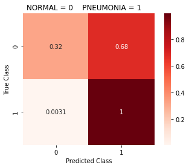


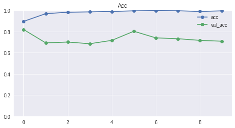


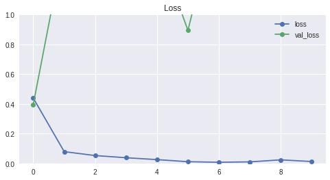


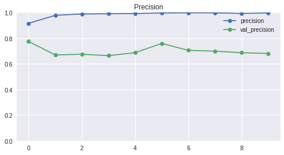


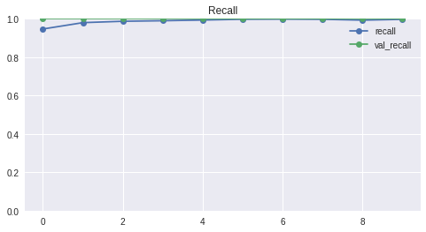


    ------------------------------------------------------------
    16/16 [==============================] - 0s 15ms/step - loss: 2.6906 - acc: 0.7422 - precision: 0.7082 - recall: 0.9969
    loss score: 2.6906497478485107
    accuracy score: 0.7421875
    precision score: 0.7082405090332031
    recall score: 0.9968652129173279
    
    Total time to complete: 1.06minutes
    

As we can see in our metric plots, our model seemed to be overfitting with the training data. We saw before that there is unbalance between those with and without pnemonia, with the majority of these images being classified as having pneumonia. Our model does extremely well at classifying those with pneumonia, but we also see an extremely high false positive rate of about 70% when trying to classify images without pneumonia. So if we were to use this model to diagnose pneumonia, if an image was determined to have 'Normal', our model would have correctly classified that around 99% of the time. However, if an image was determined to have 'Pneumonia', that may or may not be the case due to the high amount of false positives.

While we did achieve an accuracy of 74.2% with our test data and had a loss of 2.69, we will try to improve our model's ability to classify through data augmentation. 

*(Note that because we ran this in google colab, the results will never be the exact same every time).

### Augmenting our training data

We will now augment the training data within ImageDataGenerators in new variables called 'basic_aug_train_datagen' and 'aug_train_datagen'.

By implementing arguments like rotation_range, zoom_range, and horizontal_flip, we give our model more to look at, even though there are no actual new images being generated. Instead, these augments are just randomly shifting, flipping, zooming, shearing, etc. around the image data within our training set. We are choosing to augment our data because we don't have much data to work with. By augmenting the data, we are giving our model more to look at without actually providing any new data. However, we cannot pull off that trick we used earlier to create X and y variables. Now we must use our generators to create models instead of only passing in X and y variables.

It is important to note that we should NEVER augment our test or validation data. 


```python
basic_aug_train_datagen = ImageDataGenerator(rotation_range=45, 
                                             zoom_range=0.2,
                                             horizontal_flip=True)
```

The generator below will be used later on in the project. However, we will be using this next to see the augmentations it does to our images.


```python
aug_train_datagen = ImageDataGenerator(rotation_range=45, 
                                   width_shift_range=0.2, 
                                   height_shift_range=0.2, 
                                   shear_range=0.2, 
                                   zoom_range=0.2,
                                   horizontal_flip=True)
```

Storing pictures of our augmented data in the below address so we can physically view the augmentations


```python
pic_folder = '/content/drive/MyDrive/gdrive/pics/pneumo_aug_imgs/'
os.makedirs(name=pic_folder,exist_ok=True)
```


```python
#Saving augmented pics from our aug_train_datagen into the folder above
run = 1
i = 1
if run:
  folder_count = len(os.listdir(pic_folder))
  if folder_count < 32:
    for batch in aug_train_datagen.flow(X_train, y_train, save_to_dir=pic_folder, 
                                        batch_size=1):
      if i >= 32 - folder_count:
        break
      else:
        i+=1
```


```python
len(os.listdir(pic_folder))
```


    32


```python
def display_images(source, amnt_to_display):
  """
  Definition:
  Define the 'source' variable by giving it a filepath containing images along with
  setting the number you wish to view through the variable 'amnt_to_display'. The
  function will plot the selected number of images within the file and display them.

  Args:
  source: Required. A filepath containing images.
  amnt_to_display: Required. The number of images you wish to display.

  Returns:
  Plots a certain amount of images from the selected filepath.
  """
  
  plt.figure(figsize=(15,10))
  cols = amnt_to_display//2
  images = os.listdir(source)[:amnt_to_display]
  for i, img in enumerate(images):
      x_image = Im.open(source+img)
      # defining the position for each subplot
      plt.subplot(len(images) / cols + 1, cols, i + 1)
      plt.imshow(x_image)
      plt.xticks([])
      plt.yticks([])
      plt.tight_layout()
```

Now we can view our augmented pictures to see what the augmentation is doing


```python
display_images(pic_folder, 8)
```


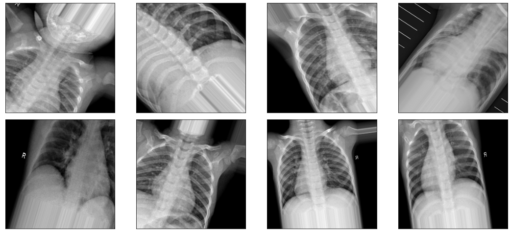


Above we can physically see that our aug_train_datagen is augmenting our pictures using the parameters we defined in our ImageDataGenerator. 

Now we will implement our datagenerator to feed in the images into our `model.fit()` function by building off of our `fit_cnn()` function, creating a new function called `fit_cnn_gen()`.


```python
def fit_cnn_gen(model, X_train, y_train, X_val, y_val, X_test, y_test,
                generator, epochs=10, batch_size=32, plot_hist=1):
  """
  Definition:
  Fits a passed in model saved in a variable 'history'. Then activates the 
  class_report function which returns a classification report and a confusion
  matrix. Finally, plots the history using the plot_history() function.

  Args:
  model: Requires a model.
  X_train: Requires a train set of features.
  y_train: Requires a train set of labels.
  X_val: Requires a validation set of features.
  y_val: Requires a validation set of labels.
  X_test: Requires a test set of features.
  y_test: Requires a test set of labels.
  epochs: default = 10. Defines the number of passes the ML algorithm will complete.
  batch_size: default = 32. Defines the number of training examples utilized in
  one iteration before updating internal parameters.
  plot_hist: default = 1. Defines whether or not the plot_history() function will
  be executed. 
  generator: default = 0. If using a generator to augment training data, this 
  variable will use the .flow() function to gather data from X_train and y_train 
  to augment the training data. 

  Returns:
  history, prints classification report, confusion matrix, and plots history metrics.
  """
  start = time.time()
  history = model.fit(generator.flow(X_train, y_train, batch_size=batch_size), 
                                  validation_data=(X_val, y_val),  
                                  epochs=epochs)
      
  class_report(model, X_test, y_test)
    
  if plot_hist:
      plot_history(history) 
  
  dashes = '---'*20
  print(dashes)
  eval_scores = model.evaluate(X_test, y_test)
  metric_list=['loss', 'accuracy', 'precision', 'recall']
  for i, score in enumerate(eval_scores):
    print(f"{metric_list[i]} score: {score}")
    
  end = time.time()
  print(f"\nTotal time to complete: {round((end-start)/60, 2)}minutes")
  return history
```


```python
cnn02 = create_basic_cnn(shape=INPUT_SHAPE)
history02 = fit_cnn_gen(cnn02, X_train, y_train, X_val, y_val, X_test, y_test, 
                    generator=basic_aug_train_datagen)
```

    Model: "sequential_1"
    _________________________________________________________________
    Layer (type)                 Output Shape              Param #   
    =================================================================
    conv2d_2 (Conv2D)            (None, 254, 254, 32)      896       
    _________________________________________________________________
    max_pooling2d_2 (MaxPooling2 (None, 127, 127, 32)      0         
    _________________________________________________________________
    conv2d_3 (Conv2D)            (None, 125, 125, 64)      18496     
    _________________________________________________________________
    max_pooling2d_3 (MaxPooling2 (None, 62, 62, 64)        0         
    _________________________________________________________________
    flatten_1 (Flatten)          (None, 246016)            0         
    _________________________________________________________________
    dense_2 (Dense)              (None, 128)               31490176  
    _________________________________________________________________
    dense_3 (Dense)              (None, 1)                 129       
    =================================================================
    Total params: 31,509,697
    Trainable params: 31,509,697
    Non-trainable params: 0
    _________________________________________________________________
    None
    Epoch 1/10
    163/163 [==============================] - 65s 401ms/step - loss: 0.6639 - acc: 0.8075 - precision: 0.8313 - recall: 0.9092 - val_loss: 0.3918 - val_acc: 0.7874 - val_precision: 0.7549 - val_recall: 0.9747
    Epoch 2/10
    163/163 [==============================] - 65s 396ms/step - loss: 0.2675 - acc: 0.8896 - precision: 0.9218 - recall: 0.9303 - val_loss: 0.2670 - val_acc: 0.9213 - val_precision: 0.9157 - val_recall: 0.9620
    Epoch 3/10
    163/163 [==============================] - 63s 385ms/step - loss: 0.2492 - acc: 0.8938 - precision: 0.9246 - recall: 0.9332 - val_loss: 0.4434 - val_acc: 0.7559 - val_precision: 0.7400 - val_recall: 0.9367
    Epoch 4/10
    163/163 [==============================] - 62s 383ms/step - loss: 0.2372 - acc: 0.9064 - precision: 0.9317 - recall: 0.9432 - val_loss: 0.3848 - val_acc: 0.7638 - val_precision: 0.7333 - val_recall: 0.9747
    Epoch 5/10
    163/163 [==============================] - 64s 391ms/step - loss: 0.2193 - acc: 0.9116 - precision: 0.9402 - recall: 0.9409 - val_loss: 0.2984 - val_acc: 0.8346 - val_precision: 0.8021 - val_recall: 0.9747
    Epoch 6/10
    163/163 [==============================] - 62s 377ms/step - loss: 0.2135 - acc: 0.9145 - precision: 0.9415 - recall: 0.9435 - val_loss: 0.4111 - val_acc: 0.7874 - val_precision: 0.7549 - val_recall: 0.9747
    Epoch 7/10
    163/163 [==============================] - 61s 375ms/step - loss: 0.1948 - acc: 0.9222 - precision: 0.9476 - recall: 0.9476 - val_loss: 0.5451 - val_acc: 0.7559 - val_precision: 0.7222 - val_recall: 0.9873
    Epoch 8/10
    163/163 [==============================] - 60s 369ms/step - loss: 0.1914 - acc: 0.9277 - precision: 0.9487 - recall: 0.9543 - val_loss: 0.5347 - val_acc: 0.7638 - val_precision: 0.7379 - val_recall: 0.9620
    Epoch 9/10
    163/163 [==============================] - 60s 368ms/step - loss: 0.2015 - acc: 0.9225 - precision: 0.9456 - recall: 0.9505 - val_loss: 0.4569 - val_acc: 0.7953 - val_precision: 0.7524 - val_recall: 1.0000
    Epoch 10/10
    163/163 [==============================] - 60s 368ms/step - loss: 0.1769 - acc: 0.9346 - precision: 0.9566 - recall: 0.9554 - val_loss: 0.7933 - val_acc: 0.7323 - val_precision: 0.7064 - val_recall: 0.9747
    ---------------------------------------------------------
                      Classification Report
    
                  precision    recall  f1-score   support
    
             0.0       0.91      0.61      0.73       193
             1.0       0.80      0.96      0.87       319
    
        accuracy                           0.83       512
       macro avg       0.85      0.78      0.80       512
    weighted avg       0.84      0.83      0.82       512
    
    ---------------------------------------------------------
    


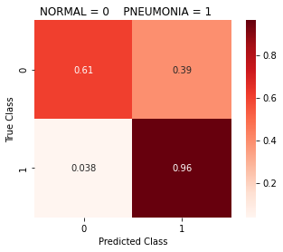


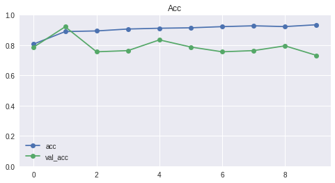


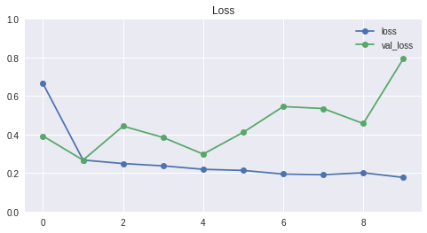


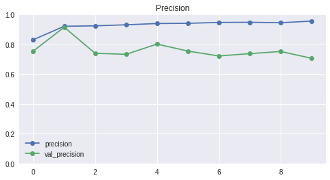


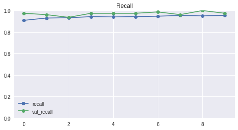


    ------------------------------------------------------------
    16/16 [==============================] - 0s 14ms/step - loss: 0.5819 - acc: 0.8281 - precision: 0.8016 - recall: 0.9624
    loss score: 0.5818932056427002
    accuracy score: 0.828125
    precision score: 0.8015666007995605
    recall score: 0.962382435798645
    
    Total time to complete: 10.47minutes
    

So our newer model definitely shows improvement when compared to our first model, which means augmenting our training data using an Image Data Generator did indeed help the model in identifying the correct class for each image. We managed to significantly decrease our loss and our accuracy improved about 8%. However, notice that it took much more time to train our model when using our ImageDataGenerator to feed in the data. We may want to reduce the image size of our data later on if we want to decrease the amount of time it takes to run. 


## RECOMMENDATION:

If you are working with a small and/or unbalanced dataset, augmenting the training data can give your model 'more' to look at, and it can prevent any overfitting that may occur if our dataset is too small. Be careful of the parameters you choose to augment within the ImageDataGenerator; depending on what you're looking for will determine (more or less) the parameters you want to alter.

We can further improve (potentially) our model by increasing the complexity through more augmentation, adding more layers, adding different types of layers, adding neurons, including weights for classes, setting different batch sizes, changing optimizers, tuning learning rates, and using transfer learning models. 

### Computing the Weights for our Classes

The reason we want to add the weights as a parameter for our model is because we want to nullify as much of the class imbalance as we can. The weights influence the classification of our classes during our model's training. The goal of this is to penalize misclassification of the minority class by setting a higher weight and reducing the weight for the majority class. 


```python
class_weights = class_weight.compute_class_weight('balanced', np.unique(y_train), 
                                                  y_train)
class_weights_dict = {0: class_weights[0], 1: class_weights[1]}
print(f"Our class weights:\n{class_weights_dict}")
```

    Our class weights:
    {0: 1.9448173005219984, 1: 0.6730322580645162}
    

Restructuring our fit_cnn_gen() func to take in class_weights and feed it into the model.fit() func.


```python
def fit_cnn_gen(model, X_train, y_train, X_val, y_val, X_test, y_test,
                generator, epochs=10, batch_size=32, plot_hist=1, 
                class_weights=None):
  """
  Definition:
  Fits a passed in model saved in a variable 'history'. Then activates the 
  class_report function which returns a classification report and a confusion
  matrix. Finally, plots the history using the plot_history() function.

  Args:
  model: Requires a model.
  X_train: Requires a train set of features.
  y_train: Requires a train set of labels.
  X_val: Requires a validation set of features.
  y_val: Requires a validation set of labels.
  X_test: Requires a test set of features.
  y_test: Requires a test set of labels.
  generator: Specify a generator to augment training data, this 
  variable will use the .flow() function to gather data from X_train and y_train 
  to augment the training data. 
  epochs: default = 10. Defines the number of passes the ML algorithm will complete.
  batch_size: default = 32. Defines the number of training examples utilized in
  one iteration before updating internal parameters.
  plot_hist: default = 1. Defines whether or not the plot_history() function will
  be executed. 
  class_weights: default = None. Pass in a dictionary containing the class weights, 
  where the keys are the classes and the values are the weights.

  Returns:
  history, prints classification report, confusion matrix, and plots history metrics.
  """
  start = time.time()
  history = model.fit(generator.flow(X_train, y_train, batch_size=batch_size), 
                        validation_data=(X_val, y_val), 
                        epochs=epochs, class_weight=class_weights)
  
  class_report(model, X_test, y_test)
    
  if plot_hist:
      plot_history(history) 

  dashes = '---'*20
  print(dashes)
  eval_scores = model.evaluate(X_test, y_test)
  metric_list=['loss', 'accuracy', 'precision', 'recall']
  for i, score in enumerate(eval_scores):
    print(f"{metric_list[i]} score: {score}")

  end = time.time()
  print(f"\nTotal time to complete: {round((end-start)/60, 2)}minutes")
  return history
```


```python
cnn03 = create_basic_cnn(shape=INPUT_SHAPE)
history03 = fit_cnn_gen(cnn03, X_train, y_train, X_val, y_val, X_test, y_test, 
                        batch_size=32, generator=basic_aug_train_datagen,
                        class_weights=class_weights_dict)
```

    Model: "sequential_2"
    _________________________________________________________________
    Layer (type)                 Output Shape              Param #   
    =================================================================
    conv2d_4 (Conv2D)            (None, 254, 254, 32)      896       
    _________________________________________________________________
    max_pooling2d_4 (MaxPooling2 (None, 127, 127, 32)      0         
    _________________________________________________________________
    conv2d_5 (Conv2D)            (None, 125, 125, 64)      18496     
    _________________________________________________________________
    max_pooling2d_5 (MaxPooling2 (None, 62, 62, 64)        0         
    _________________________________________________________________
    flatten_2 (Flatten)          (None, 246016)            0         
    _________________________________________________________________
    dense_4 (Dense)              (None, 128)               31490176  
    _________________________________________________________________
    dense_5 (Dense)              (None, 1)                 129       
    =================================================================
    Total params: 31,509,697
    Trainable params: 31,509,697
    Non-trainable params: 0
    _________________________________________________________________
    None
    Epoch 1/10
    163/163 [==============================] - 63s 385ms/step - loss: 0.6244 - acc: 0.7862 - precision: 0.9188 - recall: 0.7823 - val_loss: 0.2774 - val_acc: 0.8740 - val_precision: 0.9200 - val_recall: 0.8734
    Epoch 2/10
    163/163 [==============================] - 61s 377ms/step - loss: 0.2920 - acc: 0.8800 - precision: 0.9643 - recall: 0.8707 - val_loss: 0.1928 - val_acc: 0.9370 - val_precision: 0.9494 - val_recall: 0.9494
    Epoch 3/10
    163/163 [==============================] - 60s 371ms/step - loss: 0.2925 - acc: 0.8796 - precision: 0.9616 - recall: 0.8728 - val_loss: 0.2360 - val_acc: 0.9134 - val_precision: 0.9359 - val_recall: 0.9241
    Epoch 4/10
    163/163 [==============================] - 60s 369ms/step - loss: 0.2619 - acc: 0.8909 - precision: 0.9675 - recall: 0.8828 - val_loss: 0.1986 - val_acc: 0.9291 - val_precision: 0.9605 - val_recall: 0.9241
    Epoch 5/10
    163/163 [==============================] - 60s 367ms/step - loss: 0.2607 - acc: 0.8913 - precision: 0.9649 - recall: 0.8859 - val_loss: 0.1492 - val_acc: 0.9528 - val_precision: 0.9620 - val_recall: 0.9620
    Epoch 6/10
    163/163 [==============================] - 60s 368ms/step - loss: 0.2204 - acc: 0.9120 - precision: 0.9760 - recall: 0.9037 - val_loss: 0.2009 - val_acc: 0.9370 - val_precision: 0.9277 - val_recall: 0.9747
    Epoch 7/10
    163/163 [==============================] - 60s 370ms/step - loss: 0.2184 - acc: 0.9080 - precision: 0.9751 - recall: 0.8991 - val_loss: 0.1843 - val_acc: 0.9134 - val_precision: 0.9722 - val_recall: 0.8861
    Epoch 8/10
    163/163 [==============================] - 60s 368ms/step - loss: 0.2174 - acc: 0.9114 - precision: 0.9731 - recall: 0.9058 - val_loss: 0.2165 - val_acc: 0.9213 - val_precision: 0.9259 - val_recall: 0.9494
    Epoch 9/10
    163/163 [==============================] - 60s 367ms/step - loss: 0.2052 - acc: 0.9212 - precision: 0.9766 - recall: 0.9159 - val_loss: 0.2753 - val_acc: 0.8661 - val_precision: 0.9844 - val_recall: 0.7975
    Epoch 10/10
    163/163 [==============================] - 60s 367ms/step - loss: 0.1837 - acc: 0.9266 - precision: 0.9778 - recall: 0.9221 - val_loss: 0.1807 - val_acc: 0.9213 - val_precision: 0.9259 - val_recall: 0.9494
    ---------------------------------------------------------
                      Classification Report
    
                  precision    recall  f1-score   support
    
             0.0       0.85      0.75      0.80       193
             1.0       0.86      0.92      0.89       319
    
        accuracy                           0.86       512
       macro avg       0.85      0.83      0.84       512
    weighted avg       0.86      0.86      0.85       512
    
    ---------------------------------------------------------
    


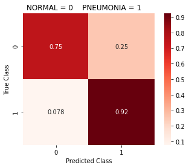


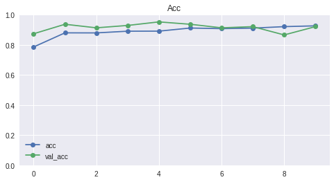


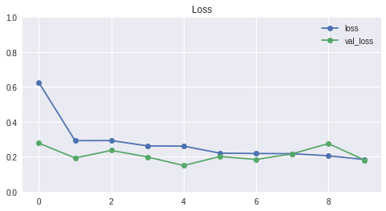


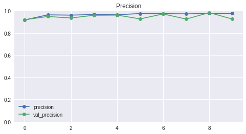


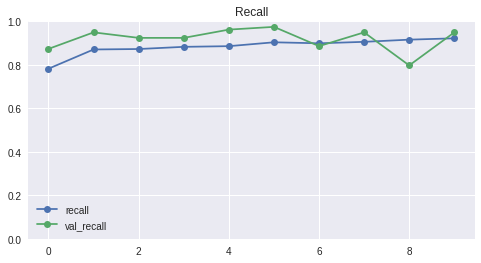


    ------------------------------------------------------------
    16/16 [==============================] - 0s 14ms/step - loss: 0.3189 - acc: 0.8555 - precision: 0.8571 - recall: 0.9216
    loss score: 0.3189418315887451
    accuracy score: 0.85546875
    precision score: 0.8571428656578064
    recall score: 0.9216300845146179
    
    Total time to complete: 10.19minutes
    

Our model managed to reduce our loss score even more, and our accuracy improved by about 3%. Also notice that our model was able to better differentiate between the classes; Our model acheived a recall score of 75% for our NORMAL class, which is significantly better than our previous model's score (61%).

## RECOMMENDATION:
"Class weights directly modify the loss function by giving more (or less) penalty to the classes with more (or less) weight. In effect, one is basically sacrificing some ability to predict the lower weight class (the majority class for unbalanced datasets) by purposely biasing the model to favor more accurate predictions of the higher weighted class (the minority class)."

(Retrieved from https://datascience.stackexchange.com/questions/52627/why-class-weight-is-outperforming-oversampling)

Here we can see that adding class weights into our function really helped out the training of our model. Our model is able to better differentiate between the NORMAL and PNEUMONIA classes, giving us better accuracy, precision, and our loss also decreased. I would recommend implementing class weights if a dataset's classes are unbalanced (not 50/50).

### Increasing the complexity of our model

We are going to begin to include more layers, along with Dropout layers to help reduce our model's tendency to overfit on the training data. However, if we make a model too complex, it could actually hinder our model's ability to classify images correctly. We will be including a dropout layer in the next model architecture - this layer ignores a random subset of units in a layer (sets the weights to 0) during each phase of training. This technique is effective because it allows us to train our neural networks on different parts of the data, which ensures that our model will not be overly sensitive to any noise in the data.


```python
def create_improved_cnn(shape='', opt=tf.keras.optimizers.Adam(), 
                        metrics=['acc', tf.keras.metrics.Precision(name='precision'),
                              tf.keras.metrics.Recall(name='recall')]):
    if len(shape) < 1:
      print('Please define input shape!')
    else:
      model = Sequential()
      model.add(layers.Conv2D(32, (3,3), activation='relu', input_shape=shape))
      model.add(MaxPooling2D((2, 2)))
      
      model.add(layers.Conv2D(64, (3,3), activation='relu'))
      model.add(MaxPooling2D((2, 2)))

      model.add(layers.Conv2D(128, (5, 5), activation='relu'))
      model.add(MaxPooling2D((4, 4)))
      
      model.add(Flatten())
      model.add(layers.Dense(512, activation='relu'))
      model.add(layers.Dropout(0.2))

      model.add(layers.Dense(256, activation='relu'))

      model.add(layers.Dense(1, activation='sigmoid'))
      model.compile(loss='binary_crossentropy', optimizer=opt, metrics=metrics)
      print(model.summary())
      return model
```


```python
cnn04 = create_improved_cnn(shape=INPUT_SHAPE, 
                            opt=tf.keras.optimizers.Adam(learning_rate=0.001))
history04 = fit_cnn_gen(cnn04, X_train, y_train, X_val, y_val, X_test, y_test, 
                    epochs=10, batch_size=32, generator=basic_aug_train_datagen, 
                    class_weights=class_weights_dict)
```

    Model: "sequential_3"
    _________________________________________________________________
    Layer (type)                 Output Shape              Param #   
    =================================================================
    conv2d_6 (Conv2D)            (None, 254, 254, 32)      896       
    _________________________________________________________________
    max_pooling2d_6 (MaxPooling2 (None, 127, 127, 32)      0         
    _________________________________________________________________
    conv2d_7 (Conv2D)            (None, 125, 125, 64)      18496     
    _________________________________________________________________
    max_pooling2d_7 (MaxPooling2 (None, 62, 62, 64)        0         
    _________________________________________________________________
    conv2d_8 (Conv2D)            (None, 58, 58, 128)       204928    
    _________________________________________________________________
    max_pooling2d_8 (MaxPooling2 (None, 14, 14, 128)       0         
    _________________________________________________________________
    flatten_3 (Flatten)          (None, 25088)             0         
    _________________________________________________________________
    dense_6 (Dense)              (None, 512)               12845568  
    _________________________________________________________________
    dropout (Dropout)            (None, 512)               0         
    _________________________________________________________________
    dense_7 (Dense)              (None, 256)               131328    
    _________________________________________________________________
    dense_8 (Dense)              (None, 1)                 257       
    =================================================================
    Total params: 13,201,473
    Trainable params: 13,201,473
    Non-trainable params: 0
    _________________________________________________________________
    None
    Epoch 1/10
    163/163 [==============================] - 61s 377ms/step - loss: 0.5241 - acc: 0.7312 - precision: 0.8858 - recall: 0.7326 - val_loss: 0.3298 - val_acc: 0.8504 - val_precision: 0.8191 - val_recall: 0.9747
    Epoch 2/10
    163/163 [==============================] - 61s 373ms/step - loss: 0.3414 - acc: 0.8564 - precision: 0.9581 - recall: 0.8436 - val_loss: 0.2203 - val_acc: 0.9370 - val_precision: 0.9610 - val_recall: 0.9367
    Epoch 3/10
    163/163 [==============================] - 61s 372ms/step - loss: 0.2839 - acc: 0.8817 - precision: 0.9649 - recall: 0.8725 - val_loss: 0.1680 - val_acc: 0.9291 - val_precision: 0.9861 - val_recall: 0.8987
    Epoch 4/10
    163/163 [==============================] - 61s 372ms/step - loss: 0.2687 - acc: 0.8921 - precision: 0.9657 - recall: 0.8862 - val_loss: 0.1768 - val_acc: 0.9528 - val_precision: 0.9867 - val_recall: 0.9367
    Epoch 5/10
    163/163 [==============================] - 61s 373ms/step - loss: 0.2453 - acc: 0.9009 - precision: 0.9695 - recall: 0.8947 - val_loss: 0.2056 - val_acc: 0.9291 - val_precision: 0.8977 - val_recall: 1.0000
    Epoch 6/10
    163/163 [==============================] - 61s 375ms/step - loss: 0.2192 - acc: 0.9103 - precision: 0.9746 - recall: 0.9027 - val_loss: 0.1348 - val_acc: 0.9134 - val_precision: 0.9359 - val_recall: 0.9241
    Epoch 7/10
    163/163 [==============================] - 61s 372ms/step - loss: 0.2116 - acc: 0.9145 - precision: 0.9745 - recall: 0.9086 - val_loss: 0.1413 - val_acc: 0.9843 - val_precision: 0.9753 - val_recall: 1.0000
    Epoch 8/10
    163/163 [==============================] - 60s 369ms/step - loss: 0.1953 - acc: 0.9247 - precision: 0.9746 - recall: 0.9226 - val_loss: 0.1447 - val_acc: 0.9370 - val_precision: 0.9863 - val_recall: 0.9114
    Epoch 9/10
    163/163 [==============================] - 60s 370ms/step - loss: 0.1867 - acc: 0.9237 - precision: 0.9777 - recall: 0.9182 - val_loss: 0.2178 - val_acc: 0.9055 - val_precision: 0.8681 - val_recall: 1.0000
    Epoch 10/10
    163/163 [==============================] - 61s 371ms/step - loss: 0.1796 - acc: 0.9291 - precision: 0.9797 - recall: 0.9236 - val_loss: 0.1440 - val_acc: 0.9291 - val_precision: 1.0000 - val_recall: 0.8861
    ---------------------------------------------------------
                      Classification Report
    
                  precision    recall  f1-score   support
    
             0.0       0.88      0.79      0.83       193
             1.0       0.88      0.93      0.91       319
    
        accuracy                           0.88       512
       macro avg       0.88      0.86      0.87       512
    weighted avg       0.88      0.88      0.88       512
    
    ---------------------------------------------------------
    


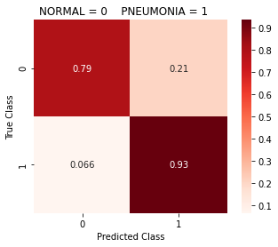


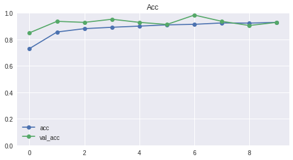


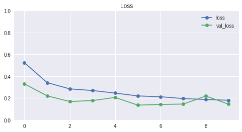


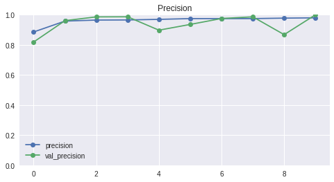


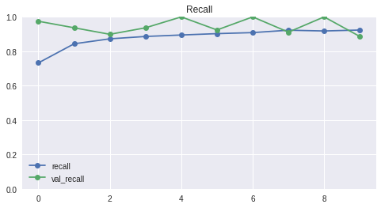


    ------------------------------------------------------------
    16/16 [==============================] - 0s 16ms/step - loss: 0.3124 - acc: 0.8809 - precision: 0.8817 - recall: 0.9342
    loss score: 0.31244057416915894
    accuracy score: 0.880859375
    precision score: 0.88165682554245
    recall score: 0.9341692924499512
    
    Total time to complete: 10.23minutes
    

Increasing the complexity of our model definitely improved our accuracy. We want to be careful not to make it too complex, otherwise the performance may not improve and may actually begin to decrease.

So how do we save these models?

## Making and Adding Callbacks

There are some callbacks that we will  instantiate and implement in order to make sure that our model doesn't overfit, and will allow us to save the model into a folder in our drive. The two callbacks that we will be focusing on will be ModelCheckpoint and EarlyStopping.

ModelCheckpoint is an object that we can instantiate in order to save a model based off of some parameters we set within the object. We can tell it where to save the model, when to save the model, the saving filter we want to use (eg. best only, all the models, etc.) and so on. 

EarlyStopping is an object that allows us to define parameters that tell the model to stop training in order to prevent overfitting. We can specify how early to stop it, what value to be looking for in order to dictate whether or not the model should stop, and whether or not we want to restore the best weights for the model if we think the model needs to reset to the previous best weights. 

It's easy to implement these into our model.fit() function; there is a parameter called 'callbacks' that can take in a list of callbacks. It's that easy.


```python
def make_callbacks(monitor='val_loss', min_delta=0, patience=0, mode='auto', 
                   f_path='/content/drive/My Drive/gdrive/models/pneumonia_models/', 
                   restore_best_weights=False, save_best_only=False, 
                   save_freq='epoch'):
  """
  Definition:
  Creates two variables, and then returns these variables in a list.

  1. variable 'earlystop' stops model training when the 'monitor' metric has not 
  improved past the 'min_delta' threshold after a certain amount of epochs, 
  defined by 'patience'. 

  2. variable 'checkpoint' saves model at some interval, so the model can be 
  loaded later on to continue the training from the saved state.

  Args:
  monitor: default = 'val_loss'. Quantity to be monitored during training.
  min_delta: default = 0. minimum change in the monitored quantity to be
  considered an improvement.
  patience: default = 0. The number of epochs with no improvement after which
  training will be stopped.
  mode: default = 'auto'. Defines the direction of monitor quantity. ex. If 'min', 
  training will stop after monitored quantity is no longer decreasing past the 
  defined min_delta. 
  f_path: default = '/content/drive/My Drive/gdrive/models/pneumonia_models/'. 
  The filepath that will be created / set as the destination for saved models 
  from 'checkpoint' variable.
  restore_best_weights: default = False. Defines whether or not to restore the 
  best model weights from the epoch with the best value of the monitored quantity.
  save_best_only: default = False. If save_best_only=True, the latest best model 
  according to the quantity monitored will not be overwritten.
  save_freq: default = 'epoch'. The defined interval at which the model is saved.

  Returns:
  A list named 'callbacks' containing the 'earlystop' and 'checkpoint' variable.
  """
  
  # Defining our early stopping func
  earlystop = EarlyStopping(monitor=monitor, min_delta=min_delta, patience=patience, 
                           mode=mode, restore_best_weights=restore_best_weights)
    
  #checking to make sure our path is set up. If not, the line below creates it.
  os.makedirs(f_path, exist_ok=True)
    
  # saves the current model at the specified checkpoint
  checkpoint_f_path = f_path+"wgt-improv-{epoch:02d}-{"+monitor+":.2f}.hdf5"
  checkpoint = ModelCheckpoint(filepath=checkpoint_f_path, monitor=monitor, 
                               save_best_only=save_best_only, mode=mode, 
                               save_freq=save_freq)
  callbacks = [earlystop, checkpoint]
  return callbacks
```


```python
#updating our fit_cnn_gen func to include callbacks
def fit_cnn_gen(model, X_train, y_train, X_val, y_val, X_test, y_test,
                generator, epochs=10, batch_size=32, plot_hist=1, 
                class_weights=None, callbacks=''):
  """
  Definition:
  Fits a passed in model saved in a variable 'history'. Then activates the 
  class_report function which returns a classification report and a confusion
  matrix. Finally, plots the history using the plot_history() function.

  Args:
  model: Requires a model.
  X_train: Requires a train set of features.
  y_train: Requires a train set of labels.
  X_val: Requires a validation set of features.
  y_val: Requires a validation set of labels.
  X_test: Requires a test set of features.
  y_test: Requires a test set of labels.
  generator: Selected generator to augment training data. This variable will use 
  the .flow() function to gather data from X_train and y_train to augment the 
  training data. 
  epochs: default = 10. Defines the number of passes the ML algorithm will complete.
  batch_size: default = 32. Defines the number of training examples utilized in
  one iteration before updating internal parameters.
  plot_hist: default = 1. Defines whether or not the plot_history() function will
  be executed. 
  class_weights: default = None. Pass in a dictionary containing the class weights, 
  where the keys are the classes and the values are the weights.
  callbacks: default = ''. will pass in a list of callbacks into the model.fit() 
  if this variable contains the list of callbacks (can pass in the make_callbacks()).
  If left at default, no callbacks will be used.


  Returns:
  history, prints classification report, confusion matrix, and plots history metrics.
  """
  start = time.time()
  if len(callbacks) > 0:
    history = model.fit(generator.flow(X_train, y_train, batch_size=batch_size), 
                        validation_data=(X_val, y_val), 
                        epochs=epochs, class_weight=class_weights,
                        callbacks=callbacks)
  else:
    history = model.fit(generator.flow(X_train, y_train, batch_size=batch_size), 
                        validation_data=(X_val, y_val), 
                        epochs=epochs, class_weight=class_weights)
    
  class_report(model, X_test, y_test)
    
  if plot_hist:
      plot_history(history) 

  dashes = '---'*20
  print(dashes)
  eval_scores = model.evaluate(X_test, y_test)
  metric_list=['loss', 'accuracy', 'precision', 'recall']
  for i, score in enumerate(eval_scores):
    print(f"{metric_list[i]} score: {score}")

  end = time.time()
  print(f"\nTotal time to complete: {round((end-start)/60, 2)} minutes")
  return history
```


```python
# Creating path to place our 256x256 models
BIG_PATH = '/content/drive/MyDrive/gdrive/models/pneumonia_models/big_mods256/'
```


```python
cnn05 = create_improved_cnn(shape=INPUT_SHAPE, 
                            opt=optimizers.Adam(learning_rate=0.001))
history05 = fit_cnn_gen(cnn05, X_train, y_train, X_val, y_val, X_test, y_test, 
                    epochs=50, batch_size=32, generator=basic_aug_train_datagen,
                    class_weights=class_weights_dict,
                    callbacks=make_callbacks(min_delta=0.001, patience=10, 
                                             save_best_only=True, f_path=BIG_PATH, 
                                             restore_best_weights=True, mode='min'))
```

    Model: "sequential_4"
    _________________________________________________________________
    Layer (type)                 Output Shape              Param #   
    =================================================================
    conv2d_9 (Conv2D)            (None, 254, 254, 32)      896       
    _________________________________________________________________
    max_pooling2d_9 (MaxPooling2 (None, 127, 127, 32)      0         
    _________________________________________________________________
    conv2d_10 (Conv2D)           (None, 125, 125, 64)      18496     
    _________________________________________________________________
    max_pooling2d_10 (MaxPooling (None, 62, 62, 64)        0         
    _________________________________________________________________
    conv2d_11 (Conv2D)           (None, 58, 58, 128)       204928    
    _________________________________________________________________
    max_pooling2d_11 (MaxPooling (None, 14, 14, 128)       0         
    _________________________________________________________________
    flatten_4 (Flatten)          (None, 25088)             0         
    _________________________________________________________________
    dense_9 (Dense)              (None, 512)               12845568  
    _________________________________________________________________
    dropout_1 (Dropout)          (None, 512)               0         
    _________________________________________________________________
    dense_10 (Dense)             (None, 256)               131328    
    _________________________________________________________________
    dense_11 (Dense)             (None, 1)                 257       
    =================================================================
    Total params: 13,201,473
    Trainable params: 13,201,473
    Non-trainable params: 0
    _________________________________________________________________
    None
    Epoch 1/50
    163/163 [==============================] - 62s 383ms/step - loss: 0.5083 - acc: 0.7293 - precision: 0.9172 - recall: 0.7132 - val_loss: 0.3966 - val_acc: 0.7559 - val_precision: 0.7264 - val_recall: 0.9747
    Epoch 2/50
    163/163 [==============================] - 61s 373ms/step - loss: 0.3168 - acc: 0.8610 - precision: 0.9568 - recall: 0.8514 - val_loss: 0.5164 - val_acc: 0.7008 - val_precision: 0.6916 - val_recall: 0.9367
    Epoch 3/50
    163/163 [==============================] - 60s 371ms/step - loss: 0.2874 - acc: 0.8765 - precision: 0.9620 - recall: 0.8681 - val_loss: 0.2590 - val_acc: 0.8425 - val_precision: 0.8471 - val_recall: 0.9114
    Epoch 4/50
    163/163 [==============================] - 60s 371ms/step - loss: 0.2613 - acc: 0.8969 - precision: 0.9678 - recall: 0.8908 - val_loss: 0.2107 - val_acc: 0.9606 - val_precision: 0.9625 - val_recall: 0.9747
    Epoch 5/50
    163/163 [==============================] - 60s 370ms/step - loss: 0.2166 - acc: 0.9093 - precision: 0.9770 - recall: 0.8991 - val_loss: 0.1329 - val_acc: 0.9449 - val_precision: 0.9615 - val_recall: 0.9494
    Epoch 6/50
    163/163 [==============================] - 61s 371ms/step - loss: 0.2135 - acc: 0.9039 - precision: 0.9725 - recall: 0.8960 - val_loss: 0.1835 - val_acc: 0.9291 - val_precision: 0.8977 - val_recall: 1.0000
    Epoch 7/50
    163/163 [==============================] - 60s 366ms/step - loss: 0.1933 - acc: 0.9227 - precision: 0.9790 - recall: 0.9156 - val_loss: 0.1559 - val_acc: 0.9370 - val_precision: 0.9733 - val_recall: 0.9241
    Epoch 8/50
    163/163 [==============================] - 60s 366ms/step - loss: 0.1772 - acc: 0.9283 - precision: 0.9813 - recall: 0.9210 - val_loss: 0.1358 - val_acc: 0.9370 - val_precision: 0.9494 - val_recall: 0.9494
    Epoch 9/50
    163/163 [==============================] - 60s 365ms/step - loss: 0.1787 - acc: 0.9260 - precision: 0.9791 - recall: 0.9200 - val_loss: 0.1607 - val_acc: 0.9370 - val_precision: 0.9863 - val_recall: 0.9114
    Epoch 10/50
    163/163 [==============================] - 60s 367ms/step - loss: 0.1651 - acc: 0.9323 - precision: 0.9809 - recall: 0.9270 - val_loss: 0.1429 - val_acc: 0.9685 - val_precision: 0.9630 - val_recall: 0.9873
    Epoch 11/50
    163/163 [==============================] - 61s 373ms/step - loss: 0.1491 - acc: 0.9350 - precision: 0.9831 - recall: 0.9285 - val_loss: 0.1168 - val_acc: 0.9764 - val_precision: 0.9634 - val_recall: 1.0000
    Epoch 12/50
    163/163 [==============================] - 60s 366ms/step - loss: 0.1432 - acc: 0.9415 - precision: 0.9861 - recall: 0.9345 - val_loss: 0.1531 - val_acc: 0.9685 - val_precision: 0.9518 - val_recall: 1.0000
    Epoch 13/50
    163/163 [==============================] - 59s 364ms/step - loss: 0.1425 - acc: 0.9411 - precision: 0.9845 - recall: 0.9355 - val_loss: 0.1355 - val_acc: 0.9764 - val_precision: 0.9750 - val_recall: 0.9873
    Epoch 14/50
    163/163 [==============================] - 59s 365ms/step - loss: 0.1507 - acc: 0.9331 - precision: 0.9814 - recall: 0.9275 - val_loss: 0.1601 - val_acc: 0.9449 - val_precision: 0.9865 - val_recall: 0.9241
    Epoch 15/50
    163/163 [==============================] - 59s 365ms/step - loss: 0.1403 - acc: 0.9438 - precision: 0.9854 - recall: 0.9383 - val_loss: 0.1928 - val_acc: 0.9291 - val_precision: 0.9605 - val_recall: 0.9241
    Epoch 16/50
    163/163 [==============================] - 60s 367ms/step - loss: 0.1274 - acc: 0.9505 - precision: 0.9871 - recall: 0.9458 - val_loss: 0.1767 - val_acc: 0.9134 - val_precision: 0.9857 - val_recall: 0.8734
    Epoch 17/50
    163/163 [==============================] - 60s 368ms/step - loss: 0.1331 - acc: 0.9448 - precision: 0.9856 - recall: 0.9394 - val_loss: 0.0967 - val_acc: 0.9685 - val_precision: 0.9630 - val_recall: 0.9873
    Epoch 18/50
    163/163 [==============================] - 60s 369ms/step - loss: 0.1353 - acc: 0.9465 - precision: 0.9865 - recall: 0.9409 - val_loss: 0.0879 - val_acc: 0.9764 - val_precision: 0.9634 - val_recall: 1.0000
    Epoch 19/50
    163/163 [==============================] - 60s 367ms/step - loss: 0.1253 - acc: 0.9515 - precision: 0.9879 - recall: 0.9463 - val_loss: 0.1061 - val_acc: 0.9764 - val_precision: 0.9634 - val_recall: 1.0000
    Epoch 20/50
    163/163 [==============================] - 60s 365ms/step - loss: 0.1186 - acc: 0.9494 - precision: 0.9865 - recall: 0.9448 - val_loss: 0.1054 - val_acc: 0.9685 - val_precision: 0.9870 - val_recall: 0.9620
    Epoch 21/50
    163/163 [==============================] - 61s 376ms/step - loss: 0.1264 - acc: 0.9500 - precision: 0.9871 - recall: 0.9450 - val_loss: 0.1054 - val_acc: 0.9606 - val_precision: 0.9512 - val_recall: 0.9873
    Epoch 22/50
    163/163 [==============================] - 60s 371ms/step - loss: 0.1139 - acc: 0.9561 - precision: 0.9887 - recall: 0.9517 - val_loss: 0.1058 - val_acc: 0.9606 - val_precision: 0.9625 - val_recall: 0.9747
    Epoch 23/50
    163/163 [==============================] - 60s 366ms/step - loss: 0.1110 - acc: 0.9544 - precision: 0.9879 - recall: 0.9502 - val_loss: 0.1033 - val_acc: 0.9606 - val_precision: 0.9744 - val_recall: 0.9620
    Epoch 24/50
    163/163 [==============================] - 59s 365ms/step - loss: 0.1027 - acc: 0.9546 - precision: 0.9887 - recall: 0.9497 - val_loss: 0.1114 - val_acc: 0.9764 - val_precision: 0.9750 - val_recall: 0.9873
    Epoch 25/50
    163/163 [==============================] - 60s 369ms/step - loss: 0.1016 - acc: 0.9571 - precision: 0.9909 - recall: 0.9510 - val_loss: 0.0650 - val_acc: 0.9843 - val_precision: 0.9873 - val_recall: 0.9873
    Epoch 26/50
    163/163 [==============================] - 60s 367ms/step - loss: 0.1134 - acc: 0.9536 - precision: 0.9890 - recall: 0.9481 - val_loss: 0.1089 - val_acc: 0.9528 - val_precision: 0.9506 - val_recall: 0.9747
    Epoch 27/50
    163/163 [==============================] - 60s 366ms/step - loss: 0.1062 - acc: 0.9582 - precision: 0.9893 - recall: 0.9541 - val_loss: 0.0998 - val_acc: 0.9606 - val_precision: 0.9625 - val_recall: 0.9747
    Epoch 28/50
    163/163 [==============================] - 59s 365ms/step - loss: 0.1204 - acc: 0.9549 - precision: 0.9877 - recall: 0.9512 - val_loss: 0.2067 - val_acc: 0.8976 - val_precision: 0.8750 - val_recall: 0.9747
    Epoch 29/50
    163/163 [==============================] - 60s 366ms/step - loss: 0.1065 - acc: 0.9536 - precision: 0.9882 - recall: 0.9489 - val_loss: 0.1015 - val_acc: 0.9764 - val_precision: 0.9872 - val_recall: 0.9747
    Epoch 30/50
    163/163 [==============================] - 61s 376ms/step - loss: 0.1001 - acc: 0.9605 - precision: 0.9909 - recall: 0.9556 - val_loss: 0.1465 - val_acc: 0.9606 - val_precision: 0.9512 - val_recall: 0.9873
    Epoch 31/50
    163/163 [==============================] - 60s 369ms/step - loss: 0.1080 - acc: 0.9567 - precision: 0.9882 - recall: 0.9530 - val_loss: 0.0726 - val_acc: 0.9685 - val_precision: 0.9747 - val_recall: 0.9747
    Epoch 32/50
    163/163 [==============================] - 61s 372ms/step - loss: 0.1071 - acc: 0.9578 - precision: 0.9890 - recall: 0.9538 - val_loss: 0.1644 - val_acc: 0.9370 - val_precision: 0.9863 - val_recall: 0.9114
    Epoch 33/50
    163/163 [==============================] - 60s 371ms/step - loss: 0.1102 - acc: 0.9540 - precision: 0.9900 - recall: 0.9476 - val_loss: 0.0713 - val_acc: 0.9843 - val_precision: 0.9753 - val_recall: 1.0000
    Epoch 34/50
    163/163 [==============================] - 60s 368ms/step - loss: 0.1070 - acc: 0.9572 - precision: 0.9898 - recall: 0.9523 - val_loss: 0.0805 - val_acc: 0.9843 - val_precision: 0.9873 - val_recall: 0.9873
    Epoch 35/50
    163/163 [==============================] - 60s 370ms/step - loss: 0.1053 - acc: 0.9571 - precision: 0.9890 - recall: 0.9528 - val_loss: 0.1834 - val_acc: 0.9449 - val_precision: 0.9615 - val_recall: 0.9494
    ---------------------------------------------------------
                      Classification Report
    
                  precision    recall  f1-score   support
    
             0.0       0.88      0.83      0.85       193
             1.0       0.90      0.93      0.92       319
    
        accuracy                           0.89       512
       macro avg       0.89      0.88      0.88       512
    weighted avg       0.89      0.89      0.89       512
    
    ---------------------------------------------------------
    


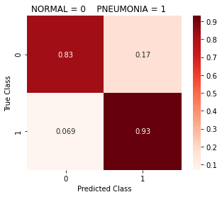


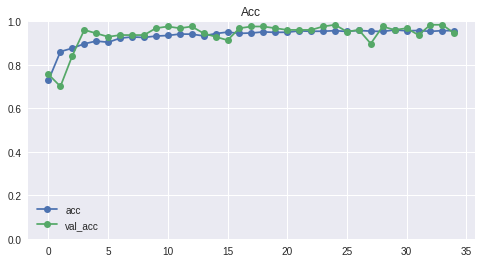


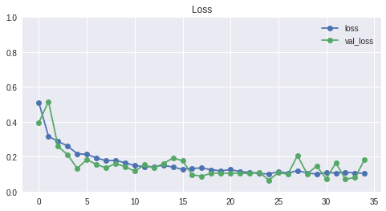


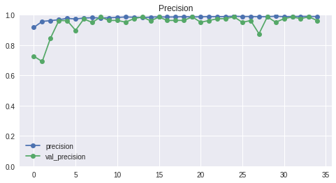


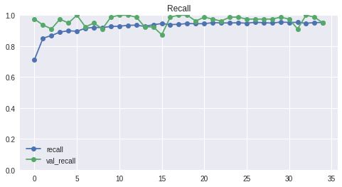


    ------------------------------------------------------------
    16/16 [==============================] - 0s 16ms/step - loss: 0.2884 - acc: 0.8926 - precision: 0.9000 - recall: 0.9310
    loss score: 0.28839099407196045
    accuracy score: 0.892578125
    precision score: 0.8999999761581421
    recall score: 0.931034505367279
    
    Total time to complete: 35.37minutes
    

## RECOMMENDATION:
I highly recommend taking advantage of using callbacks when running models. It allows us to specify the types of models we want to keep, and can even save them in a specified file of our choice. We can have a place holding our best models we can then compare and evaluate. Without using ModelCheckpoint, I would have to manually save the model at the end of training, which may actually be an overfit model (If we don't use EarlyStopping) and may not have been the best model in the group. 

The callbacks we have chosen prevent our models from overfitting and save the models that achieve the lowest 'val_loss' scores for each run. There are many more callbacks, and we will be using one more later on in the project.

#### Our Best 256x256 Custom Model Architecture so far:


```python
def create_cnn_leaky(shape='', opt=tf.keras.optimizers.Adam(), alpha=0.2,
                          metrics=['acc', tf.keras.metrics.Precision(name='precision'),
                              tf.keras.metrics.Recall(name='recall')]):
    if len(shape) < 1:
      print('Please define input shape!')
    else:
      model = Sequential()
      model.add(layers.Conv2D(32, (3,3), input_shape=shape))
      model.add(layers.LeakyReLU(alpha=alpha))
      model.add(MaxPooling2D((2, 2)))
      
      model.add(layers.Conv2D(64, (3,3)))
      model.add(layers.LeakyReLU(alpha=alpha))
      model.add(layers.Conv2D(64, (3,3)))
      model.add(layers.LeakyReLU(alpha=alpha))
      model.add(MaxPooling2D((2, 2)))

      model.add(layers.Conv2D(128, (5, 5)))
      model.add(layers.LeakyReLU(alpha=alpha))
      model.add(layers.Conv2D(128, (5, 5)))
      model.add(layers.LeakyReLU(alpha=alpha))
      model.add(MaxPooling2D((4, 4)))
      
      model.add(layers.Conv2D(256, (3, 3)))
      model.add(layers.LeakyReLU(alpha=alpha))
      model.add(layers.Conv2D(256, (3, 3)))
      model.add(layers.LeakyReLU(alpha=alpha))
      model.add(MaxPooling2D((2, 2)))
      
      model.add(Flatten())
      model.add(layers.Dense(256))
      model.add(layers.LeakyReLU(alpha=alpha))
      model.add(layers.Dropout(0.2))

      model.add(layers.Dense(128))
      model.add(layers.LeakyReLU(alpha=alpha))
      model.add(layers.Dropout(0.2))

      model.add(layers.Dense(64))
      model.add(layers.LeakyReLU(alpha=alpha))

      model.add(layers.Dense(1, activation='sigmoid'))
      model.compile(loss='binary_crossentropy', optimizer=opt, metrics=metrics)
      return model
```


```python
cnn08 = create_cnn_leaky(shape=INPUT_SHAPE, alpha=0.2, 
                         opt=optimizers.Adam(learning_rate=0.0001))
history08 = fit_cnn_gen(cnn08, X_train, y_train, 
                    X_val, y_val, X_test, y_test, 
                    epochs=100, batch_size=32, generator=aug_train_datagen, 
                    class_weights=class_weights_dict,
                    callbacks=make_callbacks(min_delta=0.001, patience=20, 
                                             save_best_only=True, f_path=BIG_PATH, 
                                             restore_best_weights=True, mode='min'))
```

    Epoch 1/100
    163/163 [==============================] - 74s 451ms/step - loss: 0.6045 - acc: 0.5698 - precision: 0.8845 - recall: 0.4841 - val_loss: 0.4794 - val_acc: 0.8189 - val_precision: 0.9667 - val_recall: 0.7342
    Epoch 2/100
    163/163 [==============================] - 73s 446ms/step - loss: 0.4110 - acc: 0.8004 - precision: 0.9417 - recall: 0.7796 - val_loss: 0.4061 - val_acc: 0.8189 - val_precision: 0.9828 - val_recall: 0.7215
    Epoch 3/100
    163/163 [==============================] - 73s 447ms/step - loss: 0.3590 - acc: 0.8292 - precision: 0.9579 - recall: 0.8054 - val_loss: 0.2761 - val_acc: 0.8898 - val_precision: 0.9577 - val_recall: 0.8608
    Epoch 4/100
    163/163 [==============================] - 73s 446ms/step - loss: 0.3220 - acc: 0.8482 - precision: 0.9636 - recall: 0.8268 - val_loss: 0.2919 - val_acc: 0.8976 - val_precision: 0.9459 - val_recall: 0.8861
    Epoch 5/100
    163/163 [==============================] - 73s 445ms/step - loss: 0.2976 - acc: 0.8610 - precision: 0.9676 - recall: 0.8410 - val_loss: 0.2542 - val_acc: 0.9134 - val_precision: 0.9722 - val_recall: 0.8861
    Epoch 6/100
    163/163 [==============================] - 73s 445ms/step - loss: 0.2874 - acc: 0.8735 - precision: 0.9732 - recall: 0.8532 - val_loss: 0.2645 - val_acc: 0.8898 - val_precision: 0.9710 - val_recall: 0.8481
    Epoch 7/100
    163/163 [==============================] - 72s 443ms/step - loss: 0.2822 - acc: 0.8767 - precision: 0.9725 - recall: 0.8583 - val_loss: 0.2957 - val_acc: 0.9213 - val_precision: 0.9059 - val_recall: 0.9747
    Epoch 8/100
    163/163 [==============================] - 72s 440ms/step - loss: 0.2656 - acc: 0.8819 - precision: 0.9744 - recall: 0.8637 - val_loss: 0.2303 - val_acc: 0.9291 - val_precision: 0.9730 - val_recall: 0.9114
    Epoch 9/100
    163/163 [==============================] - 72s 439ms/step - loss: 0.2677 - acc: 0.8806 - precision: 0.9713 - recall: 0.8648 - val_loss: 0.2760 - val_acc: 0.9134 - val_precision: 0.9722 - val_recall: 0.8861
    Epoch 10/100
    163/163 [==============================] - 72s 443ms/step - loss: 0.2672 - acc: 0.8836 - precision: 0.9731 - recall: 0.8674 - val_loss: 0.2878 - val_acc: 0.8819 - val_precision: 0.9706 - val_recall: 0.8354
    Epoch 11/100
    163/163 [==============================] - 72s 440ms/step - loss: 0.2559 - acc: 0.8852 - precision: 0.9718 - recall: 0.8707 - val_loss: 0.2762 - val_acc: 0.9055 - val_precision: 0.9855 - val_recall: 0.8608
    Epoch 12/100
    163/163 [==============================] - 72s 439ms/step - loss: 0.2443 - acc: 0.8877 - precision: 0.9743 - recall: 0.8717 - val_loss: 0.2596 - val_acc: 0.8976 - val_precision: 0.9853 - val_recall: 0.8481
    Epoch 13/100
    163/163 [==============================] - 71s 434ms/step - loss: 0.2353 - acc: 0.8974 - precision: 0.9769 - recall: 0.8828 - val_loss: 0.2097 - val_acc: 0.9449 - val_precision: 0.9865 - val_recall: 0.9241
    Epoch 14/100
    163/163 [==============================] - 72s 439ms/step - loss: 0.2271 - acc: 0.9016 - precision: 0.9784 - recall: 0.8872 - val_loss: 0.2323 - val_acc: 0.9370 - val_precision: 0.9176 - val_recall: 0.9873
    Epoch 15/100
    163/163 [==============================] - 71s 438ms/step - loss: 0.2257 - acc: 0.9076 - precision: 0.9788 - recall: 0.8950 - val_loss: 0.1439 - val_acc: 0.9606 - val_precision: 0.9744 - val_recall: 0.9620
    Epoch 16/100
    163/163 [==============================] - 72s 439ms/step - loss: 0.2119 - acc: 0.9091 - precision: 0.9775 - recall: 0.8983 - val_loss: 0.2241 - val_acc: 0.9370 - val_precision: 0.9080 - val_recall: 1.0000
    Epoch 17/100
    163/163 [==============================] - 71s 436ms/step - loss: 0.2092 - acc: 0.9078 - precision: 0.9762 - recall: 0.8978 - val_loss: 0.1673 - val_acc: 0.9764 - val_precision: 0.9634 - val_recall: 1.0000
    Epoch 18/100
    163/163 [==============================] - 71s 438ms/step - loss: 0.2105 - acc: 0.9093 - precision: 0.9757 - recall: 0.9004 - val_loss: 0.1940 - val_acc: 0.9528 - val_precision: 0.9867 - val_recall: 0.9367
    Epoch 19/100
    163/163 [==============================] - 71s 435ms/step - loss: 0.2078 - acc: 0.9116 - precision: 0.9760 - recall: 0.9032 - val_loss: 0.1603 - val_acc: 0.9843 - val_precision: 0.9753 - val_recall: 1.0000
    Epoch 20/100
    163/163 [==============================] - 71s 435ms/step - loss: 0.2025 - acc: 0.9120 - precision: 0.9784 - recall: 0.9014 - val_loss: 0.1118 - val_acc: 0.9921 - val_precision: 0.9875 - val_recall: 1.0000
    Epoch 21/100
    163/163 [==============================] - 71s 435ms/step - loss: 0.1941 - acc: 0.9174 - precision: 0.9802 - recall: 0.9071 - val_loss: 0.1166 - val_acc: 0.9843 - val_precision: 0.9753 - val_recall: 1.0000
    Epoch 22/100
    163/163 [==============================] - 71s 433ms/step - loss: 0.2050 - acc: 0.9141 - precision: 0.9769 - recall: 0.9058 - val_loss: 0.1479 - val_acc: 0.9606 - val_precision: 0.9868 - val_recall: 0.9494
    Epoch 23/100
    163/163 [==============================] - 71s 436ms/step - loss: 0.1811 - acc: 0.9231 - precision: 0.9801 - recall: 0.9151 - val_loss: 0.1192 - val_acc: 0.9764 - val_precision: 0.9872 - val_recall: 0.9747
    Epoch 24/100
    163/163 [==============================] - 71s 436ms/step - loss: 0.1768 - acc: 0.9281 - precision: 0.9816 - recall: 0.9205 - val_loss: 0.1292 - val_acc: 0.9843 - val_precision: 0.9753 - val_recall: 1.0000
    Epoch 25/100
    163/163 [==============================] - 72s 439ms/step - loss: 0.1723 - acc: 0.9296 - precision: 0.9829 - recall: 0.9213 - val_loss: 0.1841 - val_acc: 0.9528 - val_precision: 0.9294 - val_recall: 1.0000
    Epoch 26/100
    163/163 [==============================] - 72s 441ms/step - loss: 0.1959 - acc: 0.9212 - precision: 0.9785 - recall: 0.9141 - val_loss: 0.0917 - val_acc: 0.9921 - val_precision: 0.9875 - val_recall: 1.0000
    Epoch 27/100
    163/163 [==============================] - 72s 441ms/step - loss: 0.1706 - acc: 0.9294 - precision: 0.9805 - recall: 0.9234 - val_loss: 0.0873 - val_acc: 0.9843 - val_precision: 0.9753 - val_recall: 1.0000
    Epoch 28/100
    163/163 [==============================] - 72s 441ms/step - loss: 0.1638 - acc: 0.9327 - precision: 0.9819 - recall: 0.9265 - val_loss: 0.1318 - val_acc: 0.9764 - val_precision: 0.9872 - val_recall: 0.9747
    Epoch 29/100
    163/163 [==============================] - 72s 442ms/step - loss: 0.1677 - acc: 0.9348 - precision: 0.9844 - recall: 0.9270 - val_loss: 0.1160 - val_acc: 0.9843 - val_precision: 0.9753 - val_recall: 1.0000
    Epoch 30/100
    163/163 [==============================] - 72s 442ms/step - loss: 0.1632 - acc: 0.9321 - precision: 0.9825 - recall: 0.9252 - val_loss: 0.1129 - val_acc: 0.9843 - val_precision: 0.9753 - val_recall: 1.0000
    Epoch 31/100
    163/163 [==============================] - 72s 443ms/step - loss: 0.1565 - acc: 0.9369 - precision: 0.9855 - recall: 0.9288 - val_loss: 0.0724 - val_acc: 0.9843 - val_precision: 0.9753 - val_recall: 1.0000
    Epoch 32/100
    163/163 [==============================] - 72s 442ms/step - loss: 0.1536 - acc: 0.9365 - precision: 0.9849 - recall: 0.9288 - val_loss: 0.0719 - val_acc: 0.9921 - val_precision: 0.9875 - val_recall: 1.0000
    Epoch 33/100
    163/163 [==============================] - 72s 442ms/step - loss: 0.1460 - acc: 0.9404 - precision: 0.9842 - recall: 0.9347 - val_loss: 0.0799 - val_acc: 0.9843 - val_precision: 0.9753 - val_recall: 1.0000
    Epoch 34/100
    163/163 [==============================] - 71s 438ms/step - loss: 0.1434 - acc: 0.9406 - precision: 0.9850 - recall: 0.9342 - val_loss: 0.1156 - val_acc: 0.9685 - val_precision: 0.9518 - val_recall: 1.0000
    Epoch 35/100
    163/163 [==============================] - 71s 437ms/step - loss: 0.1427 - acc: 0.9402 - precision: 0.9850 - recall: 0.9337 - val_loss: 0.1047 - val_acc: 0.9764 - val_precision: 0.9634 - val_recall: 1.0000
    Epoch 36/100
    163/163 [==============================] - 71s 438ms/step - loss: 0.1532 - acc: 0.9431 - precision: 0.9853 - recall: 0.9373 - val_loss: 0.0632 - val_acc: 0.9921 - val_precision: 0.9875 - val_recall: 1.0000
    Epoch 37/100
    163/163 [==============================] - 71s 436ms/step - loss: 0.1442 - acc: 0.9410 - precision: 0.9853 - recall: 0.9345 - val_loss: 0.0589 - val_acc: 0.9843 - val_precision: 0.9753 - val_recall: 1.0000
    Epoch 38/100
    163/163 [==============================] - 71s 437ms/step - loss: 0.1389 - acc: 0.9442 - precision: 0.9841 - recall: 0.9401 - val_loss: 0.0859 - val_acc: 0.9843 - val_precision: 0.9753 - val_recall: 1.0000
    Epoch 39/100
    163/163 [==============================] - 71s 434ms/step - loss: 0.1402 - acc: 0.9421 - precision: 0.9864 - recall: 0.9350 - val_loss: 0.1244 - val_acc: 0.9764 - val_precision: 0.9634 - val_recall: 1.0000
    Epoch 40/100
    163/163 [==============================] - 71s 433ms/step - loss: 0.1389 - acc: 0.9459 - precision: 0.9854 - recall: 0.9412 - val_loss: 0.0913 - val_acc: 0.9764 - val_precision: 0.9750 - val_recall: 0.9873
    Epoch 41/100
    163/163 [==============================] - 70s 429ms/step - loss: 0.1420 - acc: 0.9427 - precision: 0.9859 - recall: 0.9363 - val_loss: 0.0592 - val_acc: 0.9921 - val_precision: 0.9875 - val_recall: 1.0000
    Epoch 42/100
    163/163 [==============================] - 71s 435ms/step - loss: 0.1318 - acc: 0.9452 - precision: 0.9854 - recall: 0.9401 - val_loss: 0.1246 - val_acc: 0.9685 - val_precision: 0.9870 - val_recall: 0.9620
    Epoch 43/100
    163/163 [==============================] - 70s 427ms/step - loss: 0.1305 - acc: 0.9465 - precision: 0.9862 - recall: 0.9412 - val_loss: 0.1028 - val_acc: 0.9606 - val_precision: 0.9868 - val_recall: 0.9494
    Epoch 44/100
    163/163 [==============================] - 68s 418ms/step - loss: 0.1288 - acc: 0.9505 - precision: 0.9868 - recall: 0.9461 - val_loss: 0.0601 - val_acc: 0.9843 - val_precision: 0.9873 - val_recall: 0.9873
    Epoch 45/100
    163/163 [==============================] - 68s 416ms/step - loss: 0.1411 - acc: 0.9459 - precision: 0.9867 - recall: 0.9399 - val_loss: 0.0992 - val_acc: 0.9843 - val_precision: 0.9873 - val_recall: 0.9873
    Epoch 46/100
    163/163 [==============================] - 69s 421ms/step - loss: 0.1340 - acc: 0.9475 - precision: 0.9868 - recall: 0.9419 - val_loss: 0.0909 - val_acc: 0.9843 - val_precision: 0.9873 - val_recall: 0.9873
    Epoch 47/100
    163/163 [==============================] - 68s 418ms/step - loss: 0.1207 - acc: 0.9490 - precision: 0.9876 - recall: 0.9432 - val_loss: 0.0760 - val_acc: 0.9843 - val_precision: 0.9873 - val_recall: 0.9873
    Epoch 48/100
    163/163 [==============================] - 67s 411ms/step - loss: 0.1259 - acc: 0.9492 - precision: 0.9868 - recall: 0.9443 - val_loss: 0.0798 - val_acc: 0.9843 - val_precision: 0.9753 - val_recall: 1.0000
    Epoch 49/100
    163/163 [==============================] - 67s 412ms/step - loss: 0.1192 - acc: 0.9540 - precision: 0.9882 - recall: 0.9494 - val_loss: 0.0556 - val_acc: 0.9921 - val_precision: 0.9875 - val_recall: 1.0000
    Epoch 50/100
    163/163 [==============================] - 67s 412ms/step - loss: 0.1366 - acc: 0.9411 - precision: 0.9837 - recall: 0.9363 - val_loss: 0.1058 - val_acc: 0.9606 - val_precision: 0.9868 - val_recall: 0.9494
    Epoch 51/100
    163/163 [==============================] - 66s 407ms/step - loss: 0.1240 - acc: 0.9505 - precision: 0.9868 - recall: 0.9461 - val_loss: 0.0515 - val_acc: 0.9921 - val_precision: 0.9875 - val_recall: 1.0000
    Epoch 52/100
    163/163 [==============================] - 66s 405ms/step - loss: 0.1254 - acc: 0.9530 - precision: 0.9887 - recall: 0.9476 - val_loss: 0.0730 - val_acc: 0.9764 - val_precision: 0.9750 - val_recall: 0.9873
    Epoch 53/100
    163/163 [==============================] - 66s 404ms/step - loss: 0.1236 - acc: 0.9530 - precision: 0.9871 - recall: 0.9492 - val_loss: 0.0935 - val_acc: 0.9764 - val_precision: 0.9750 - val_recall: 0.9873
    Epoch 54/100
    163/163 [==============================] - 66s 405ms/step - loss: 0.1243 - acc: 0.9532 - precision: 0.9866 - recall: 0.9499 - val_loss: 0.0616 - val_acc: 0.9921 - val_precision: 0.9875 - val_recall: 1.0000
    Epoch 55/100
    163/163 [==============================] - 65s 401ms/step - loss: 0.1239 - acc: 0.9519 - precision: 0.9855 - recall: 0.9492 - val_loss: 0.0885 - val_acc: 0.9685 - val_precision: 0.9870 - val_recall: 0.9620
    Epoch 56/100
    163/163 [==============================] - 65s 400ms/step - loss: 0.1125 - acc: 0.9526 - precision: 0.9882 - recall: 0.9476 - val_loss: 0.0675 - val_acc: 0.9764 - val_precision: 1.0000 - val_recall: 0.9620
    Epoch 57/100
    163/163 [==============================] - 66s 404ms/step - loss: 0.1279 - acc: 0.9500 - precision: 0.9858 - recall: 0.9463 - val_loss: 0.0685 - val_acc: 0.9685 - val_precision: 0.9747 - val_recall: 0.9747
    Epoch 58/100
    163/163 [==============================] - 66s 406ms/step - loss: 0.1100 - acc: 0.9582 - precision: 0.9888 - recall: 0.9546 - val_loss: 0.0498 - val_acc: 0.9921 - val_precision: 0.9875 - val_recall: 1.0000
    Epoch 59/100
    163/163 [==============================] - 66s 405ms/step - loss: 0.1232 - acc: 0.9534 - precision: 0.9856 - recall: 0.9512 - val_loss: 0.1064 - val_acc: 0.9764 - val_precision: 0.9872 - val_recall: 0.9747
    Epoch 60/100
    163/163 [==============================] - 65s 398ms/step - loss: 0.1076 - acc: 0.9559 - precision: 0.9903 - recall: 0.9499 - val_loss: 0.0957 - val_acc: 0.9843 - val_precision: 0.9873 - val_recall: 0.9873
    Epoch 61/100
    163/163 [==============================] - 65s 399ms/step - loss: 0.1187 - acc: 0.9534 - precision: 0.9871 - recall: 0.9497 - val_loss: 0.0702 - val_acc: 0.9764 - val_precision: 0.9750 - val_recall: 0.9873
    Epoch 62/100
    163/163 [==============================] - 65s 399ms/step - loss: 0.1053 - acc: 0.9565 - precision: 0.9890 - recall: 0.9520 - val_loss: 0.0865 - val_acc: 0.9764 - val_precision: 0.9750 - val_recall: 0.9873
    Epoch 63/100
    163/163 [==============================] - 65s 400ms/step - loss: 0.1107 - acc: 0.9548 - precision: 0.9874 - recall: 0.9512 - val_loss: 0.0472 - val_acc: 0.9764 - val_precision: 0.9872 - val_recall: 0.9747
    Epoch 64/100
    163/163 [==============================] - 66s 402ms/step - loss: 0.1142 - acc: 0.9559 - precision: 0.9880 - recall: 0.9523 - val_loss: 0.0712 - val_acc: 0.9843 - val_precision: 0.9873 - val_recall: 0.9873
    Epoch 65/100
    163/163 [==============================] - 66s 402ms/step - loss: 0.1085 - acc: 0.9549 - precision: 0.9874 - recall: 0.9515 - val_loss: 0.0628 - val_acc: 0.9921 - val_precision: 0.9875 - val_recall: 1.0000
    Epoch 66/100
    163/163 [==============================] - 66s 403ms/step - loss: 0.1081 - acc: 0.9580 - precision: 0.9896 - recall: 0.9535 - val_loss: 0.0891 - val_acc: 0.9764 - val_precision: 0.9872 - val_recall: 0.9747
    Epoch 67/100
    163/163 [==============================] - 65s 400ms/step - loss: 0.1137 - acc: 0.9557 - precision: 0.9893 - recall: 0.9507 - val_loss: 0.0602 - val_acc: 0.9921 - val_precision: 0.9875 - val_recall: 1.0000
    Epoch 68/100
    163/163 [==============================] - 65s 398ms/step - loss: 0.1111 - acc: 0.9563 - precision: 0.9880 - recall: 0.9528 - val_loss: 0.0710 - val_acc: 0.9764 - val_precision: 0.9872 - val_recall: 0.9747
    Epoch 69/100
    163/163 [==============================] - 65s 396ms/step - loss: 0.1091 - acc: 0.9551 - precision: 0.9874 - recall: 0.9517 - val_loss: 0.0833 - val_acc: 0.9764 - val_precision: 0.9634 - val_recall: 1.0000
    Epoch 70/100
    163/163 [==============================] - 64s 394ms/step - loss: 0.1169 - acc: 0.9484 - precision: 0.9852 - recall: 0.9448 - val_loss: 0.0772 - val_acc: 0.9685 - val_precision: 0.9747 - val_recall: 0.9747
    Epoch 71/100
    163/163 [==============================] - 64s 393ms/step - loss: 0.0987 - acc: 0.9605 - precision: 0.9917 - recall: 0.9548 - val_loss: 0.0783 - val_acc: 0.9606 - val_precision: 0.9744 - val_recall: 0.9620
    Epoch 72/100
    163/163 [==============================] - 64s 393ms/step - loss: 0.1045 - acc: 0.9584 - precision: 0.9901 - recall: 0.9535 - val_loss: 0.0383 - val_acc: 0.9843 - val_precision: 0.9873 - val_recall: 0.9873
    Epoch 73/100
    163/163 [==============================] - 64s 391ms/step - loss: 0.0974 - acc: 0.9580 - precision: 0.9890 - recall: 0.9541 - val_loss: 0.0714 - val_acc: 0.9921 - val_precision: 0.9875 - val_recall: 1.0000
    Epoch 74/100
    163/163 [==============================] - 63s 386ms/step - loss: 0.1144 - acc: 0.9561 - precision: 0.9882 - recall: 0.9523 - val_loss: 0.0399 - val_acc: 0.9921 - val_precision: 0.9875 - val_recall: 1.0000
    Epoch 75/100
    163/163 [==============================] - 63s 387ms/step - loss: 0.0989 - acc: 0.9640 - precision: 0.9899 - recall: 0.9613 - val_loss: 0.0486 - val_acc: 0.9843 - val_precision: 0.9873 - val_recall: 0.9873
    Epoch 76/100
    163/163 [==============================] - 63s 386ms/step - loss: 0.0997 - acc: 0.9599 - precision: 0.9893 - recall: 0.9564 - val_loss: 0.0407 - val_acc: 0.9921 - val_precision: 0.9875 - val_recall: 1.0000
    Epoch 77/100
    163/163 [==============================] - 63s 387ms/step - loss: 0.0952 - acc: 0.9647 - precision: 0.9915 - recall: 0.9608 - val_loss: 0.0519 - val_acc: 0.9843 - val_precision: 0.9873 - val_recall: 0.9873
    Epoch 78/100
    163/163 [==============================] - 63s 388ms/step - loss: 0.0976 - acc: 0.9615 - precision: 0.9907 - recall: 0.9572 - val_loss: 0.0513 - val_acc: 0.9843 - val_precision: 0.9873 - val_recall: 0.9873
    Epoch 79/100
    163/163 [==============================] - 63s 386ms/step - loss: 0.0988 - acc: 0.9578 - precision: 0.9867 - recall: 0.9561 - val_loss: 0.0523 - val_acc: 0.9843 - val_precision: 0.9753 - val_recall: 1.0000
    Epoch 80/100
    163/163 [==============================] - 63s 386ms/step - loss: 0.0970 - acc: 0.9607 - precision: 0.9901 - recall: 0.9566 - val_loss: 0.0600 - val_acc: 0.9606 - val_precision: 1.0000 - val_recall: 0.9367
    Epoch 81/100
    163/163 [==============================] - 63s 384ms/step - loss: 0.0878 - acc: 0.9640 - precision: 0.9909 - recall: 0.9603 - val_loss: 0.0733 - val_acc: 0.9921 - val_precision: 0.9875 - val_recall: 1.0000
    Epoch 82/100
    163/163 [==============================] - 63s 387ms/step - loss: 0.0959 - acc: 0.9626 - precision: 0.9909 - recall: 0.9585 - val_loss: 0.1032 - val_acc: 0.9764 - val_precision: 0.9872 - val_recall: 0.9747
    Epoch 83/100
    163/163 [==============================] - 63s 388ms/step - loss: 0.1067 - acc: 0.9613 - precision: 0.9909 - recall: 0.9566 - val_loss: 0.0863 - val_acc: 0.9843 - val_precision: 0.9753 - val_recall: 1.0000
    Epoch 84/100
    163/163 [==============================] - 63s 386ms/step - loss: 0.0976 - acc: 0.9603 - precision: 0.9899 - recall: 0.9564 - val_loss: 0.0582 - val_acc: 0.9843 - val_precision: 0.9873 - val_recall: 0.9873
    Epoch 85/100
    163/163 [==============================] - 63s 386ms/step - loss: 0.0974 - acc: 0.9636 - precision: 0.9896 - recall: 0.9610 - val_loss: 0.0620 - val_acc: 0.9843 - val_precision: 0.9873 - val_recall: 0.9873
    Epoch 86/100
    163/163 [==============================] - 63s 388ms/step - loss: 0.0846 - acc: 0.9638 - precision: 0.9902 - recall: 0.9608 - val_loss: 0.0699 - val_acc: 0.9606 - val_precision: 0.9744 - val_recall: 0.9620
    Epoch 87/100
    163/163 [==============================] - 63s 388ms/step - loss: 0.0929 - acc: 0.9634 - precision: 0.9907 - recall: 0.9597 - val_loss: 0.0826 - val_acc: 0.9764 - val_precision: 0.9872 - val_recall: 0.9747
    Epoch 88/100
    163/163 [==============================] - 63s 389ms/step - loss: 0.1003 - acc: 0.9636 - precision: 0.9902 - recall: 0.9605 - val_loss: 0.0509 - val_acc: 0.9843 - val_precision: 0.9753 - val_recall: 1.0000
    Epoch 89/100
    163/163 [==============================] - 63s 385ms/step - loss: 0.0863 - acc: 0.9651 - precision: 0.9902 - recall: 0.9626 - val_loss: 0.0656 - val_acc: 0.9921 - val_precision: 0.9875 - val_recall: 1.0000
    Epoch 90/100
    163/163 [==============================] - 63s 389ms/step - loss: 0.0931 - acc: 0.9599 - precision: 0.9898 - recall: 0.9559 - val_loss: 0.0639 - val_acc: 0.9764 - val_precision: 0.9872 - val_recall: 0.9747
    Epoch 91/100
    163/163 [==============================] - 63s 386ms/step - loss: 0.1021 - acc: 0.9555 - precision: 0.9869 - recall: 0.9528 - val_loss: 0.0736 - val_acc: 0.9764 - val_precision: 0.9872 - val_recall: 0.9747
    Epoch 92/100
    163/163 [==============================] - 63s 388ms/step - loss: 0.0862 - acc: 0.9655 - precision: 0.9910 - recall: 0.9623 - val_loss: 0.0858 - val_acc: 0.9764 - val_precision: 0.9872 - val_recall: 0.9747
    ---------------------------------------------------------
                      Classification Report
    
                  precision    recall  f1-score   support
    
             0.0       0.95      0.83      0.89       193
             1.0       0.90      0.97      0.94       319
    
        accuracy                           0.92       512
       macro avg       0.93      0.90      0.91       512
    weighted avg       0.92      0.92      0.92       512
    
    ---------------------------------------------------------
    


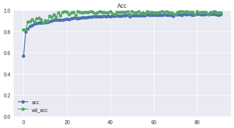


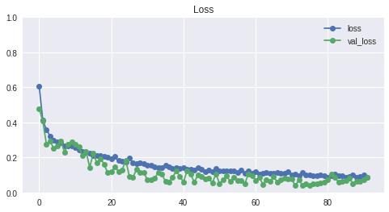


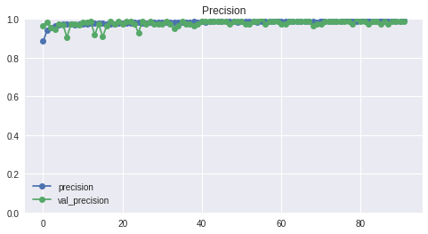


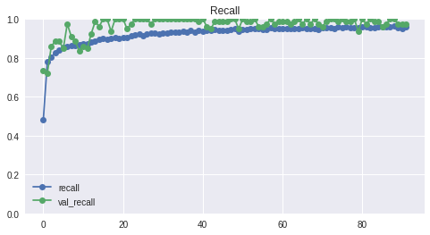


    ------------------------------------------------------------
    16/16 [==============================] - 0s 23ms/step - loss: 0.2803 - acc: 0.9199 - precision: 0.9041 - recall: 0.9749
    loss score: 0.2802964448928833
    accuracy score: 0.919921875
    precision score: 0.9040697813034058
    recall score: 0.9749216437339783
    

The above model produced our best created model that uses 256x256 image sizes.

#### Loading in Best Models (256x256)

This section is how we were able to take advantage of ModelCheckpoint and Earlystopping - we have been saving our models in a specific folder, and can now go into that folder and choose models based on a certain metric threshold (in this case we chose accuracy) and move these models that surpass that threshold into a folder we deem as 'best models'.


```python
def move_best_models(source, X_test, y_test, new_dir, threshold=0.9):
  """
  Definition: Moves all models within the source file if the model's accuracy
  is greater than the set threshold based off of the model.evaluate() method.

  Args:
  source: Provide the file source to filter through models.
  X_test: Provide the X_test variable to evaluate the model against.
  y_test: Provide the y_test variable to evaluate the model against.
  new_dir: Provide new directory for the filtered models to move to. Can be a 
  folder that is not yet created.
  threshold: default = 0.9. The model's accuracy must be higher than this float
  to be able to move into the new folder.

  Returns:
  Prints the evaluation metrics for each model, along with the model name if the 
  model accuracy is higher than the designated threshold. 
  """
  
  model_list = []
  os.makedirs(new_dir, exist_ok=True)
  for file in os.listdir(source):
    try:
      model = load_model(source + file)
      eval = model.evaluate(X_test, y_test)
      if eval[1] > threshold:
        print(file)
        model_list.append(file)
    except:
      continue
  for f in model_list:
          shutil.move(source+f, new_dir)
```

#### Filter through 256x256 models

Run this code below to filter through newly created models and place models with an accuracy > 0.90 into the new_dirs folder. We go through this process for all of our model types.


```python
# the file location where we've stored all of our 256x256 models
source = '/content/drive/MyDrive/gdrive/models/pneumonia_models/big_mods256/'

# the file location where we want to move the best models from our 'source'
new_dirs = '/content/drive/MyDrive/gdrive/models/pneumonia_models/best_models/big/'

# We define the accuracy threshold to be 0.9 -- the model must have a higher accuracy
# than 90% in order to be moved into the 'new_dirs' file
move_best_models(source, X_test, y_test, new_dirs, threshold=0.90)
```

    16/16 [==============================] - 0s 16ms/step - loss: 0.3976 - acc: 0.8203 - precision: 0.7888 - recall: 0.9718
    16/16 [==============================] - 0s 16ms/step - loss: 0.3687 - acc: 0.8359 - precision: 0.8426 - recall: 0.9060
    16/16 [==============================] - 0s 16ms/step - loss: 0.3304 - acc: 0.8770 - precision: 0.8879 - recall: 0.9185
    16/16 [==============================] - 0s 16ms/step - loss: 0.3329 - acc: 0.8789 - precision: 0.8836 - recall: 0.9279
    16/16 [==============================] - 0s 16ms/step - loss: 0.3465 - acc: 0.8750 - precision: 0.8512 - recall: 0.9687
    16/16 [==============================] - 0s 16ms/step - loss: 0.2895 - acc: 0.8828 - precision: 0.8754 - recall: 0.9467
    16/16 [==============================] - 0s 16ms/step - loss: 0.2754 - acc: 0.8867 - precision: 0.8850 - recall: 0.9404
    16/16 [==============================] - 0s 16ms/step - loss: 0.2884 - acc: 0.8926 - precision: 0.9000 - recall: 0.9310
    16/16 [==============================] - 0s 16ms/step - loss: 0.4806 - acc: 0.7480 - precision: 0.7436 - recall: 0.9091
    16/16 [==============================] - 0s 16ms/step - loss: 0.3118 - acc: 0.8867 - precision: 0.9251 - recall: 0.8903
    16/16 [==============================] - 0s 16ms/step - loss: 0.3098 - acc: 0.8711 - precision: 0.8584 - recall: 0.9498
    16/16 [==============================] - 0s 16ms/step - loss: 0.3305 - acc: 0.8477 - precision: 0.9446 - recall: 0.8025
    16/16 [==============================] - 0s 16ms/step - loss: 0.2706 - acc: 0.8867 - precision: 0.9040 - recall: 0.9154
    16/16 [==============================] - 0s 16ms/step - loss: 0.2766 - acc: 0.8867 - precision: 0.8739 - recall: 0.9561
    16/16 [==============================] - 0s 16ms/step - loss: 0.3016 - acc: 0.8965 - precision: 0.8982 - recall: 0.9404
    16/16 [==============================] - 0s 16ms/step - loss: 0.2676 - acc: 0.9160 - precision: 0.9059 - recall: 0.9655
    wgt-improv-12-0.07.hdf5
    16/16 [==============================] - 0s 16ms/step - loss: 0.7895 - acc: 0.5430 - precision: 0.8058 - recall: 0.3511
    16/16 [==============================] - 0s 16ms/step - loss: 0.6614 - acc: 0.6230 - precision: 0.9500 - recall: 0.4169
    16/16 [==============================] - 0s 16ms/step - loss: 0.7125 - acc: 0.6523 - precision: 0.9669 - recall: 0.4577
    16/16 [==============================] - 0s 16ms/step - loss: 0.4070 - acc: 0.8086 - precision: 0.9048 - recall: 0.7743
    16/16 [==============================] - 0s 16ms/step - loss: 0.4023 - acc: 0.8340 - precision: 0.8128 - recall: 0.9530
    16/16 [==============================] - 0s 16ms/step - loss: 0.4724 - acc: 0.8164 - precision: 0.7805 - recall: 0.9812
    16/16 [==============================] - 0s 16ms/step - loss: 0.7278 - acc: 0.6445 - precision: 0.8703 - recall: 0.5047
    16/16 [==============================] - 0s 16ms/step - loss: 0.5859 - acc: 0.6875 - precision: 0.8442 - recall: 0.6113
    16/16 [==============================] - 0s 16ms/step - loss: 0.4516 - acc: 0.7988 - precision: 0.8293 - recall: 0.8527
    16/16 [==============================] - 0s 16ms/step - loss: 0.5288 - acc: 0.7344 - precision: 0.8927 - recall: 0.6520
    16/16 [==============================] - 0s 16ms/step - loss: 0.4626 - acc: 0.7500 - precision: 0.9704 - recall: 0.6176
    16/16 [==============================] - 0s 16ms/step - loss: 0.3741 - acc: 0.8320 - precision: 0.8397 - recall: 0.9028
    16/16 [==============================] - 0s 17ms/step - loss: 0.3513 - acc: 0.8477 - precision: 0.9228 - recall: 0.8245
    16/16 [==============================] - 0s 16ms/step - loss: 0.3806 - acc: 0.8262 - precision: 0.9323 - recall: 0.7774
    16/16 [==============================] - 0s 16ms/step - loss: 0.3674 - acc: 0.8652 - precision: 0.8551 - recall: 0.9436
    16/16 [==============================] - 0s 16ms/step - loss: 0.3635 - acc: 0.8672 - precision: 0.8575 - recall: 0.9436
    16/16 [==============================] - 0s 16ms/step - loss: 0.3217 - acc: 0.8770 - precision: 0.8810 - recall: 0.9279
    16/16 [==============================] - 0s 17ms/step - loss: 0.3625 - acc: 0.8633 - precision: 0.8392 - recall: 0.9655
    16/16 [==============================] - 0s 16ms/step - loss: 0.3090 - acc: 0.8887 - precision: 0.9199 - recall: 0.8997
    16/16 [==============================] - 0s 16ms/step - loss: 0.3297 - acc: 0.8848 - precision: 0.9194 - recall: 0.8934
    16/16 [==============================] - 0s 16ms/step - loss: 0.4224 - acc: 0.8730 - precision: 0.8489 - recall: 0.9687
    

### Loading in Best Models (256x256)


```python
best_model3 = load_model('/content/drive/MyDrive/gdrive/models/pneumonia_models/best_models/big/wgt-improv-72-0.04.hdf5')
class_report(best_model3, X_test, y_test)
best_model3.evaluate(X_test, y_test)
```

    ---------------------------------------------------------
                      Classification Report
    
                  precision    recall  f1-score   support
    
             0.0       0.95      0.83      0.89       193
             1.0       0.90      0.97      0.94       319
    
        accuracy                           0.92       512
       macro avg       0.93      0.90      0.91       512
    weighted avg       0.92      0.92      0.92       512
    
    ---------------------------------------------------------
    


    16/16 [==============================] - 1s 32ms/step - loss: 0.2803 - acc: 0.9199 - precision: 0.9041 - recall: 0.9749
    


    [0.28029748797416687, 0.919921875, 0.9040697813034058, 0.9749216437339783]


## Training Models on a Smaller image size

So far, we've been training models on image sizes of 256x256. While those sizes provided more data (more pixels), they also took our models a lot of time to train (30-40 minutes, depending on the number of epochs and our EarlyStopping parameters we used). Below, we are going to switch image sizes to 64x64 and see if we can reduce the amount of time it takes to train the models and get close to the scores of our best models that are training on larger image sizes.


```python
# Setting our new, smaller image size
SMALL_IMG = (64, 64)

# Creating new ImageDataGenerators for our small set
# Note that this is an unneeded step, we could use the other IDG's as well
train_datagen_small = ImageDataGenerator(rescale = 1./255)
test_val_datagen_small = ImageDataGenerator(rescale = 1./255, 
                                      validation_split=VAL_SPLIT)
```


```python
train_set_small = train_datagen_small.flow_from_directory(train_folder, 
                                                   target_size=SMALL_IMG,
                                                   batch_size=TRAIN_BATCH_SIZE,
                                                   class_mode='binary')

test_set_small = test_val_datagen_small.flow_from_directory(test_folder, 
                                                     target_size=SMALL_IMG,
                                                     batch_size=TEST_BATCH_SIZE,
                                                     class_mode='binary', 
                                                     subset='training')

val_set_small = test_val_datagen_small.flow_from_directory(test_folder, 
                                                    target_size=SMALL_IMG,
                                                    batch_size=VAL_BATCH_SIZE,
                                                    class_mode='binary', 
                                                    subset='validation')
```

    Found 5216 images belonging to 2 classes.
    Found 513 images belonging to 2 classes.
    Found 127 images belonging to 2 classes.
    


```python
start = time.time()
Xs_train, ys_train = next(train_set_small)
Xs_test, ys_test = next(test_set_small)
Xs_val, ys_val = next(val_set_small)
end = time.time()
print(f"Total time to run this cell: {round((end - start) / 60, 2)} minutes")
```

    Total time to run this cell: 1.14 minutes
    

Notice the size of our image has decreased dramatically. Just because we are unable to make out much does not mean that the models cannot properly diagnose what class the image belongs to.


```python
random_image(Xs_train, ys_train)
```

    Pneumonia Class --> 1.0
    


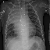


```python
INPUT_SHAPE_small = Xs_train.shape[1:]
print(INPUT_SHAPE_small)
```

    (64, 64, 3)
    


```python
# This is the same as our other DataGenerator, we are just bringing it 
# down to view the augmentations
aug_train_small_datagen = ImageDataGenerator(rotation_range=45, 
                                   width_shift_range=0.2, 
                                   height_shift_range=0.2, 
                                   shear_range=0.2, 
                                   zoom_range=0.2, 
                                   horizontal_flip=True)
```

We will start by creating a rather basic CNN using our smaller images to get a feel for what we may want to improve on.


```python
# New path to put our models with smaller images
SMALL_PATH = '/content/drive/My Drive/gdrive/models/pneumonia_models/small_mods64/'
```


```python
def create_small_cnn(shape='', opt=tf.keras.optimizers.Adam(), 
                          metrics=['acc', tf.keras.metrics.Precision(name='precision'),
                              tf.keras.metrics.Recall(name='recall')]):
    if len(shape) < 1:
      print('Please define input shape!')
    else:
      model = Sequential()
      model.add(layers.Conv2D(32, (3,3), activation='relu', padding='same', 
                              input_shape=shape))
      model.add(layers.Conv2D(32, (3,3), activation='relu', padding='same'))
      model.add(MaxPooling2D(pool_size=(2, 2), padding='same'))

      model.add(layers.Conv2D(64, (3,3), activation='relu', padding='same'))
      model.add(layers.Conv2D(64, (3,3), activation='relu', padding='same'))
      model.add(MaxPooling2D(pool_size=(2, 2), padding='same'))

      model.add(Flatten())
      model.add(layers.Dense(64, activation='relu'))
      model.add(layers.Dropout(0.2))
        
      model.add(layers.Dense(64, activation='relu'))

      model.add(layers.Dense(1, activation='sigmoid'))
      model.compile(loss='binary_crossentropy', optimizer=opt, metrics=metrics)
      print(model.summary())
      return model

```


```python
cnn_small01 = create_small_cnn(shape=INPUT_SHAPE_small, 
                               opt=tf.keras.optimizers.Adam(learning_rate=0.001))
history_sm01 = fit_cnn_gen(cnn_small01, Xs_train, ys_train, 
                        Xs_val, ys_val, Xs_test, ys_test, 
                        batch_size=32, epochs=30, 
                        generator=aug_train_small_datagen,
                        class_weights=class_weights_dict, 
                        callbacks=make_callbacks(patience=5, min_delta=0.001, 
                                                 mode='min', 
                                                 f_path=SMALL_PATH,
                                                 save_best_only=True))
```

    Model: "sequential_3"
    _________________________________________________________________
    Layer (type)                 Output Shape              Param #   
    =================================================================
    conv2d_10 (Conv2D)           (None, 64, 64, 32)        896       
    _________________________________________________________________
    conv2d_11 (Conv2D)           (None, 64, 64, 32)        9248      
    _________________________________________________________________
    max_pooling2d_6 (MaxPooling2 (None, 32, 32, 32)        0         
    _________________________________________________________________
    conv2d_12 (Conv2D)           (None, 32, 32, 64)        18496     
    _________________________________________________________________
    conv2d_13 (Conv2D)           (None, 32, 32, 64)        36928     
    _________________________________________________________________
    max_pooling2d_7 (MaxPooling2 (None, 16, 16, 64)        0         
    _________________________________________________________________
    flatten_3 (Flatten)          (None, 16384)             0         
    _________________________________________________________________
    dense_8 (Dense)              (None, 64)                1048640   
    _________________________________________________________________
    dropout_2 (Dropout)          (None, 64)                0         
    _________________________________________________________________
    dense_9 (Dense)              (None, 64)                4160      
    _________________________________________________________________
    dense_10 (Dense)             (None, 1)                 65        
    =================================================================
    Total params: 1,118,433
    Trainable params: 1,118,433
    Non-trainable params: 0
    _________________________________________________________________
    None
    Epoch 1/30
    163/163 [==============================] - 6s 36ms/step - loss: 0.6531 - acc: 0.5635 - precision: 0.8420 - recall: 0.5076 - val_loss: 0.6828 - val_acc: 0.5354 - val_precision: 0.5909 - val_recall: 0.8228
    Epoch 2/30
    163/163 [==============================] - 5s 33ms/step - loss: 0.5321 - acc: 0.6875 - precision: 0.9293 - recall: 0.6271 - val_loss: 0.5412 - val_acc: 0.6614 - val_precision: 0.6915 - val_recall: 0.8228
    Epoch 3/30
    163/163 [==============================] - 5s 33ms/step - loss: 0.4844 - acc: 0.7101 - precision: 0.9349 - recall: 0.6555 - val_loss: 0.3454 - val_acc: 0.8740 - val_precision: 0.9565 - val_recall: 0.8354
    Epoch 4/30
    163/163 [==============================] - 5s 32ms/step - loss: 0.4252 - acc: 0.7696 - precision: 0.9465 - recall: 0.7311 - val_loss: 0.3537 - val_acc: 0.8504 - val_precision: 0.9412 - val_recall: 0.8101
    Epoch 5/30
    163/163 [==============================] - 5s 33ms/step - loss: 0.3738 - acc: 0.7951 - precision: 0.9561 - recall: 0.7590 - val_loss: 0.3346 - val_acc: 0.8740 - val_precision: 0.9701 - val_recall: 0.8228
    Epoch 6/30
    163/163 [==============================] - 5s 32ms/step - loss: 0.3373 - acc: 0.8303 - precision: 0.9637 - recall: 0.8018 - val_loss: 0.4306 - val_acc: 0.7795 - val_precision: 0.9811 - val_recall: 0.6582
    Epoch 7/30
    163/163 [==============================] - 5s 32ms/step - loss: 0.3208 - acc: 0.8411 - precision: 0.9649 - recall: 0.8157 - val_loss: 0.3449 - val_acc: 0.8346 - val_precision: 0.9833 - val_recall: 0.7468
    Epoch 8/30
    163/163 [==============================] - 5s 33ms/step - loss: 0.3161 - acc: 0.8409 - precision: 0.9643 - recall: 0.8160 - val_loss: 0.3316 - val_acc: 0.8504 - val_precision: 0.9839 - val_recall: 0.7722
    Epoch 9/30
    163/163 [==============================] - 5s 33ms/step - loss: 0.3041 - acc: 0.8524 - precision: 0.9686 - recall: 0.8281 - val_loss: 0.3123 - val_acc: 0.8425 - val_precision: 0.9836 - val_recall: 0.7595
    Epoch 10/30
    163/163 [==============================] - 5s 33ms/step - loss: 0.2948 - acc: 0.8641 - precision: 0.9678 - recall: 0.8452 - val_loss: 0.2363 - val_acc: 0.8976 - val_precision: 0.9714 - val_recall: 0.8608
    Epoch 11/30
    163/163 [==============================] - 5s 33ms/step - loss: 0.2668 - acc: 0.8754 - precision: 0.9747 - recall: 0.8545 - val_loss: 0.2182 - val_acc: 0.8740 - val_precision: 1.0000 - val_recall: 0.7975
    Epoch 12/30
    163/163 [==============================] - 5s 32ms/step - loss: 0.2551 - acc: 0.8844 - precision: 0.9739 - recall: 0.8676 - val_loss: 0.2574 - val_acc: 0.8898 - val_precision: 0.9851 - val_recall: 0.8354
    Epoch 13/30
    163/163 [==============================] - 5s 32ms/step - loss: 0.2618 - acc: 0.8877 - precision: 0.9703 - recall: 0.8756 - val_loss: 0.2457 - val_acc: 0.8819 - val_precision: 0.9848 - val_recall: 0.8228
    Epoch 14/30
    163/163 [==============================] - 5s 33ms/step - loss: 0.2470 - acc: 0.8907 - precision: 0.9725 - recall: 0.8777 - val_loss: 0.2299 - val_acc: 0.8976 - val_precision: 0.9853 - val_recall: 0.8481
    Epoch 15/30
    163/163 [==============================] - 5s 33ms/step - loss: 0.2379 - acc: 0.8911 - precision: 0.9739 - recall: 0.8769 - val_loss: 0.1836 - val_acc: 0.9134 - val_precision: 0.9857 - val_recall: 0.8734
    Epoch 16/30
    163/163 [==============================] - 5s 32ms/step - loss: 0.2613 - acc: 0.8850 - precision: 0.9707 - recall: 0.8715 - val_loss: 0.2005 - val_acc: 0.9213 - val_precision: 0.9367 - val_recall: 0.9367
    Epoch 17/30
    163/163 [==============================] - 5s 33ms/step - loss: 0.2279 - acc: 0.8993 - precision: 0.9713 - recall: 0.8908 - val_loss: 0.1797 - val_acc: 0.9370 - val_precision: 1.0000 - val_recall: 0.8987
    Epoch 18/30
    163/163 [==============================] - 5s 32ms/step - loss: 0.2298 - acc: 0.9045 - precision: 0.9728 - recall: 0.8965 - val_loss: 0.3201 - val_acc: 0.8425 - val_precision: 1.0000 - val_recall: 0.7468
    Epoch 19/30
    163/163 [==============================] - 5s 32ms/step - loss: 0.2313 - acc: 0.8990 - precision: 0.9758 - recall: 0.8859 - val_loss: 0.2058 - val_acc: 0.9370 - val_precision: 0.9733 - val_recall: 0.9241
    Epoch 20/30
    163/163 [==============================] - 5s 33ms/step - loss: 0.2125 - acc: 0.9036 - precision: 0.9731 - recall: 0.8950 - val_loss: 0.1429 - val_acc: 0.9370 - val_precision: 0.9863 - val_recall: 0.9114
    Epoch 21/30
    163/163 [==============================] - 5s 32ms/step - loss: 0.2055 - acc: 0.9133 - precision: 0.9774 - recall: 0.9043 - val_loss: 0.1601 - val_acc: 0.9449 - val_precision: 0.9737 - val_recall: 0.9367
    Epoch 22/30
    163/163 [==============================] - 5s 32ms/step - loss: 0.2127 - acc: 0.9128 - precision: 0.9745 - recall: 0.9063 - val_loss: 0.1967 - val_acc: 0.9055 - val_precision: 1.0000 - val_recall: 0.8481
    Epoch 23/30
    163/163 [==============================] - 5s 32ms/step - loss: 0.2143 - acc: 0.9076 - precision: 0.9753 - recall: 0.8983 - val_loss: 0.1747 - val_acc: 0.9291 - val_precision: 0.9730 - val_recall: 0.9114
    Epoch 24/30
    163/163 [==============================] - 5s 32ms/step - loss: 0.1916 - acc: 0.9181 - precision: 0.9786 - recall: 0.9097 - val_loss: 0.2301 - val_acc: 0.9134 - val_precision: 0.9048 - val_recall: 0.9620
    Epoch 25/30
    163/163 [==============================] - 5s 33ms/step - loss: 0.2070 - acc: 0.9103 - precision: 0.9768 - recall: 0.9006 - val_loss: 0.1277 - val_acc: 0.9685 - val_precision: 0.9870 - val_recall: 0.9620
    Epoch 26/30
    163/163 [==============================] - 5s 32ms/step - loss: 0.1830 - acc: 0.9247 - precision: 0.9825 - recall: 0.9148 - val_loss: 0.1517 - val_acc: 0.9606 - val_precision: 0.9744 - val_recall: 0.9620
    Epoch 27/30
    163/163 [==============================] - 5s 32ms/step - loss: 0.2023 - acc: 0.9116 - precision: 0.9742 - recall: 0.9050 - val_loss: 0.1185 - val_acc: 0.9843 - val_precision: 1.0000 - val_recall: 0.9747
    Epoch 28/30
    163/163 [==============================] - 5s 32ms/step - loss: 0.1902 - acc: 0.9202 - precision: 0.9790 - recall: 0.9123 - val_loss: 0.1251 - val_acc: 0.9449 - val_precision: 0.9865 - val_recall: 0.9241
    Epoch 29/30
    163/163 [==============================] - 5s 33ms/step - loss: 0.1897 - acc: 0.9216 - precision: 0.9774 - recall: 0.9156 - val_loss: 0.1185 - val_acc: 0.9764 - val_precision: 0.9872 - val_recall: 0.9747
    Epoch 30/30
    163/163 [==============================] - 5s 33ms/step - loss: 0.1932 - acc: 0.9247 - precision: 0.9770 - recall: 0.9203 - val_loss: 0.1544 - val_acc: 0.9528 - val_precision: 0.9740 - val_recall: 0.9494
    ---------------------------------------------------------
                      Classification Report
    
                  precision    recall  f1-score   support
    
             0.0       0.84      0.84      0.84       193
             1.0       0.91      0.90      0.90       319
    
        accuracy                           0.88       512
       macro avg       0.87      0.87      0.87       512
    weighted avg       0.88      0.88      0.88       512
    
    ---------------------------------------------------------
    


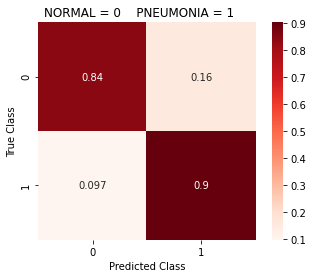


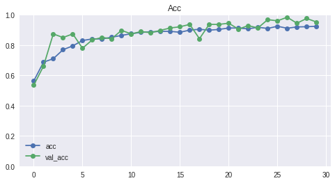


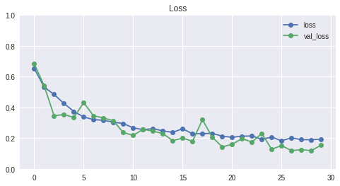


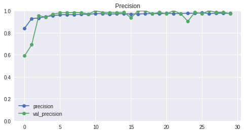


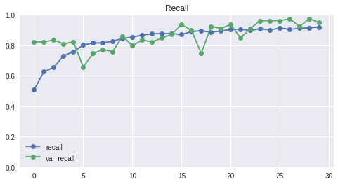


    ------------------------------------------------------------
    16/16 [==============================] - 0s 3ms/step - loss: 0.2754 - acc: 0.8809 - precision: 0.9057 - recall: 0.9028
    loss score: 0.2754409909248352
    accuracy score: 0.880859375
    precision score: 0.9056603908538818
    recall score: 0.9028213024139404
    
    Total time to complete: 2.72 minutes
    

The model above performed well - but we also notice that because we using smaller image sizes, our model trained much faster than other models trained using 256x256 images. Take note that in the model above, we also decided to change our padding parameter in our model's non-dense layers. Basically what padding='same' does is it makes sure the output size are the same as the input size. So we are basically making sure that no data is lost when going through our model's layers. We could definitely apply this to our bigger models and see what the effect it has on them.  

But for now, Let's try and change our activation function to leaky relu, since that activation function did outperform our other models that were trained on 256x256 images that used reLU as the activation function.

The Difference between ReLU and LeakyReLU

The gist I've  gotten so far:

The 'dying ReLU' problem = when the input values are less than 0, ReLU considers those values to be 0. If the derivative of the slope of the ReLU is of 0, absolutely no learning is performed on the layers below the dead ReLU == dead neurons. LeakyReLU solves this problem by giving input values less than 0 a slightly negative number instead of 0 == solves the problem of having dead neurons. 


```python
def create_cnn_leaky_small(shape='', opt=tf.keras.optimizers.Adam(), alpha=0.2,
                          metrics=['acc', tf.keras.metrics.Precision(name='precision'),
                              tf.keras.metrics.Recall(name='recall')]):
    if len(shape) < 1:
      print('Please define input shape!')
    else:
      model = Sequential()
      model.add(layers.Conv2D(32, (3,3), input_shape=shape))
      model.add(layers.LeakyReLU(alpha=alpha))
      model.add(MaxPooling2D((2, 2)))
      
      model.add(layers.Conv2D(64, (3,3)))
      model.add(layers.LeakyReLU(alpha=alpha))
      model.add(MaxPooling2D((2, 2)))

      model.add(layers.Conv2D(128, (3, 3)))
      model.add(layers.LeakyReLU(alpha=alpha))
      model.add(MaxPooling2D((2, 2)))
      
      model.add(Flatten())
      model.add(layers.Dense(128))
      model.add(layers.LeakyReLU(alpha=alpha))
      model.add(layers.Dropout(0.2))

      model.add(layers.Dense(64))
      model.add(layers.LeakyReLU(alpha=alpha))

      model.add(layers.Dense(1, activation='sigmoid'))
      model.compile(loss='binary_crossentropy', optimizer=opt, metrics=metrics)
      print(model.summary())
      return model
```


```python
cnn_sl = create_cnn_leaky_small(shape=INPUT_SHAPE_small, alpha=0.2, 
                         opt=optimizers.Adam(learning_rate=0.001))
history_sl = fit_cnn_gen(cnn_sl, Xs_train, ys_train, 
                    Xs_val, ys_val, Xs_test, ys_test, 
                    epochs=100, batch_size=32, generator=aug_train_small_datagen, 
                    class_weights=class_weights_dict,
                    callbacks=make_callbacks(min_delta=0.001, patience=20, 
                                             save_best_only=True, 
                                             f_path=SMALL_PATH, 
                                             restore_best_weights=True, mode='min'))
```

    Model: "sequential_7"
    _________________________________________________________________
    Layer (type)                 Output Shape              Param #   
    =================================================================
    conv2d_24 (Conv2D)           (None, 62, 62, 32)        896       
    _________________________________________________________________
    leaky_re_lu_10 (LeakyReLU)   (None, 62, 62, 32)        0         
    _________________________________________________________________
    max_pooling2d_16 (MaxPooling (None, 31, 31, 32)        0         
    _________________________________________________________________
    conv2d_25 (Conv2D)           (None, 29, 29, 64)        18496     
    _________________________________________________________________
    leaky_re_lu_11 (LeakyReLU)   (None, 29, 29, 64)        0         
    _________________________________________________________________
    max_pooling2d_17 (MaxPooling (None, 14, 14, 64)        0         
    _________________________________________________________________
    conv2d_26 (Conv2D)           (None, 12, 12, 128)       73856     
    _________________________________________________________________
    leaky_re_lu_12 (LeakyReLU)   (None, 12, 12, 128)       0         
    _________________________________________________________________
    max_pooling2d_18 (MaxPooling (None, 6, 6, 128)         0         
    _________________________________________________________________
    flatten_7 (Flatten)          (None, 4608)              0         
    _________________________________________________________________
    dense_20 (Dense)             (None, 128)               589952    
    _________________________________________________________________
    leaky_re_lu_13 (LeakyReLU)   (None, 128)               0         
    _________________________________________________________________
    dropout_6 (Dropout)          (None, 128)               0         
    _________________________________________________________________
    dense_21 (Dense)             (None, 64)                8256      
    _________________________________________________________________
    leaky_re_lu_14 (LeakyReLU)   (None, 64)                0         
    _________________________________________________________________
    dense_22 (Dense)             (None, 1)                 65        
    =================================================================
    Total params: 691,521
    Trainable params: 691,521
    Non-trainable params: 0
    _________________________________________________________________
    None
    Epoch 1/100
    163/163 [==============================] - 5s 34ms/step - loss: 0.5879 - acc: 0.6484 - precision: 0.8720 - recall: 0.6173 - val_loss: 0.4065 - val_acc: 0.8268 - val_precision: 0.9385 - val_recall: 0.7722
    Epoch 2/100
    163/163 [==============================] - 5s 32ms/step - loss: 0.4452 - acc: 0.7715 - precision: 0.9365 - recall: 0.7427 - val_loss: 0.4138 - val_acc: 0.8189 - val_precision: 0.9828 - val_recall: 0.7215
    Epoch 3/100
    163/163 [==============================] - 5s 32ms/step - loss: 0.3650 - acc: 0.8374 - precision: 0.9517 - recall: 0.8230 - val_loss: 0.5836 - val_acc: 0.7165 - val_precision: 0.9778 - val_recall: 0.5570
    Epoch 4/100
    163/163 [==============================] - 5s 32ms/step - loss: 0.3062 - acc: 0.8635 - precision: 0.9636 - recall: 0.8483 - val_loss: 0.2373 - val_acc: 0.9213 - val_precision: 0.9859 - val_recall: 0.8861
    Epoch 5/100
    163/163 [==============================] - 5s 33ms/step - loss: 0.2949 - acc: 0.8658 - precision: 0.9649 - recall: 0.8503 - val_loss: 0.2167 - val_acc: 0.9134 - val_precision: 0.9857 - val_recall: 0.8734
    Epoch 6/100
    163/163 [==============================] - 5s 33ms/step - loss: 0.2828 - acc: 0.8702 - precision: 0.9643 - recall: 0.8570 - val_loss: 0.2096 - val_acc: 0.9291 - val_precision: 0.9861 - val_recall: 0.8987
    Epoch 7/100
    163/163 [==============================] - 5s 32ms/step - loss: 0.2800 - acc: 0.8777 - precision: 0.9647 - recall: 0.8671 - val_loss: 0.1691 - val_acc: 0.9685 - val_precision: 0.9870 - val_recall: 0.9620
    Epoch 8/100
    163/163 [==============================] - 5s 32ms/step - loss: 0.2461 - acc: 0.8936 - precision: 0.9708 - recall: 0.8834 - val_loss: 0.1834 - val_acc: 0.9213 - val_precision: 0.9859 - val_recall: 0.8861
    Epoch 9/100
    163/163 [==============================] - 5s 32ms/step - loss: 0.2393 - acc: 0.8963 - precision: 0.9733 - recall: 0.8846 - val_loss: 0.2475 - val_acc: 0.8819 - val_precision: 0.9848 - val_recall: 0.8228
    Epoch 10/100
    163/163 [==============================] - 5s 32ms/step - loss: 0.2418 - acc: 0.8959 - precision: 0.9714 - recall: 0.8859 - val_loss: 0.1478 - val_acc: 0.9764 - val_precision: 0.9872 - val_recall: 0.9747
    Epoch 11/100
    163/163 [==============================] - 5s 32ms/step - loss: 0.2394 - acc: 0.8969 - precision: 0.9709 - recall: 0.8877 - val_loss: 0.2104 - val_acc: 0.9055 - val_precision: 0.9855 - val_recall: 0.8608
    Epoch 12/100
    163/163 [==============================] - 5s 32ms/step - loss: 0.2372 - acc: 0.8951 - precision: 0.9701 - recall: 0.8862 - val_loss: 0.1505 - val_acc: 0.9606 - val_precision: 0.9868 - val_recall: 0.9494
    Epoch 13/100
    163/163 [==============================] - 5s 32ms/step - loss: 0.2197 - acc: 0.9049 - precision: 0.9739 - recall: 0.8960 - val_loss: 0.1428 - val_acc: 0.9921 - val_precision: 0.9875 - val_recall: 1.0000
    Epoch 14/100
    163/163 [==============================] - 5s 32ms/step - loss: 0.2057 - acc: 0.9109 - precision: 0.9749 - recall: 0.9032 - val_loss: 0.1198 - val_acc: 0.9528 - val_precision: 0.9867 - val_recall: 0.9367
    Epoch 15/100
    163/163 [==============================] - 5s 32ms/step - loss: 0.2085 - acc: 0.9118 - precision: 0.9768 - recall: 0.9027 - val_loss: 0.2024 - val_acc: 0.9055 - val_precision: 0.9855 - val_recall: 0.8608
    Epoch 16/100
    163/163 [==============================] - 5s 32ms/step - loss: 0.2010 - acc: 0.9137 - precision: 0.9756 - recall: 0.9066 - val_loss: 0.1167 - val_acc: 0.9606 - val_precision: 0.9868 - val_recall: 0.9494
    Epoch 17/100
    163/163 [==============================] - 5s 32ms/step - loss: 0.1878 - acc: 0.9220 - precision: 0.9774 - recall: 0.9161 - val_loss: 0.2077 - val_acc: 0.9213 - val_precision: 0.9859 - val_recall: 0.8861
    Epoch 18/100
    163/163 [==============================] - 5s 32ms/step - loss: 0.1960 - acc: 0.9191 - precision: 0.9787 - recall: 0.9110 - val_loss: 0.1946 - val_acc: 0.9213 - val_precision: 0.9859 - val_recall: 0.8861
    Epoch 19/100
    163/163 [==============================] - 5s 32ms/step - loss: 0.1939 - acc: 0.9191 - precision: 0.9768 - recall: 0.9128 - val_loss: 0.1829 - val_acc: 0.9213 - val_precision: 0.9859 - val_recall: 0.8861
    Epoch 20/100
    163/163 [==============================] - 5s 32ms/step - loss: 0.1815 - acc: 0.9241 - precision: 0.9793 - recall: 0.9172 - val_loss: 0.1916 - val_acc: 0.9449 - val_precision: 0.9865 - val_recall: 0.9241
    Epoch 21/100
    163/163 [==============================] - 5s 32ms/step - loss: 0.1825 - acc: 0.9281 - precision: 0.9800 - recall: 0.9221 - val_loss: 0.1801 - val_acc: 0.9449 - val_precision: 0.9865 - val_recall: 0.9241
    Epoch 22/100
    163/163 [==============================] - 5s 32ms/step - loss: 0.1893 - acc: 0.9229 - precision: 0.9759 - recall: 0.9190 - val_loss: 0.2466 - val_acc: 0.8976 - val_precision: 0.9853 - val_recall: 0.8481
    Epoch 23/100
    163/163 [==============================] - 5s 32ms/step - loss: 0.1869 - acc: 0.9275 - precision: 0.9781 - recall: 0.9231 - val_loss: 0.1504 - val_acc: 0.9449 - val_precision: 0.9737 - val_recall: 0.9367
    Epoch 24/100
    163/163 [==============================] - 5s 32ms/step - loss: 0.1810 - acc: 0.9273 - precision: 0.9810 - recall: 0.9200 - val_loss: 0.1364 - val_acc: 0.9370 - val_precision: 0.9610 - val_recall: 0.9367
    Epoch 25/100
    163/163 [==============================] - 5s 32ms/step - loss: 0.1741 - acc: 0.9273 - precision: 0.9797 - recall: 0.9213 - val_loss: 0.1881 - val_acc: 0.9449 - val_precision: 0.9865 - val_recall: 0.9241
    Epoch 26/100
    163/163 [==============================] - 5s 32ms/step - loss: 0.1742 - acc: 0.9310 - precision: 0.9790 - recall: 0.9270 - val_loss: 0.0906 - val_acc: 0.9685 - val_precision: 0.9747 - val_recall: 0.9747
    Epoch 27/100
    163/163 [==============================] - 5s 33ms/step - loss: 0.1806 - acc: 0.9277 - precision: 0.9779 - recall: 0.9236 - val_loss: 0.2106 - val_acc: 0.9134 - val_precision: 0.8778 - val_recall: 1.0000
    Epoch 28/100
    163/163 [==============================] - 5s 33ms/step - loss: 0.1822 - acc: 0.9275 - precision: 0.9768 - recall: 0.9244 - val_loss: 0.1091 - val_acc: 0.9685 - val_precision: 0.9870 - val_recall: 0.9620
    Epoch 29/100
    163/163 [==============================] - 5s 33ms/step - loss: 0.1742 - acc: 0.9247 - precision: 0.9791 - recall: 0.9182 - val_loss: 0.0864 - val_acc: 0.9685 - val_precision: 0.9870 - val_recall: 0.9620
    Epoch 30/100
    163/163 [==============================] - 5s 32ms/step - loss: 0.1636 - acc: 0.9337 - precision: 0.9783 - recall: 0.9314 - val_loss: 0.1481 - val_acc: 0.9449 - val_precision: 0.9865 - val_recall: 0.9241
    Epoch 31/100
    163/163 [==============================] - 5s 32ms/step - loss: 0.1842 - acc: 0.9250 - precision: 0.9778 - recall: 0.9200 - val_loss: 0.1403 - val_acc: 0.9370 - val_precision: 0.9733 - val_recall: 0.9241
    Epoch 32/100
    163/163 [==============================] - 5s 32ms/step - loss: 0.1672 - acc: 0.9296 - precision: 0.9800 - recall: 0.9241 - val_loss: 0.2666 - val_acc: 0.8661 - val_precision: 0.9844 - val_recall: 0.7975
    Epoch 33/100
    163/163 [==============================] - 5s 32ms/step - loss: 0.1707 - acc: 0.9346 - precision: 0.9799 - recall: 0.9311 - val_loss: 0.1166 - val_acc: 0.9685 - val_precision: 0.9747 - val_recall: 0.9747
    Epoch 34/100
    163/163 [==============================] - 5s 32ms/step - loss: 0.1567 - acc: 0.9360 - precision: 0.9812 - recall: 0.9316 - val_loss: 0.1128 - val_acc: 0.9685 - val_precision: 0.9747 - val_recall: 0.9747
    Epoch 35/100
    163/163 [==============================] - 5s 32ms/step - loss: 0.1571 - acc: 0.9369 - precision: 0.9807 - recall: 0.9334 - val_loss: 0.1296 - val_acc: 0.9685 - val_precision: 0.9747 - val_recall: 0.9747
    Epoch 36/100
    163/163 [==============================] - 5s 32ms/step - loss: 0.1496 - acc: 0.9410 - precision: 0.9811 - recall: 0.9386 - val_loss: 0.2718 - val_acc: 0.8976 - val_precision: 0.9853 - val_recall: 0.8481
    Epoch 37/100
    163/163 [==============================] - 5s 32ms/step - loss: 0.1704 - acc: 0.9335 - precision: 0.9793 - recall: 0.9301 - val_loss: 0.1160 - val_acc: 0.9685 - val_precision: 0.9747 - val_recall: 0.9747
    Epoch 38/100
    163/163 [==============================] - 5s 32ms/step - loss: 0.1680 - acc: 0.9302 - precision: 0.9782 - recall: 0.9267 - val_loss: 0.1275 - val_acc: 0.9685 - val_precision: 0.9870 - val_recall: 0.9620
    Epoch 39/100
    163/163 [==============================] - 5s 32ms/step - loss: 0.1666 - acc: 0.9344 - precision: 0.9778 - recall: 0.9329 - val_loss: 0.0725 - val_acc: 0.9764 - val_precision: 0.9750 - val_recall: 0.9873
    Epoch 40/100
    163/163 [==============================] - 5s 32ms/step - loss: 0.1537 - acc: 0.9356 - precision: 0.9815 - recall: 0.9308 - val_loss: 0.1612 - val_acc: 0.9449 - val_precision: 0.9865 - val_recall: 0.9241
    Epoch 41/100
    163/163 [==============================] - 5s 32ms/step - loss: 0.1517 - acc: 0.9411 - precision: 0.9811 - recall: 0.9388 - val_loss: 0.1055 - val_acc: 0.9528 - val_precision: 0.9740 - val_recall: 0.9494
    Epoch 42/100
    163/163 [==============================] - 5s 32ms/step - loss: 0.1541 - acc: 0.9377 - precision: 0.9810 - recall: 0.9342 - val_loss: 0.0817 - val_acc: 0.9764 - val_precision: 0.9872 - val_recall: 0.9747
    Epoch 43/100
    163/163 [==============================] - 5s 32ms/step - loss: 0.1614 - acc: 0.9339 - precision: 0.9807 - recall: 0.9293 - val_loss: 0.0578 - val_acc: 0.9843 - val_precision: 0.9753 - val_recall: 1.0000
    Epoch 44/100
    163/163 [==============================] - 5s 32ms/step - loss: 0.1491 - acc: 0.9417 - precision: 0.9830 - recall: 0.9378 - val_loss: 0.1169 - val_acc: 0.9606 - val_precision: 0.9744 - val_recall: 0.9620
    Epoch 45/100
    163/163 [==============================] - 5s 32ms/step - loss: 0.1555 - acc: 0.9350 - precision: 0.9812 - recall: 0.9303 - val_loss: 0.1056 - val_acc: 0.9606 - val_precision: 0.9868 - val_recall: 0.9494
    Epoch 46/100
    163/163 [==============================] - 5s 32ms/step - loss: 0.1528 - acc: 0.9411 - precision: 0.9827 - recall: 0.9373 - val_loss: 0.1649 - val_acc: 0.9291 - val_precision: 1.0000 - val_recall: 0.8861
    Epoch 47/100
    163/163 [==============================] - 5s 32ms/step - loss: 0.1432 - acc: 0.9413 - precision: 0.9829 - recall: 0.9373 - val_loss: 0.1002 - val_acc: 0.9685 - val_precision: 0.9630 - val_recall: 0.9873
    Epoch 48/100
    163/163 [==============================] - 5s 32ms/step - loss: 0.1505 - acc: 0.9406 - precision: 0.9808 - recall: 0.9383 - val_loss: 0.1124 - val_acc: 0.9606 - val_precision: 0.9868 - val_recall: 0.9494
    Epoch 49/100
    163/163 [==============================] - 5s 32ms/step - loss: 0.1390 - acc: 0.9438 - precision: 0.9830 - recall: 0.9406 - val_loss: 0.1108 - val_acc: 0.9685 - val_precision: 0.9747 - val_recall: 0.9747
    Epoch 50/100
    163/163 [==============================] - 5s 32ms/step - loss: 0.1513 - acc: 0.9408 - precision: 0.9803 - recall: 0.9391 - val_loss: 0.0998 - val_acc: 0.9606 - val_precision: 0.9625 - val_recall: 0.9747
    Epoch 51/100
    163/163 [==============================] - 5s 32ms/step - loss: 0.1602 - acc: 0.9373 - precision: 0.9805 - recall: 0.9342 - val_loss: 0.1197 - val_acc: 0.9685 - val_precision: 0.9870 - val_recall: 0.9620
    Epoch 52/100
    163/163 [==============================] - 5s 32ms/step - loss: 0.1534 - acc: 0.9406 - precision: 0.9796 - recall: 0.9396 - val_loss: 0.1125 - val_acc: 0.9606 - val_precision: 0.9625 - val_recall: 0.9747
    Epoch 53/100
    163/163 [==============================] - 5s 32ms/step - loss: 0.1418 - acc: 0.9440 - precision: 0.9822 - recall: 0.9417 - val_loss: 0.1040 - val_acc: 0.9764 - val_precision: 0.9750 - val_recall: 0.9873
    Epoch 54/100
    163/163 [==============================] - 5s 32ms/step - loss: 0.1495 - acc: 0.9408 - precision: 0.9816 - recall: 0.9378 - val_loss: 0.1068 - val_acc: 0.9606 - val_precision: 0.9744 - val_recall: 0.9620
    Epoch 55/100
    163/163 [==============================] - 5s 32ms/step - loss: 0.1446 - acc: 0.9450 - precision: 0.9830 - recall: 0.9422 - val_loss: 0.0932 - val_acc: 0.9764 - val_precision: 0.9872 - val_recall: 0.9747
    Epoch 56/100
    163/163 [==============================] - 5s 32ms/step - loss: 0.1292 - acc: 0.9480 - precision: 0.9852 - recall: 0.9443 - val_loss: 0.0935 - val_acc: 0.9764 - val_precision: 0.9634 - val_recall: 1.0000
    Epoch 57/100
    163/163 [==============================] - 5s 32ms/step - loss: 0.1515 - acc: 0.9387 - precision: 0.9805 - recall: 0.9360 - val_loss: 0.1272 - val_acc: 0.9685 - val_precision: 0.9870 - val_recall: 0.9620
    Epoch 58/100
    163/163 [==============================] - 5s 32ms/step - loss: 0.1435 - acc: 0.9419 - precision: 0.9843 - recall: 0.9368 - val_loss: 0.0880 - val_acc: 0.9764 - val_precision: 0.9634 - val_recall: 1.0000
    Epoch 59/100
    163/163 [==============================] - 5s 32ms/step - loss: 0.1313 - acc: 0.9475 - precision: 0.9849 - recall: 0.9437 - val_loss: 0.1362 - val_acc: 0.9370 - val_precision: 0.9733 - val_recall: 0.9241
    Epoch 60/100
    163/163 [==============================] - 5s 32ms/step - loss: 0.1389 - acc: 0.9436 - precision: 0.9840 - recall: 0.9394 - val_loss: 0.1245 - val_acc: 0.9528 - val_precision: 0.9740 - val_recall: 0.9494
    Epoch 61/100
    163/163 [==============================] - 5s 32ms/step - loss: 0.1411 - acc: 0.9400 - precision: 0.9808 - recall: 0.9375 - val_loss: 0.1078 - val_acc: 0.9843 - val_precision: 0.9753 - val_recall: 1.0000
    Epoch 62/100
    163/163 [==============================] - 5s 32ms/step - loss: 0.1356 - acc: 0.9469 - precision: 0.9846 - recall: 0.9432 - val_loss: 0.1809 - val_acc: 0.9213 - val_precision: 0.9859 - val_recall: 0.8861
    Epoch 63/100
    163/163 [==============================] - 5s 32ms/step - loss: 0.1370 - acc: 0.9452 - precision: 0.9836 - recall: 0.9419 - val_loss: 0.1041 - val_acc: 0.9606 - val_precision: 0.9744 - val_recall: 0.9620
    ---------------------------------------------------------
                      Classification Report
    
                  precision    recall  f1-score   support
    
             0.0       0.93      0.81      0.86       193
             1.0       0.89      0.96      0.93       319
    
        accuracy                           0.90       512
       macro avg       0.91      0.89      0.90       512
    weighted avg       0.91      0.90      0.90       512
    
    ---------------------------------------------------------
    


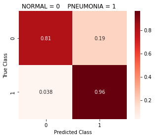


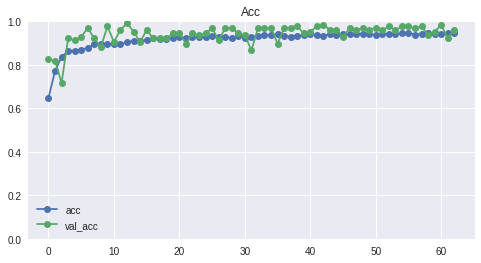


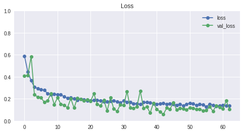


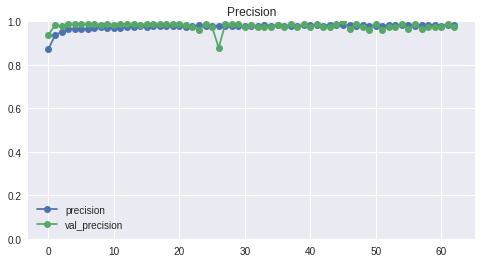


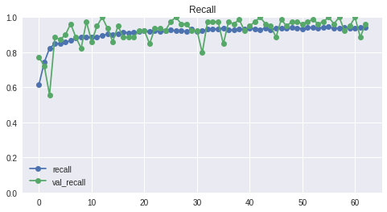


    ------------------------------------------------------------
    16/16 [==============================] - 0s 4ms/step - loss: 0.3059 - acc: 0.9043 - precision: 0.8924 - recall: 0.9624
    loss score: 0.30594193935394287
    accuracy score: 0.904296875
    precision score: 0.8924418687820435
    recall score: 0.962382435798645
    
    Total time to complete: 5.59 minutes
    


```python
def create_cnn_leaky_small_pads(shape='', opt=tf.keras.optimizers.Adam(), alpha=0.2,
                          metrics=['acc', tf.keras.metrics.Precision(name='precision'),
                              tf.keras.metrics.Recall(name='recall')]):
    if len(shape) < 1:
      print('Please define input shape!')
    else:
      model = Sequential()
      model.add(layers.Conv2D(32, (3,3), input_shape=shape, padding='same'))
      model.add(layers.LeakyReLU(alpha=alpha))
      model.add(MaxPooling2D((2, 2), padding='same'))
      
      model.add(layers.Conv2D(64, (3,3), padding='same'))
      model.add(layers.LeakyReLU(alpha=alpha))
      model.add(MaxPooling2D((2, 2), padding='same'))

      model.add(layers.Conv2D(128, (3, 3), padding='same'))
      model.add(layers.LeakyReLU(alpha=alpha))
      model.add(MaxPooling2D((2, 2), padding='same'))
      
      model.add(Flatten())
      model.add(layers.Dense(128))
      model.add(layers.LeakyReLU(alpha=alpha))
      model.add(layers.Dropout(0.2))

      model.add(layers.Dense(64))
      model.add(layers.LeakyReLU(alpha=alpha))

      model.add(layers.Dense(1, activation='sigmoid'))
      model.compile(loss='binary_crossentropy', optimizer=opt, metrics=metrics)
      print(model.summary())
      return model
```


```python
cnn_slp = create_cnn_leaky_small_pads(shape=INPUT_SHAPE_small, alpha=0.2, 
                         opt=optimizers.Adam(learning_rate=0.001))
history_slp = fit_cnn_gen(cnn_slp, Xs_train, ys_train, 
                    Xs_val, ys_val, Xs_test, ys_test, 
                    epochs=100, batch_size=32, generator=aug_train_small_datagen, 
                    class_weights=class_weights_dict,
                    callbacks=make_callbacks(min_delta=0.001, patience=20, 
                                             save_best_only=True, 
                                             f_path=SMALL_PATH, 
                                             restore_best_weights=True, mode='min'))
```

    Model: "sequential_5"
    _________________________________________________________________
    Layer (type)                 Output Shape              Param #   
    =================================================================
    conv2d_18 (Conv2D)           (None, 64, 64, 32)        896       
    _________________________________________________________________
    leaky_re_lu (LeakyReLU)      (None, 64, 64, 32)        0         
    _________________________________________________________________
    max_pooling2d_10 (MaxPooling (None, 32, 32, 32)        0         
    _________________________________________________________________
    conv2d_19 (Conv2D)           (None, 32, 32, 64)        18496     
    _________________________________________________________________
    leaky_re_lu_1 (LeakyReLU)    (None, 32, 32, 64)        0         
    _________________________________________________________________
    max_pooling2d_11 (MaxPooling (None, 16, 16, 64)        0         
    _________________________________________________________________
    conv2d_20 (Conv2D)           (None, 16, 16, 128)       73856     
    _________________________________________________________________
    leaky_re_lu_2 (LeakyReLU)    (None, 16, 16, 128)       0         
    _________________________________________________________________
    max_pooling2d_12 (MaxPooling (None, 8, 8, 128)         0         
    _________________________________________________________________
    flatten_5 (Flatten)          (None, 8192)              0         
    _________________________________________________________________
    dense_14 (Dense)             (None, 128)               1048704   
    _________________________________________________________________
    leaky_re_lu_3 (LeakyReLU)    (None, 128)               0         
    _________________________________________________________________
    dropout_4 (Dropout)          (None, 128)               0         
    _________________________________________________________________
    dense_15 (Dense)             (None, 64)                8256      
    _________________________________________________________________
    leaky_re_lu_4 (LeakyReLU)    (None, 64)                0         
    _________________________________________________________________
    dense_16 (Dense)             (None, 1)                 65        
    =================================================================
    Total params: 1,150,273
    Trainable params: 1,150,273
    Non-trainable params: 0
    _________________________________________________________________
    None
    Epoch 1/100
    163/163 [==============================] - 6s 34ms/step - loss: 0.6009 - acc: 0.6649 - precision: 0.8648 - recall: 0.6506 - val_loss: 0.7290 - val_acc: 0.5197 - val_precision: 1.0000 - val_recall: 0.2278
    Epoch 2/100
    163/163 [==============================] - 5s 32ms/step - loss: 0.5075 - acc: 0.7166 - precision: 0.9157 - recall: 0.6813 - val_loss: 0.4180 - val_acc: 0.8189 - val_precision: 0.8889 - val_recall: 0.8101
    Epoch 3/100
    163/163 [==============================] - 5s 33ms/step - loss: 0.4185 - acc: 0.7885 - precision: 0.9348 - recall: 0.7690 - val_loss: 0.2956 - val_acc: 0.8819 - val_precision: 0.9848 - val_recall: 0.8228
    Epoch 4/100
    163/163 [==============================] - 5s 33ms/step - loss: 0.3640 - acc: 0.8219 - precision: 0.9453 - recall: 0.8070 - val_loss: 0.2552 - val_acc: 0.9291 - val_precision: 0.9861 - val_recall: 0.8987
    Epoch 5/100
    163/163 [==============================] - 5s 33ms/step - loss: 0.3297 - acc: 0.8484 - precision: 0.9549 - recall: 0.8354 - val_loss: 0.2021 - val_acc: 0.9606 - val_precision: 0.9868 - val_recall: 0.9494
    Epoch 6/100
    163/163 [==============================] - 5s 32ms/step - loss: 0.3000 - acc: 0.8602 - precision: 0.9554 - recall: 0.8516 - val_loss: 0.2146 - val_acc: 0.9213 - val_precision: 0.9859 - val_recall: 0.8861
    Epoch 7/100
    163/163 [==============================] - 5s 32ms/step - loss: 0.3001 - acc: 0.8643 - precision: 0.9597 - recall: 0.8532 - val_loss: 0.2231 - val_acc: 0.9291 - val_precision: 0.9487 - val_recall: 0.9367
    Epoch 8/100
    163/163 [==============================] - 5s 33ms/step - loss: 0.2679 - acc: 0.8740 - precision: 0.9648 - recall: 0.8619 - val_loss: 0.3768 - val_acc: 0.8346 - val_precision: 0.9833 - val_recall: 0.7468
    Epoch 9/100
    163/163 [==============================] - 5s 34ms/step - loss: 0.2569 - acc: 0.8894 - precision: 0.9695 - recall: 0.8787 - val_loss: 0.3105 - val_acc: 0.8583 - val_precision: 0.9841 - val_recall: 0.7848
    Epoch 10/100
    163/163 [==============================] - 5s 33ms/step - loss: 0.2502 - acc: 0.8880 - precision: 0.9676 - recall: 0.8787 - val_loss: 0.2794 - val_acc: 0.8819 - val_precision: 0.9848 - val_recall: 0.8228
    Epoch 11/100
    163/163 [==============================] - 5s 32ms/step - loss: 0.2276 - acc: 0.9022 - precision: 0.9733 - recall: 0.8929 - val_loss: 0.3047 - val_acc: 0.8819 - val_precision: 0.9848 - val_recall: 0.8228
    Epoch 12/100
    163/163 [==============================] - 5s 33ms/step - loss: 0.2328 - acc: 0.8999 - precision: 0.9692 - recall: 0.8937 - val_loss: 0.1311 - val_acc: 0.9843 - val_precision: 0.9873 - val_recall: 0.9873
    Epoch 13/100
    163/163 [==============================] - 5s 32ms/step - loss: 0.2121 - acc: 0.9062 - precision: 0.9716 - recall: 0.9001 - val_loss: 0.3178 - val_acc: 0.8504 - val_precision: 0.9839 - val_recall: 0.7722
    Epoch 14/100
    163/163 [==============================] - 5s 32ms/step - loss: 0.2234 - acc: 0.9015 - precision: 0.9724 - recall: 0.8926 - val_loss: 0.1532 - val_acc: 0.9370 - val_precision: 0.9863 - val_recall: 0.9114
    Epoch 15/100
    163/163 [==============================] - 5s 32ms/step - loss: 0.2169 - acc: 0.9076 - precision: 0.9740 - recall: 0.8996 - val_loss: 0.1812 - val_acc: 0.9528 - val_precision: 0.9867 - val_recall: 0.9367
    Epoch 16/100
    163/163 [==============================] - 5s 32ms/step - loss: 0.1959 - acc: 0.9178 - precision: 0.9768 - recall: 0.9110 - val_loss: 0.2542 - val_acc: 0.8976 - val_precision: 0.9853 - val_recall: 0.8481
    Epoch 17/100
    163/163 [==============================] - 5s 32ms/step - loss: 0.2075 - acc: 0.9103 - precision: 0.9744 - recall: 0.9030 - val_loss: 0.1351 - val_acc: 0.9685 - val_precision: 0.9870 - val_recall: 0.9620
    Epoch 18/100
    163/163 [==============================] - 5s 32ms/step - loss: 0.1799 - acc: 0.9245 - precision: 0.9801 - recall: 0.9169 - val_loss: 0.1471 - val_acc: 0.9528 - val_precision: 0.9867 - val_recall: 0.9367
    Epoch 19/100
    163/163 [==============================] - 5s 32ms/step - loss: 0.1949 - acc: 0.9210 - precision: 0.9763 - recall: 0.9159 - val_loss: 0.2559 - val_acc: 0.9134 - val_precision: 0.9857 - val_recall: 0.8734
    Epoch 20/100
    163/163 [==============================] - 5s 32ms/step - loss: 0.1873 - acc: 0.9224 - precision: 0.9772 - recall: 0.9169 - val_loss: 0.1304 - val_acc: 0.9449 - val_precision: 0.9865 - val_recall: 0.9241
    Epoch 21/100
    163/163 [==============================] - 5s 32ms/step - loss: 0.1873 - acc: 0.9247 - precision: 0.9772 - recall: 0.9200 - val_loss: 0.1864 - val_acc: 0.9370 - val_precision: 0.9733 - val_recall: 0.9241
    Epoch 22/100
    163/163 [==============================] - 5s 32ms/step - loss: 0.1861 - acc: 0.9218 - precision: 0.9779 - recall: 0.9154 - val_loss: 0.2055 - val_acc: 0.9291 - val_precision: 0.9268 - val_recall: 0.9620
    Epoch 23/100
    163/163 [==============================] - 5s 32ms/step - loss: 0.1818 - acc: 0.9258 - precision: 0.9765 - recall: 0.9223 - val_loss: 0.1960 - val_acc: 0.9134 - val_precision: 0.9857 - val_recall: 0.8734
    Epoch 24/100
    163/163 [==============================] - 5s 33ms/step - loss: 0.1877 - acc: 0.9247 - precision: 0.9791 - recall: 0.9182 - val_loss: 0.1212 - val_acc: 0.9606 - val_precision: 1.0000 - val_recall: 0.9367
    Epoch 25/100
    163/163 [==============================] - 5s 32ms/step - loss: 0.1777 - acc: 0.9260 - precision: 0.9760 - recall: 0.9231 - val_loss: 0.1191 - val_acc: 0.9528 - val_precision: 0.9867 - val_recall: 0.9367
    Epoch 26/100
    163/163 [==============================] - 5s 32ms/step - loss: 0.1715 - acc: 0.9298 - precision: 0.9803 - recall: 0.9241 - val_loss: 0.1781 - val_acc: 0.9291 - val_precision: 0.9730 - val_recall: 0.9114
    Epoch 27/100
    163/163 [==============================] - 5s 32ms/step - loss: 0.1750 - acc: 0.9308 - precision: 0.9782 - recall: 0.9275 - val_loss: 0.2060 - val_acc: 0.9291 - val_precision: 0.9861 - val_recall: 0.8987
    Epoch 28/100
    163/163 [==============================] - 5s 32ms/step - loss: 0.1637 - acc: 0.9302 - precision: 0.9793 - recall: 0.9257 - val_loss: 0.0949 - val_acc: 0.9606 - val_precision: 0.9868 - val_recall: 0.9494
    Epoch 29/100
    163/163 [==============================] - 5s 32ms/step - loss: 0.1695 - acc: 0.9287 - precision: 0.9782 - recall: 0.9246 - val_loss: 0.1249 - val_acc: 0.9606 - val_precision: 0.9744 - val_recall: 0.9620
    Epoch 30/100
    163/163 [==============================] - 5s 32ms/step - loss: 0.1606 - acc: 0.9314 - precision: 0.9798 - recall: 0.9267 - val_loss: 0.3177 - val_acc: 0.8898 - val_precision: 1.0000 - val_recall: 0.8228
    Epoch 31/100
    163/163 [==============================] - 5s 32ms/step - loss: 0.1705 - acc: 0.9337 - precision: 0.9799 - recall: 0.9298 - val_loss: 0.1378 - val_acc: 0.9606 - val_precision: 0.9405 - val_recall: 1.0000
    Epoch 32/100
    163/163 [==============================] - 5s 32ms/step - loss: 0.1633 - acc: 0.9333 - precision: 0.9793 - recall: 0.9298 - val_loss: 0.4070 - val_acc: 0.8425 - val_precision: 1.0000 - val_recall: 0.7468
    Epoch 33/100
    163/163 [==============================] - 5s 32ms/step - loss: 0.1637 - acc: 0.9365 - precision: 0.9805 - recall: 0.9332 - val_loss: 0.2248 - val_acc: 0.9055 - val_precision: 0.9855 - val_recall: 0.8608
    Epoch 34/100
    163/163 [==============================] - 5s 32ms/step - loss: 0.1638 - acc: 0.9356 - precision: 0.9791 - recall: 0.9332 - val_loss: 0.1701 - val_acc: 0.9291 - val_precision: 0.9167 - val_recall: 0.9747
    Epoch 35/100
    163/163 [==============================] - 5s 32ms/step - loss: 0.1567 - acc: 0.9388 - precision: 0.9811 - recall: 0.9357 - val_loss: 0.0943 - val_acc: 0.9685 - val_precision: 0.9630 - val_recall: 0.9873
    Epoch 36/100
    163/163 [==============================] - 5s 32ms/step - loss: 0.1629 - acc: 0.9362 - precision: 0.9797 - recall: 0.9334 - val_loss: 0.1938 - val_acc: 0.9213 - val_precision: 0.9726 - val_recall: 0.8987
    Epoch 37/100
    163/163 [==============================] - 5s 32ms/step - loss: 0.1533 - acc: 0.9379 - precision: 0.9808 - recall: 0.9347 - val_loss: 0.1065 - val_acc: 0.9528 - val_precision: 0.9620 - val_recall: 0.9620
    Epoch 38/100
    163/163 [==============================] - 5s 32ms/step - loss: 0.1450 - acc: 0.9404 - precision: 0.9819 - recall: 0.9370 - val_loss: 0.2250 - val_acc: 0.8898 - val_precision: 0.9012 - val_recall: 0.9241
    Epoch 39/100
    163/163 [==============================] - 5s 32ms/step - loss: 0.1485 - acc: 0.9390 - precision: 0.9808 - recall: 0.9363 - val_loss: 0.1387 - val_acc: 0.9291 - val_precision: 0.9605 - val_recall: 0.9241
    Epoch 40/100
    163/163 [==============================] - 5s 32ms/step - loss: 0.1534 - acc: 0.9392 - precision: 0.9826 - recall: 0.9347 - val_loss: 0.1739 - val_acc: 0.9055 - val_precision: 0.9855 - val_recall: 0.8608
    Epoch 41/100
    163/163 [==============================] - 5s 32ms/step - loss: 0.1567 - acc: 0.9377 - precision: 0.9810 - recall: 0.9342 - val_loss: 0.1407 - val_acc: 0.9370 - val_precision: 0.9176 - val_recall: 0.9873
    Epoch 42/100
    163/163 [==============================] - 5s 32ms/step - loss: 0.1486 - acc: 0.9381 - precision: 0.9803 - recall: 0.9355 - val_loss: 0.1080 - val_acc: 0.9764 - val_precision: 0.9750 - val_recall: 0.9873
    Epoch 43/100
    163/163 [==============================] - 5s 32ms/step - loss: 0.1543 - acc: 0.9379 - precision: 0.9818 - recall: 0.9337 - val_loss: 0.1526 - val_acc: 0.9449 - val_precision: 1.0000 - val_recall: 0.9114
    Epoch 44/100
    163/163 [==============================] - 5s 32ms/step - loss: 0.1400 - acc: 0.9398 - precision: 0.9824 - recall: 0.9357 - val_loss: 0.1494 - val_acc: 0.9528 - val_precision: 0.9398 - val_recall: 0.9873
    Epoch 45/100
    163/163 [==============================] - 5s 32ms/step - loss: 0.1417 - acc: 0.9456 - precision: 0.9825 - recall: 0.9435 - val_loss: 0.2380 - val_acc: 0.9134 - val_precision: 0.9857 - val_recall: 0.8734
    Epoch 46/100
    163/163 [==============================] - 5s 32ms/step - loss: 0.1432 - acc: 0.9419 - precision: 0.9840 - recall: 0.9370 - val_loss: 0.1082 - val_acc: 0.9685 - val_precision: 0.9870 - val_recall: 0.9620
    Epoch 47/100
    163/163 [==============================] - 5s 32ms/step - loss: 0.1476 - acc: 0.9398 - precision: 0.9834 - recall: 0.9347 - val_loss: 0.1560 - val_acc: 0.9370 - val_precision: 0.9080 - val_recall: 1.0000
    Epoch 48/100
    163/163 [==============================] - 5s 32ms/step - loss: 0.1462 - acc: 0.9433 - precision: 0.9835 - recall: 0.9394 - val_loss: 0.1308 - val_acc: 0.9528 - val_precision: 0.9398 - val_recall: 0.9873
    ---------------------------------------------------------
                      Classification Report
    
                  precision    recall  f1-score   support
    
             0.0       0.88      0.87      0.87       193
             1.0       0.92      0.93      0.92       319
    
        accuracy                           0.90       512
       macro avg       0.90      0.90      0.90       512
    weighted avg       0.90      0.90      0.90       512
    
    ---------------------------------------------------------
    


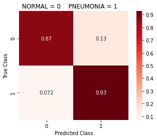


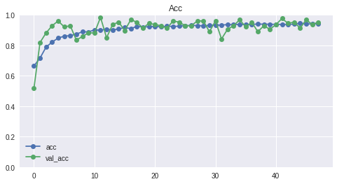


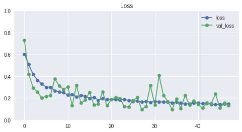


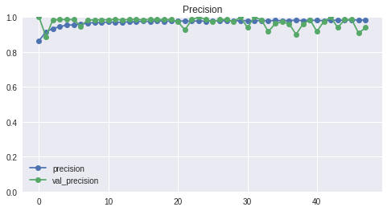


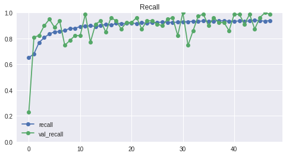


    ------------------------------------------------------------
    16/16 [==============================] - 0s 4ms/step - loss: 0.2711 - acc: 0.9043 - precision: 0.9193 - recall: 0.9279
    loss score: 0.2710723876953125
    accuracy score: 0.904296875
    precision score: 0.9192546606063843
    recall score: 0.9278996586799622
    
    Total time to complete: 4.28 minutes
    

### Loading in Best Models (64x64)


```python
# Our 64x64 model with highest accuracy
best_sm_model1 = load_model('/content/drive/MyDrive/gdrive/models/pneumonia_models/best_models/small/wgt-improv-71-0.04.hdf5')
class_report(best_sm_model1, Xs_test, ys_test)
best_sm_model1.evaluate(Xs_test, ys_test)
```

    ---------------------------------------------------------
                      Classification Report
    
                  precision    recall  f1-score   support
    
             0.0       0.95      0.86      0.90       194
             1.0       0.92      0.97      0.95       318
    
        accuracy                           0.93       512
       macro avg       0.94      0.92      0.92       512
    weighted avg       0.93      0.93      0.93       512
    
    ---------------------------------------------------------
    


    16/16 [==============================] - 0s 4ms/step - loss: 0.2220 - acc: 0.9297 - precision: 0.9172 - recall: 0.9748
    


    [0.2220173478126526, 0.9296875, 0.9171597361564636, 0.9748427867889404]


```python
# Our 64x64 model with best sensitivity and specificity (recall for both classes)
best_sm_model4 = load_model('/content/drive/MyDrive/gdrive/models/pneumonia_models/best_models/small/wgt-improv-45-0.05.hdf5')
class_report(best_sm_model4, Xs_test, ys_test)
best_sm_model4.evaluate(Xs_test, ys_test)
```

    ---------------------------------------------------------
                      Classification Report
    
                  precision    recall  f1-score   support
    
             0.0       0.91      0.89      0.90       194
             1.0       0.93      0.95      0.94       318
    
        accuracy                           0.93       512
       macro avg       0.92      0.92      0.92       512
    weighted avg       0.93      0.93      0.93       512
    
    ---------------------------------------------------------
    


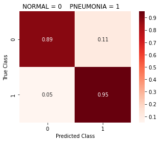


    16/16 [==============================] - 0s 4ms/step - loss: 0.2344 - acc: 0.9258 - precision: 0.9321 - recall: 0.9497
    


    [0.234402596950531, 0.92578125, 0.9320987462997437, 0.9496855139732361]


## RECOMMENDATION:

If you are short on time, I recommend reducing image size in order to speed up training. Our 64x64 models trained significantly faster (about 10 times faster) than the models that dealt with 256x256 images and got the same scores, if not better. Storing smaller images take up less space in storage as well so if reducing image size does not decrease your model's performance, having smaller images may be the right way to go.

### Using ReduceLROnPlateau

Our third callback we will be using in this project is `ReduceLROnPlateau`. What this callback does is it lowers the learning rate after a certain threshold has not been met for a certain amount of iterations. Similar to EarlyStopping, ReduceLROnPlateau has a `patience` variable. The patience variable is the number of epochs that must run (and there is no improvement in our monitored value) before the learning rate is reduced. Once the model does not improve after a certain number of epochs, our learning rate will be multiplied by the `factor` variable. The new `learning rate = old learning rate * factor`. There are other parameters we use that you can see the definition of below.

Basically, we are aiming to implement learning rate decay on our model. "The learning rate is used to control how much we adjust the weights of our model with respect to the loss gradient." With a higher learning rate, we take a bigger step downt the slope of the gradient -- and smaller learning rate = smaller step down the slope. If the learning rate is too large the model may never converge on a local minima (arrive at our best accuracy) and if the learning rate is too small, the model may take an extremely long time to arrive at the local minima. By using ReduceLROnPlateau we can reduce our learning rate if we don't see a change in a specified monitored value, allowing us to converge at a decent pace.


```python
def three_callbacks(monitor='val_loss', min_delta=0, patience=0, mode='auto', 
                   f_path='/content/drive/My Drive/gdrive/models/pneumonia_models/', 
                   restore_best_weights=False, save_best_only=False, 
                   save_freq='epoch', lr_patience=5, factor=0.1, cd=0):
  """
  Definition:
  Creates three variables, and then returns these variables in a list.

  1. variable 'earlystop' stops model training when the 'monitor' metric has not 
  improved past the 'min_delta' threshold after a certain amount of epochs, 
  defined by 'patience'. 

  2. variable 'checkpoint' saves model at some interval, so the model can be 
  loaded later on to continue the training from the saved state.

  3. variable 'reducelr' reduces learning rate after a certain number of intervals.

  Args:
  monitor: default = 'val_loss'. Quantity to be monitored during training.
  min_delta: default = 0. minimum change in the monitored quantity to be
  considered an improvement.
  patience: default = 0. The number of epochs with no improvement after which
  training will be stopped.
  mode: default = 'auto'. Defines the direction of monitor quantity. ex. If 'min', 
  training will stop after monitored quantity is no longer decreasing past the 
  defined min_delta. 
  f_path: default = '/content/drive/My Drive/gdrive/models/pneumonia_models/'. 
  The filepath that will be created / set as the destination for saved models 
  from 'checkpoint' variable.
  restore_best_weights: default = False. Defines whether or not to restore the 
  best model weights from the epoch with the best value of the monitored quantity.
  save_best_only: default = False. If save_best_only=True, the latest best model 
  according to the quantity monitored will not be overwritten.
  save_freq: default = 'epoch'. The defined interval at which the model is saved.
  lr_patience: default = 5. Dictates how long the ReduceLROnPlateau callback must 
  wait until it can initiate learning rate decay if there is no improvement in the monitored
  metric.
  factor: default = 0.1. Float that is multipled by the current learning rate. This action is 
  learning rate decay, and the product is the new learning rate until training stops.
  cooldown: default = 0. Defines how long the ReduceLROnPlateau must wait until it
  may begin lr_patience after initiating learning rate decay. 

  Returns:
  A list named 'callbacks' containing the 'earlystop', 'checkpoint', and
  'reducelr' variable.
  """
  
  # Defining our early stopping func
  earlystop = EarlyStopping(monitor=monitor, min_delta=min_delta, patience=patience, 
                            mode=mode, restore_best_weights=restore_best_weights)
    
  #checking to make sure our path is set up. If not, the line below creates it.
  os.makedirs(f_path, exist_ok=True)
    
  # saves the current model at the specified checkpoint
  checkpoint_f_path = f_path+"wgt-improv-{epoch:02d}-{"+monitor+":.2f}.hdf5"
  checkpoint = ModelCheckpoint(filepath=checkpoint_f_path, monitor=monitor, 
                               save_best_only=save_best_only, mode=mode, 
                               save_freq=save_freq)
  reducelr = ReduceLROnPlateau(monitor=monitor, mode=mode, min_delta=min_delta, 
                               patience=lr_patience, min_lr=1e-5,factor=factor, 
                               cooldown=cd, verbose=1)
  callbacks = [earlystop, checkpoint, reducelr]
  return callbacks
```

Using our leaky CNN with Learning Rate Decay


```python
cnn_sl = create_cnn_leaky_small(shape=INPUT_SHAPE_small, alpha=0.3, 
                         opt=optimizers.Adam(learning_rate=0.001))
# Using our three_callbacks in the 'callbacks' variable.
history_sl = fit_cnn_gen(cnn_sl, Xs_train, ys_train, 
                    Xs_val, ys_val, Xs_test, ys_test, 
                    epochs=120, batch_size=32, generator=aug_train_small_datagen, 
                    class_weights=class_weights_dict,
                    callbacks=three_callbacks(min_delta=0.001, patience=20, 
                                             save_best_only=True, factor=0.9,
                                             f_path=SMALL_PATH, lr_patience=8,
                                             restore_best_weights=True, 
                                             mode='min'))
```

    Model: "sequential_11"
    _________________________________________________________________
    Layer (type)                 Output Shape              Param #   
    =================================================================
    conv2d_36 (Conv2D)           (None, 62, 62, 32)        896       
    _________________________________________________________________
    leaky_re_lu_30 (LeakyReLU)   (None, 62, 62, 32)        0         
    _________________________________________________________________
    max_pooling2d_28 (MaxPooling (None, 31, 31, 32)        0         
    _________________________________________________________________
    conv2d_37 (Conv2D)           (None, 29, 29, 64)        18496     
    _________________________________________________________________
    leaky_re_lu_31 (LeakyReLU)   (None, 29, 29, 64)        0         
    _________________________________________________________________
    max_pooling2d_29 (MaxPooling (None, 14, 14, 64)        0         
    _________________________________________________________________
    conv2d_38 (Conv2D)           (None, 12, 12, 128)       73856     
    _________________________________________________________________
    leaky_re_lu_32 (LeakyReLU)   (None, 12, 12, 128)       0         
    _________________________________________________________________
    max_pooling2d_30 (MaxPooling (None, 6, 6, 128)         0         
    _________________________________________________________________
    flatten_11 (Flatten)         (None, 4608)              0         
    _________________________________________________________________
    dense_32 (Dense)             (None, 128)               589952    
    _________________________________________________________________
    leaky_re_lu_33 (LeakyReLU)   (None, 128)               0         
    _________________________________________________________________
    dropout_10 (Dropout)         (None, 128)               0         
    _________________________________________________________________
    dense_33 (Dense)             (None, 64)                8256      
    _________________________________________________________________
    leaky_re_lu_34 (LeakyReLU)   (None, 64)                0         
    _________________________________________________________________
    dense_34 (Dense)             (None, 1)                 65        
    =================================================================
    Total params: 691,521
    Trainable params: 691,521
    Non-trainable params: 0
    _________________________________________________________________
    None
    Epoch 1/120
    163/163 [==============================] - 6s 34ms/step - loss: 0.5909 - acc: 0.6440 - precision: 0.8662 - recall: 0.6438 - val_loss: 0.4357 - val_acc: 0.8110 - val_precision: 0.9825 - val_recall: 0.7089
    Epoch 2/120
    163/163 [==============================] - 5s 32ms/step - loss: 0.4074 - acc: 0.7943 - precision: 0.9439 - recall: 0.7688 - val_loss: 0.4092 - val_acc: 0.8031 - val_precision: 0.9821 - val_recall: 0.6962
    Epoch 3/120
    163/163 [==============================] - 5s 32ms/step - loss: 0.3711 - acc: 0.8198 - precision: 0.9497 - recall: 0.7997 - val_loss: 0.2937 - val_acc: 0.8819 - val_precision: 0.9848 - val_recall: 0.8228
    Epoch 4/120
    163/163 [==============================] - 5s 32ms/step - loss: 0.3214 - acc: 0.8553 - precision: 0.9618 - recall: 0.8385 - val_loss: 0.2054 - val_acc: 0.9291 - val_precision: 0.9861 - val_recall: 0.8987
    Epoch 5/120
    163/163 [==============================] - 5s 32ms/step - loss: 0.2983 - acc: 0.8639 - precision: 0.9631 - recall: 0.8493 - val_loss: 0.3506 - val_acc: 0.8346 - val_precision: 0.9833 - val_recall: 0.7468
    Epoch 6/120
    163/163 [==============================] - 5s 32ms/step - loss: 0.2648 - acc: 0.8867 - precision: 0.9697 - recall: 0.8748 - val_loss: 0.2896 - val_acc: 0.8898 - val_precision: 0.9851 - val_recall: 0.8354
    Epoch 7/120
    163/163 [==============================] - 5s 32ms/step - loss: 0.2525 - acc: 0.8900 - precision: 0.9693 - recall: 0.8797 - val_loss: 0.2608 - val_acc: 0.8898 - val_precision: 0.9851 - val_recall: 0.8354
    Epoch 8/120
    163/163 [==============================] - 5s 33ms/step - loss: 0.2419 - acc: 0.8955 - precision: 0.9706 - recall: 0.8862 - val_loss: 0.1302 - val_acc: 0.9528 - val_precision: 0.9867 - val_recall: 0.9367
    Epoch 9/120
    163/163 [==============================] - 5s 32ms/step - loss: 0.2471 - acc: 0.8953 - precision: 0.9698 - recall: 0.8867 - val_loss: 0.3490 - val_acc: 0.8504 - val_precision: 0.9839 - val_recall: 0.7722
    Epoch 10/120
    163/163 [==============================] - 5s 33ms/step - loss: 0.2337 - acc: 0.8976 - precision: 0.9723 - recall: 0.8875 - val_loss: 0.1168 - val_acc: 0.9606 - val_precision: 0.9625 - val_recall: 0.9747
    Epoch 11/120
    163/163 [==============================] - 5s 32ms/step - loss: 0.2340 - acc: 0.9001 - precision: 0.9732 - recall: 0.8901 - val_loss: 0.1347 - val_acc: 0.9528 - val_precision: 0.9867 - val_recall: 0.9367
    Epoch 12/120
    163/163 [==============================] - 5s 32ms/step - loss: 0.2182 - acc: 0.9084 - precision: 0.9743 - recall: 0.9004 - val_loss: 0.2619 - val_acc: 0.8898 - val_precision: 0.9851 - val_recall: 0.8354
    Epoch 13/120
    163/163 [==============================] - 5s 32ms/step - loss: 0.2188 - acc: 0.9082 - precision: 0.9738 - recall: 0.9006 - val_loss: 0.1679 - val_acc: 0.9606 - val_precision: 0.9868 - val_recall: 0.9494
    Epoch 14/120
    163/163 [==============================] - 5s 32ms/step - loss: 0.2214 - acc: 0.9055 - precision: 0.9758 - recall: 0.8950 - val_loss: 0.0841 - val_acc: 0.9606 - val_precision: 0.9868 - val_recall: 0.9494
    Epoch 15/120
    163/163 [==============================] - 5s 32ms/step - loss: 0.2032 - acc: 0.9139 - precision: 0.9753 - recall: 0.9071 - val_loss: 0.3505 - val_acc: 0.8504 - val_precision: 0.9839 - val_recall: 0.7722
    Epoch 16/120
    163/163 [==============================] - 5s 32ms/step - loss: 0.2149 - acc: 0.9089 - precision: 0.9735 - recall: 0.9019 - val_loss: 0.2705 - val_acc: 0.8819 - val_precision: 0.9848 - val_recall: 0.8228
    Epoch 17/120
    163/163 [==============================] - 5s 33ms/step - loss: 0.2188 - acc: 0.9105 - precision: 0.9757 - recall: 0.9019 - val_loss: 0.1446 - val_acc: 0.9370 - val_precision: 0.9863 - val_recall: 0.9114
    Epoch 18/120
    163/163 [==============================] - 5s 32ms/step - loss: 0.2017 - acc: 0.9124 - precision: 0.9729 - recall: 0.9074 - val_loss: 0.1360 - val_acc: 0.9764 - val_precision: 0.9872 - val_recall: 0.9747
    Epoch 19/120
    163/163 [==============================] - 5s 32ms/step - loss: 0.2003 - acc: 0.9118 - precision: 0.9755 - recall: 0.9040 - val_loss: 0.1049 - val_acc: 0.9685 - val_precision: 0.9870 - val_recall: 0.9620
    Epoch 20/120
    163/163 [==============================] - 5s 32ms/step - loss: 0.1947 - acc: 0.9166 - precision: 0.9757 - recall: 0.9105 - val_loss: 0.1437 - val_acc: 0.9370 - val_precision: 0.9863 - val_recall: 0.9114
    Epoch 21/120
    163/163 [==============================] - 5s 32ms/step - loss: 0.1888 - acc: 0.9216 - precision: 0.9774 - recall: 0.9156 - val_loss: 0.1081 - val_acc: 0.9606 - val_precision: 0.9868 - val_recall: 0.9494
    Epoch 22/120
    163/163 [==============================] - ETA: 0s - loss: 0.1869 - acc: 0.9235 - precision: 0.9804 - recall: 0.9154
    Epoch 00022: ReduceLROnPlateau reducing learning rate to 0.0009000000427477062.
    163/163 [==============================] - 5s 32ms/step - loss: 0.1869 - acc: 0.9235 - precision: 0.9804 - recall: 0.9154 - val_loss: 0.1183 - val_acc: 0.9528 - val_precision: 0.9867 - val_recall: 0.9367
    Epoch 23/120
    163/163 [==============================] - 5s 33ms/step - loss: 0.1819 - acc: 0.9235 - precision: 0.9798 - recall: 0.9159 - val_loss: 0.1323 - val_acc: 0.9764 - val_precision: 0.9872 - val_recall: 0.9747
    Epoch 24/120
    163/163 [==============================] - 5s 32ms/step - loss: 0.1830 - acc: 0.9254 - precision: 0.9783 - recall: 0.9200 - val_loss: 0.2284 - val_acc: 0.8976 - val_precision: 0.9853 - val_recall: 0.8481
    Epoch 25/120
    163/163 [==============================] - 5s 32ms/step - loss: 0.1900 - acc: 0.9212 - precision: 0.9771 - recall: 0.9154 - val_loss: 0.1126 - val_acc: 0.9685 - val_precision: 0.9747 - val_recall: 0.9747
    Epoch 26/120
    163/163 [==============================] - 5s 32ms/step - loss: 0.1716 - acc: 0.9314 - precision: 0.9809 - recall: 0.9257 - val_loss: 0.1165 - val_acc: 0.9449 - val_precision: 0.9865 - val_recall: 0.9241
    Epoch 27/120
    163/163 [==============================] - 5s 32ms/step - loss: 0.1744 - acc: 0.9296 - precision: 0.9811 - recall: 0.9231 - val_loss: 0.1147 - val_acc: 0.9528 - val_precision: 0.9867 - val_recall: 0.9367
    Epoch 28/120
    163/163 [==============================] - 5s 33ms/step - loss: 0.1624 - acc: 0.9337 - precision: 0.9817 - recall: 0.9280 - val_loss: 0.0928 - val_acc: 0.9685 - val_precision: 0.9870 - val_recall: 0.9620
    Epoch 29/120
    163/163 [==============================] - 5s 32ms/step - loss: 0.1702 - acc: 0.9310 - precision: 0.9803 - recall: 0.9257 - val_loss: 0.1497 - val_acc: 0.9528 - val_precision: 0.9867 - val_recall: 0.9367
    Epoch 30/120
    163/163 [==============================] - ETA: 0s - loss: 0.1657 - acc: 0.9358 - precision: 0.9841 - recall: 0.9285
    Epoch 00030: ReduceLROnPlateau reducing learning rate to 0.0008100000384729356.
    163/163 [==============================] - 5s 32ms/step - loss: 0.1657 - acc: 0.9358 - precision: 0.9841 - recall: 0.9285 - val_loss: 0.1219 - val_acc: 0.9528 - val_precision: 0.9867 - val_recall: 0.9367
    Epoch 31/120
    163/163 [==============================] - 5s 32ms/step - loss: 0.1688 - acc: 0.9277 - precision: 0.9800 - recall: 0.9215 - val_loss: 0.1284 - val_acc: 0.9528 - val_precision: 0.9867 - val_recall: 0.9367
    Epoch 32/120
    163/163 [==============================] - 5s 32ms/step - loss: 0.1700 - acc: 0.9289 - precision: 0.9790 - recall: 0.9241 - val_loss: 0.1792 - val_acc: 0.9370 - val_precision: 0.9863 - val_recall: 0.9114
    Epoch 33/120
    163/163 [==============================] - 5s 32ms/step - loss: 0.1556 - acc: 0.9365 - precision: 0.9823 - recall: 0.9314 - val_loss: 0.1419 - val_acc: 0.9528 - val_precision: 0.9867 - val_recall: 0.9367
    Epoch 34/120
    163/163 [==============================] - 5s 32ms/step - loss: 0.1576 - acc: 0.9379 - precision: 0.9826 - recall: 0.9329 - val_loss: 0.1935 - val_acc: 0.9291 - val_precision: 0.9861 - val_recall: 0.8987
    ---------------------------------------------------------
                      Classification Report
    
                  precision    recall  f1-score   support
    
             0.0       0.86      0.85      0.86       193
             1.0       0.91      0.92      0.91       319
    
        accuracy                           0.89       512
       macro avg       0.89      0.88      0.89       512
    weighted avg       0.89      0.89      0.89       512
    
    ---------------------------------------------------------
    


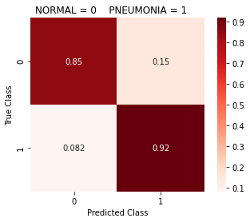


    ------------------------------------------------------------
    16/16 [==============================] - 0s 4ms/step - loss: 0.2575 - acc: 0.8926 - precision: 0.9099 - recall: 0.9185
    loss score: 0.25750547647476196
    accuracy score: 0.892578125
    precision score: 0.909937858581543
    recall score: 0.9184952974319458
    
    Total time to complete: 3.05 minutes
    

Using learning rate decay through ReduceLROnPlateau has proven to train the best model - our best model that has come out of here has an accuracy of 93% (best_sm_model1 above).

## Applying Transfer Learning Models


Transfer Learning models are models trained off of hundreds of thousands of images, and depending on what the current problem we are dealing with will more or less determine the transfer model we will want to use. **When used appropriately**, transfer models can converge quicker and have a higher starting accuracy than some custom built models. 

According to Hashmi, Mohammad Farukh et al., "Different neural networks require images of different sizes according to their defined architecture. ResNet18, DenseNet121, and MobileNetV2 expect images of size 224 × 224, while InceptionV3 and Xception require images of size 229 × 229." [2]

The first transfer model we will be trying out will be the VGG-19 model. This model has been trained on images with a size of 224x224, so we will make a new generator, test, and validation set to feed into our transfer model with that image shape.

Because of the image size VGG-19 requires, we expect for our models to train for about as long as our 256x256 models.


```python
# We've defined the three train, test, and val batch sizes already above
# in our code - so we won't manually call on them when activating this function
def create_train_test_val(image_size, train_batch_size=TRAIN_BATCH_SIZE, 
                          test_batch_size=TEST_BATCH_SIZE, 
                          val_batch_size=VAL_BATCH_SIZE, val_split=0.2):
  """
  Definition:
  Creates an IDG for train and test data with a validation split, and then generates
  and returns train, test, and val sets according to specified image size.

  Args:
  image_size: Required. The image shape for all sets.
  train_batch_size: default = TRAIN_BATCH_SIZE. The size of the training data.
  test_batch_size: default = TEST_BATCH_SIZE. The size of the test data.
  val_batch_size: default = VAL_BATCH_SIZE. The size of the validation data.
  val_split: default = 0.2. The percentage of data to be taken from test data to 
  create the validation data.

  Returns:
  X_train, y_train, X_test, y_test, X_val, y_val
  """
  train_datagen = ImageDataGenerator(rescale = 1./255)
  test_val_datagen = ImageDataGenerator(rescale = 1./255, 
                                        validation_split=val_split)

  train_set = train_datagen.flow_from_directory(train_folder, 
                                                   target_size=image_size,
                                                   batch_size=train_batch_size,
                                                   class_mode='binary')

  test_set = test_val_datagen.flow_from_directory(test_folder, 
                                                     target_size=image_size,
                                                     batch_size=test_batch_size,
                                                     class_mode='binary', 
                                                     subset='training')

  val_set = test_val_datagen.flow_from_directory(test_folder, 
                                                    target_size=image_size,
                                                    batch_size=val_batch_size,
                                                    class_mode='binary', 
                                                    subset='validation')
  start = time.time()
  X_train, y_train = next(train_set)
  X_test, y_test = next(test_set)
  X_val, y_val = next(val_set)
  end = time.time()
  print(f"Total time to run this cell: {round((end - start) / 60, 2)} minutes")
  return X_train, y_train, X_test, y_test, X_val, y_val


```


```python
Xt_train, yt_train, Xt_test, yt_test, Xt_val, yt_val = create_train_test_val(image_size=(224, 224))
INPUT_SHAPE_tf = Xt_train.shape[1:]
```

    Found 5216 images belonging to 2 classes.
    Found 513 images belonging to 2 classes.
    Found 127 images belonging to 2 classes.
    Total time to run this cell: 0.98 minutes
    

#### VGG-19

Below we will define a function that can use any transfer learning model as a base, and we provide the top layers


```python
  vgg_base = VGG19(input_shape=INPUT_SHAPE_tf, weights='imagenet', 
                   include_top=False)
```

    Downloading data from https://storage.googleapis.com/tensorflow/keras-applications/vgg19/vgg19_weights_tf_dim_ordering_tf_kernels_notop.h5
    80142336/80134624 [==============================] - 3s 0us/step
    


```python
def transfer_model(base, opt=tf.keras.optimizers.Adam(), alpha=0.2,
                          metrics=['acc', tf.keras.metrics.Precision(name='precision'),
                              tf.keras.metrics.Recall(name='recall')]):

  for layer in base.layers:
    layer.trainable = False

  model = Sequential()
  model.add(base)
  model.add(layers.Flatten())
  model.add(layers.Dense(4096))
  model.add(layers.LeakyReLU(alpha=alpha))
  model.add(layers.BatchNormalization())

  model.add(layers.Dense(1024))
  model.add(layers.LeakyReLU(alpha=alpha))
  #model.add(layers.Dropout(0.2))

  model.add(layers.Dense(256))
  model.add(layers.LeakyReLU(alpha=alpha))

  model.add(layers.Dense(1, activation='sigmoid'))
  model.compile(loss='binary_crossentropy', optimizer=opt, metrics=metrics)
  print(model.summary())
  return model
```


```python
# Defining where we will store our vgg-19 models
VGG_PATH = '/content/drive/MyDrive/gdrive/models/pneumonia_models/vgg_mods224/'
```


```python
#USING OUR BIG IMAGES
vgg_cnn = transfer_model(base=vgg_base, alpha=0.3, 
                         opt=optimizers.Adam(learning_rate=0.001))
history_vgg = fit_cnn_gen(vgg_cnn, Xt_train, yt_train, 
                    Xt_val, yt_val, Xt_test, yt_test, 
                    epochs=50, batch_size=32, generator=aug_train_datagen, 
                    class_weights=class_weights_dict, #{0: [1.94, 2, 2], 1:[0.67, 0.6, 0.7]}
                    callbacks=three_callbacks(min_delta=0.001, patience=10, 
                                             save_best_only=True, factor=0.9,
                                             f_path=VGG_PATH, lr_patience=6,
                                             restore_best_weights=True, 
                                             mode='min'))
```

    Model: "sequential_17"
    _________________________________________________________________
    Layer (type)                 Output Shape              Param #   
    =================================================================
    vgg19 (Functional)           (None, 7, 7, 512)         20024384  
    _________________________________________________________________
    flatten_17 (Flatten)         (None, 25088)             0         
    _________________________________________________________________
    dense_54 (Dense)             (None, 4096)              102764544 
    _________________________________________________________________
    leaky_re_lu_52 (LeakyReLU)   (None, 4096)              0         
    _________________________________________________________________
    batch_normalization_4 (Batch (None, 4096)              16384     
    _________________________________________________________________
    dense_55 (Dense)             (None, 1024)              4195328   
    _________________________________________________________________
    leaky_re_lu_53 (LeakyReLU)   (None, 1024)              0         
    _________________________________________________________________
    dense_56 (Dense)             (None, 256)               262400    
    _________________________________________________________________
    leaky_re_lu_54 (LeakyReLU)   (None, 256)               0         
    _________________________________________________________________
    dense_57 (Dense)             (None, 1)                 257       
    =================================================================
    Total params: 127,263,297
    Trainable params: 107,230,721
    Non-trainable params: 20,032,576
    _________________________________________________________________
    None
    Epoch 1/50
    163/163 [==============================] - 54s 332ms/step - loss: 0.9662 - acc: 0.8244 - precision: 0.9399 - recall: 0.8157 - val_loss: 0.5480 - val_acc: 0.8110 - val_precision: 0.7670 - val_recall: 1.0000
    Epoch 2/50
    163/163 [==============================] - 55s 338ms/step - loss: 0.4186 - acc: 0.8733 - precision: 0.9620 - recall: 0.8635 - val_loss: 0.3440 - val_acc: 0.9685 - val_precision: 0.9747 - val_recall: 0.9747
    Epoch 3/50
    163/163 [==============================] - 55s 335ms/step - loss: 0.3183 - acc: 0.8961 - precision: 0.9688 - recall: 0.8888 - val_loss: 0.2344 - val_acc: 0.9764 - val_precision: 0.9750 - val_recall: 0.9873
    Epoch 4/50
    163/163 [==============================] - 57s 349ms/step - loss: 0.3092 - acc: 0.8942 - precision: 0.9663 - recall: 0.8885 - val_loss: 0.1647 - val_acc: 0.9606 - val_precision: 0.9868 - val_recall: 0.9494
    Epoch 5/50
    163/163 [==============================] - 50s 309ms/step - loss: 0.2660 - acc: 0.9164 - precision: 0.9778 - recall: 0.9081 - val_loss: 0.5877 - val_acc: 0.8504 - val_precision: 0.9839 - val_recall: 0.7722
    Epoch 6/50
    163/163 [==============================] - 54s 330ms/step - loss: 0.2079 - acc: 0.9216 - precision: 0.9806 - recall: 0.9125 - val_loss: 0.1564 - val_acc: 0.9764 - val_precision: 0.9750 - val_recall: 0.9873
    Epoch 7/50
    163/163 [==============================] - 50s 308ms/step - loss: 0.2020 - acc: 0.9206 - precision: 0.9784 - recall: 0.9133 - val_loss: 0.5019 - val_acc: 0.8740 - val_precision: 0.9846 - val_recall: 0.8101
    Epoch 8/50
    163/163 [==============================] - 49s 298ms/step - loss: 0.1873 - acc: 0.9262 - precision: 0.9818 - recall: 0.9177 - val_loss: 0.3149 - val_acc: 0.8425 - val_precision: 0.9836 - val_recall: 0.7595
    Epoch 9/50
    163/163 [==============================] - 48s 297ms/step - loss: 0.1811 - acc: 0.9285 - precision: 0.9805 - recall: 0.9221 - val_loss: 0.1811 - val_acc: 0.9843 - val_precision: 0.9753 - val_recall: 1.0000
    Epoch 10/50
    163/163 [==============================] - 48s 297ms/step - loss: 0.1948 - acc: 0.9229 - precision: 0.9793 - recall: 0.9156 - val_loss: 0.2063 - val_acc: 0.9291 - val_precision: 0.9861 - val_recall: 0.8987
    Epoch 11/50
    163/163 [==============================] - 48s 297ms/step - loss: 0.1843 - acc: 0.9275 - precision: 0.9815 - recall: 0.9197 - val_loss: 0.2269 - val_acc: 0.9291 - val_precision: 0.9730 - val_recall: 0.9114
    Epoch 12/50
    163/163 [==============================] - 54s 330ms/step - loss: 0.1684 - acc: 0.9304 - precision: 0.9840 - recall: 0.9213 - val_loss: 0.1378 - val_acc: 0.9764 - val_precision: 0.9750 - val_recall: 0.9873
    Epoch 13/50
    163/163 [==============================] - 50s 307ms/step - loss: 0.1546 - acc: 0.9377 - precision: 0.9847 - recall: 0.9306 - val_loss: 0.4131 - val_acc: 0.8898 - val_precision: 0.9851 - val_recall: 0.8354
    Epoch 14/50
    163/163 [==============================] - 54s 331ms/step - loss: 0.1524 - acc: 0.9352 - precision: 0.9844 - recall: 0.9275 - val_loss: 0.1198 - val_acc: 0.9843 - val_precision: 0.9873 - val_recall: 0.9873
    Epoch 15/50
    163/163 [==============================] - 50s 307ms/step - loss: 0.1522 - acc: 0.9402 - precision: 0.9863 - recall: 0.9324 - val_loss: 0.5034 - val_acc: 0.7480 - val_precision: 0.9796 - val_recall: 0.6076
    Epoch 16/50
    163/163 [==============================] - 49s 298ms/step - loss: 0.1482 - acc: 0.9365 - precision: 0.9844 - recall: 0.9293 - val_loss: 0.2196 - val_acc: 0.9213 - val_precision: 0.9859 - val_recall: 0.8861
    Epoch 17/50
    163/163 [==============================] - 48s 296ms/step - loss: 0.1420 - acc: 0.9381 - precision: 0.9837 - recall: 0.9321 - val_loss: 0.2001 - val_acc: 0.9213 - val_precision: 0.9726 - val_recall: 0.8987
    Epoch 18/50
    163/163 [==============================] - 48s 297ms/step - loss: 0.1485 - acc: 0.9404 - precision: 0.9872 - recall: 0.9319 - val_loss: 0.1851 - val_acc: 0.9370 - val_precision: 0.9863 - val_recall: 0.9114
    Epoch 19/50
    163/163 [==============================] - 49s 298ms/step - loss: 0.1605 - acc: 0.9348 - precision: 0.9846 - recall: 0.9267 - val_loss: 0.1370 - val_acc: 0.9370 - val_precision: 0.9863 - val_recall: 0.9114
    Epoch 20/50
    163/163 [==============================] - 54s 330ms/step - loss: 0.1528 - acc: 0.9325 - precision: 0.9822 - recall: 0.9259 - val_loss: 0.1104 - val_acc: 0.9606 - val_precision: 0.9868 - val_recall: 0.9494
    Epoch 21/50
    163/163 [==============================] - 50s 306ms/step - loss: 0.1401 - acc: 0.9431 - precision: 0.9853 - recall: 0.9373 - val_loss: 0.3189 - val_acc: 0.8898 - val_precision: 0.9851 - val_recall: 0.8354
    Epoch 22/50
    163/163 [==============================] - 49s 298ms/step - loss: 0.1289 - acc: 0.9490 - precision: 0.9860 - recall: 0.9448 - val_loss: 0.1799 - val_acc: 0.9449 - val_precision: 0.9865 - val_recall: 0.9241
    Epoch 23/50
    163/163 [==============================] - 48s 296ms/step - loss: 0.1421 - acc: 0.9427 - precision: 0.9856 - recall: 0.9365 - val_loss: 0.4907 - val_acc: 0.8583 - val_precision: 0.9841 - val_recall: 0.7848
    Epoch 24/50
    163/163 [==============================] - 48s 296ms/step - loss: 0.1506 - acc: 0.9388 - precision: 0.9858 - recall: 0.9311 - val_loss: 0.2969 - val_acc: 0.8898 - val_precision: 0.9851 - val_recall: 0.8354
    Epoch 25/50
    163/163 [==============================] - 48s 297ms/step - loss: 0.1483 - acc: 0.9375 - precision: 0.9842 - recall: 0.9308 - val_loss: 0.2742 - val_acc: 0.9055 - val_precision: 0.9855 - val_recall: 0.8608
    Epoch 26/50
    163/163 [==============================] - ETA: 0s - loss: 0.1284 - acc: 0.9434 - precision: 0.9869 - recall: 0.9363
    Epoch 00026: ReduceLROnPlateau reducing learning rate to 0.0009000000427477062.
    163/163 [==============================] - 48s 296ms/step - loss: 0.1284 - acc: 0.9434 - precision: 0.9869 - recall: 0.9363 - val_loss: 0.1669 - val_acc: 0.9449 - val_precision: 0.9737 - val_recall: 0.9367
    Epoch 27/50
    163/163 [==============================] - 48s 297ms/step - loss: 0.1395 - acc: 0.9456 - precision: 0.9883 - recall: 0.9378 - val_loss: 0.1442 - val_acc: 0.9685 - val_precision: 0.9747 - val_recall: 0.9747
    Epoch 28/50
    163/163 [==============================] - 48s 295ms/step - loss: 0.1274 - acc: 0.9440 - precision: 0.9856 - recall: 0.9383 - val_loss: 0.1183 - val_acc: 0.9843 - val_precision: 0.9753 - val_recall: 1.0000
    Epoch 29/50
    163/163 [==============================] - 48s 296ms/step - loss: 0.1386 - acc: 0.9477 - precision: 0.9865 - recall: 0.9425 - val_loss: 0.1656 - val_acc: 0.9134 - val_precision: 1.0000 - val_recall: 0.8608
    Epoch 30/50
    163/163 [==============================] - 53s 327ms/step - loss: 0.1493 - acc: 0.9388 - precision: 0.9863 - recall: 0.9306 - val_loss: 0.0759 - val_acc: 0.9764 - val_precision: 0.9750 - val_recall: 0.9873
    Epoch 31/50
    163/163 [==============================] - 50s 306ms/step - loss: 0.1312 - acc: 0.9461 - precision: 0.9880 - recall: 0.9388 - val_loss: 0.1251 - val_acc: 0.9764 - val_precision: 0.9872 - val_recall: 0.9747
    Epoch 32/50
    163/163 [==============================] - 49s 298ms/step - loss: 0.1321 - acc: 0.9498 - precision: 0.9860 - recall: 0.9458 - val_loss: 0.3451 - val_acc: 0.8976 - val_precision: 0.9853 - val_recall: 0.8481
    Epoch 33/50
    163/163 [==============================] - 54s 330ms/step - loss: 0.1409 - acc: 0.9461 - precision: 0.9857 - recall: 0.9412 - val_loss: 0.0706 - val_acc: 0.9764 - val_precision: 0.9750 - val_recall: 0.9873
    Epoch 34/50
    163/163 [==============================] - 52s 317ms/step - loss: 0.1354 - acc: 0.9431 - precision: 0.9875 - recall: 0.9352 - val_loss: 0.2994 - val_acc: 0.8819 - val_precision: 0.9848 - val_recall: 0.8228
    Epoch 35/50
    163/163 [==============================] - 48s 296ms/step - loss: 0.1190 - acc: 0.9475 - precision: 0.9873 - recall: 0.9414 - val_loss: 0.1403 - val_acc: 0.9528 - val_precision: 0.9867 - val_recall: 0.9367
    Epoch 36/50
    163/163 [==============================] - 48s 296ms/step - loss: 0.1279 - acc: 0.9511 - precision: 0.9866 - recall: 0.9471 - val_loss: 0.1301 - val_acc: 0.9606 - val_precision: 0.9744 - val_recall: 0.9620
    Epoch 37/50
    163/163 [==============================] - 51s 316ms/step - loss: 0.1293 - acc: 0.9438 - precision: 0.9893 - recall: 0.9345 - val_loss: 0.1080 - val_acc: 0.9764 - val_precision: 0.9872 - val_recall: 0.9747
    Epoch 38/50
    163/163 [==============================] - 49s 298ms/step - loss: 0.1245 - acc: 0.9475 - precision: 0.9870 - recall: 0.9417 - val_loss: 0.0883 - val_acc: 0.9685 - val_precision: 0.9747 - val_recall: 0.9747
    Epoch 39/50
    163/163 [==============================] - ETA: 0s - loss: 0.1235 - acc: 0.9515 - precision: 0.9892 - recall: 0.9450
    Epoch 00039: ReduceLROnPlateau reducing learning rate to 0.0008100000384729356.
    163/163 [==============================] - 49s 298ms/step - loss: 0.1235 - acc: 0.9515 - precision: 0.9892 - recall: 0.9450 - val_loss: 0.1931 - val_acc: 0.9606 - val_precision: 0.9868 - val_recall: 0.9494
    Epoch 40/50
    163/163 [==============================] - 50s 306ms/step - loss: 0.1302 - acc: 0.9461 - precision: 0.9883 - recall: 0.9386 - val_loss: 0.1732 - val_acc: 0.9606 - val_precision: 0.9868 - val_recall: 0.9494
    Epoch 41/50
    163/163 [==============================] - 51s 312ms/step - loss: 0.1366 - acc: 0.9479 - precision: 0.9857 - recall: 0.9435 - val_loss: 0.1168 - val_acc: 0.9764 - val_precision: 0.9750 - val_recall: 0.9873
    Epoch 42/50
    163/163 [==============================] - 48s 297ms/step - loss: 0.1148 - acc: 0.9544 - precision: 0.9871 - recall: 0.9510 - val_loss: 0.1143 - val_acc: 0.9764 - val_precision: 0.9750 - val_recall: 0.9873
    Epoch 43/50
    163/163 [==============================] - 49s 302ms/step - loss: 0.1146 - acc: 0.9503 - precision: 0.9879 - recall: 0.9448 - val_loss: 0.1828 - val_acc: 0.9449 - val_precision: 0.9865 - val_recall: 0.9241
    ---------------------------------------------------------
                      Classification Report
    
                  precision    recall  f1-score   support
    
             0.0       0.92      0.84      0.88       193
             1.0       0.91      0.96      0.93       319
    
        accuracy                           0.91       512
       macro avg       0.92      0.90      0.91       512
    weighted avg       0.91      0.91      0.91       512
    
    ---------------------------------------------------------
    


    ------------------------------------------------------------
    16/16 [==============================] - 1s 71ms/step - loss: 0.2690 - acc: 0.9141 - precision: 0.9104 - recall: 0.9561
    loss score: 0.2689768373966217
    accuracy score: 0.9140625
    precision score: 0.9104477763175964
    recall score: 0.9561128616333008
    
    Total time to complete: 36.39 minutes
    

Filtering through our created VGG-19 models


```python
source = '/content/drive/MyDrive/gdrive/models/pneumonia_models/vgg_mods224/'
new_dirs = '/content/drive/MyDrive/gdrive/models/pneumonia_models/best_models/vgg_224/'
move_best_models(source, Xt_test, yt_test, new_dirs, threshold=0.90)
```

    16/16 [==============================] - 1s 45ms/step - loss: 0.5139 - acc: 0.8555 - precision: 0.8198 - recall: 0.9843
    16/16 [==============================] - 1s 46ms/step - loss: 0.5042 - acc: 0.8867 - precision: 0.8655 - recall: 0.9687
    16/16 [==============================] - 1s 44ms/step - loss: 0.3854 - acc: 0.8965 - precision: 0.8889 - recall: 0.9530
    16/16 [==============================] - 1s 44ms/step - loss: 0.3911 - acc: 0.8848 - precision: 0.8672 - recall: 0.9624
    16/16 [==============================] - 1s 45ms/step - loss: 0.2690 - acc: 0.9141 - precision: 0.9104 - recall: 0.9561
    wgt-improv-33-0.07.hdf5
    


```python
best_vgg_model1 = load_model('/content/drive/MyDrive/gdrive/models/pneumonia_models/best_models/vgg_224/wgt-improv-33-0.07.hdf5')
best_vgg_model1.evaluate(Xt_test, yt_test)
```

    16/16 [==============================] - 1s 46ms/step - loss: 0.2690 - acc: 0.9141 - precision: 0.9104 - recall: 0.9561
    


    [0.2689671516418457, 0.9140625, 0.9104477763175964, 0.9561128616333008]


#### DenseNet121

We can use the same train, test, and val sets as the vgg-19 model because both models can use the 224x224 image sizes.


```python
INPUT_SHAPE_tf
```


    (224, 224, 3)


```python
dense_base = DenseNet121(include_top=False, weights='imagenet', 
                          input_shape=INPUT_SHAPE_tf)
```

    Downloading data from https://storage.googleapis.com/tensorflow/keras-applications/densenet/densenet121_weights_tf_dim_ordering_tf_kernels_notop.h5
    29089792/29084464 [==============================] - 0s 0us/step
    


```python
# defining the path to store our DenseNet121 models
DENSE_PATH = '/content/drive/MyDrive/gdrive/models/pneumonia_models/dense_mods224/'
```


```python
def transfer_model(base, opt=tf.keras.optimizers.Adam(), alpha=0.3,
                          metrics=['acc', tf.keras.metrics.Precision(name='precision'),
                              tf.keras.metrics.Recall(name='recall')]):

  for layer in base.layers:
    layer.trainable = False

  model = Sequential()
  model.add(base)
  model.add(layers.Flatten())
  model.add(layers.Dense(2056))
  model.add(layers.LeakyReLU(alpha=alpha))
  model.add(layers.BatchNormalization())

  model.add(layers.Dense(512))
  model.add(layers.LeakyReLU(alpha=alpha))
  #model.add(layers.Dropout(0.2))

  model.add(layers.Dense(128))
  model.add(layers.LeakyReLU(alpha=alpha))

  model.add(layers.Dense(1, activation='sigmoid'))
  model.compile(loss='binary_crossentropy', optimizer=opt, metrics=metrics)
  print(model.summary())
  return model
```


```python
dense_cnn = transfer_model(base=dense_base, alpha=0.3, 
                         opt=optimizers.Adam(learning_rate=0.001))
history_dense = fit_cnn_gen(dense_cnn, Xt_train, yt_train, 
                    Xt_val, yt_val, Xt_test, yt_test, 
                    epochs=50, batch_size=32, generator=aug_train_datagen, 
                    class_weights=class_weights_dict, #{0: [1.94, 2, 2], 1:[0.67, 0.6, 0.7]}
                    callbacks=three_callbacks(min_delta=0.001, patience=10, 
                                             save_best_only=True, factor=0.9,
                                             f_path=DENSE_PATH, lr_patience=6,
                                             restore_best_weights=True, 
                                             mode='min'))
```

    Model: "sequential_2"
    _________________________________________________________________
    Layer (type)                 Output Shape              Param #   
    =================================================================
    densenet121 (Functional)     (None, 7, 7, 1024)        7037504   
    _________________________________________________________________
    flatten_2 (Flatten)          (None, 50176)             0         
    _________________________________________________________________
    dense_6 (Dense)              (None, 2056)              103163912 
    _________________________________________________________________
    leaky_re_lu_3 (LeakyReLU)    (None, 2056)              0         
    _________________________________________________________________
    batch_normalization_1 (Batch (None, 2056)              8224      
    _________________________________________________________________
    dense_7 (Dense)              (None, 512)               1053184   
    _________________________________________________________________
    leaky_re_lu_4 (LeakyReLU)    (None, 512)               0         
    _________________________________________________________________
    dense_8 (Dense)              (None, 128)               65664     
    _________________________________________________________________
    leaky_re_lu_5 (LeakyReLU)    (None, 128)               0         
    _________________________________________________________________
    dense_9 (Dense)              (None, 1)                 129       
    =================================================================
    Total params: 111,328,617
    Trainable params: 104,287,001
    Non-trainable params: 7,041,616
    _________________________________________________________________
    None
    Epoch 1/50
    163/163 [==============================] - 64s 395ms/step - loss: 0.4485 - acc: 0.8700 - precision: 0.9605 - recall: 0.8604 - val_loss: 0.2210 - val_acc: 0.9370 - val_precision: 0.9733 - val_recall: 0.9241
    Epoch 2/50
    163/163 [==============================] - 63s 384ms/step - loss: 0.2684 - acc: 0.9064 - precision: 0.9713 - recall: 0.9006 - val_loss: 0.1676 - val_acc: 0.9291 - val_precision: 0.9730 - val_recall: 0.9114
    Epoch 3/50
    163/163 [==============================] - 57s 351ms/step - loss: 0.1909 - acc: 0.9202 - precision: 0.9816 - recall: 0.9097 - val_loss: 0.1914 - val_acc: 0.9291 - val_precision: 0.9487 - val_recall: 0.9367
    Epoch 4/50
    163/163 [==============================] - 62s 378ms/step - loss: 0.1740 - acc: 0.9335 - precision: 0.9830 - recall: 0.9265 - val_loss: 0.1348 - val_acc: 0.9528 - val_precision: 0.9506 - val_recall: 0.9747
    Epoch 5/50
    163/163 [==============================] - 58s 357ms/step - loss: 0.1628 - acc: 0.9400 - precision: 0.9853 - recall: 0.9332 - val_loss: 0.1659 - val_acc: 0.9213 - val_precision: 0.9859 - val_recall: 0.8861
    Epoch 6/50
    163/163 [==============================] - 57s 348ms/step - loss: 0.2131 - acc: 0.9218 - precision: 0.9811 - recall: 0.9123 - val_loss: 0.3534 - val_acc: 0.8976 - val_precision: 0.9714 - val_recall: 0.8608
    Epoch 7/50
    163/163 [==============================] - 57s 348ms/step - loss: 0.1613 - acc: 0.9396 - precision: 0.9879 - recall: 0.9301 - val_loss: 0.4826 - val_acc: 0.8504 - val_precision: 1.0000 - val_recall: 0.7595
    Epoch 8/50
    163/163 [==============================] - 62s 382ms/step - loss: 0.1453 - acc: 0.9396 - precision: 0.9861 - recall: 0.9319 - val_loss: 0.1167 - val_acc: 0.9291 - val_precision: 0.9861 - val_recall: 0.8987
    Epoch 9/50
    163/163 [==============================] - 65s 401ms/step - loss: 0.1558 - acc: 0.9363 - precision: 0.9855 - recall: 0.9280 - val_loss: 0.1059 - val_acc: 0.9606 - val_precision: 0.9512 - val_recall: 0.9873
    Epoch 10/50
    163/163 [==============================] - 59s 362ms/step - loss: 0.1445 - acc: 0.9413 - precision: 0.9864 - recall: 0.9339 - val_loss: 0.2747 - val_acc: 0.9055 - val_precision: 1.0000 - val_recall: 0.8481
    Epoch 11/50
    163/163 [==============================] - 57s 349ms/step - loss: 0.1354 - acc: 0.9456 - precision: 0.9883 - recall: 0.9378 - val_loss: 0.2222 - val_acc: 0.9055 - val_precision: 1.0000 - val_recall: 0.8481
    Epoch 12/50
    163/163 [==============================] - 57s 348ms/step - loss: 0.1423 - acc: 0.9421 - precision: 0.9864 - recall: 0.9350 - val_loss: 0.1393 - val_acc: 0.9528 - val_precision: 0.9867 - val_recall: 0.9367
    Epoch 13/50
    163/163 [==============================] - 56s 347ms/step - loss: 0.1165 - acc: 0.9534 - precision: 0.9892 - recall: 0.9476 - val_loss: 0.2260 - val_acc: 0.9134 - val_precision: 0.9857 - val_recall: 0.8734
    Epoch 14/50
    163/163 [==============================] - 56s 346ms/step - loss: 0.1300 - acc: 0.9490 - precision: 0.9884 - recall: 0.9425 - val_loss: 0.2243 - val_acc: 0.9370 - val_precision: 0.9080 - val_recall: 1.0000
    Epoch 15/50
    163/163 [==============================] - ETA: 0s - loss: 0.1480 - acc: 0.9475 - precision: 0.9873 - recall: 0.9414
    Epoch 00015: ReduceLROnPlateau reducing learning rate to 0.0009000000427477062.
    163/163 [==============================] - 56s 346ms/step - loss: 0.1480 - acc: 0.9475 - precision: 0.9873 - recall: 0.9414 - val_loss: 0.1982 - val_acc: 0.9134 - val_precision: 0.9857 - val_recall: 0.8734
    Epoch 16/50
    163/163 [==============================] - 56s 345ms/step - loss: 0.1222 - acc: 0.9523 - precision: 0.9903 - recall: 0.9450 - val_loss: 0.2882 - val_acc: 0.8898 - val_precision: 1.0000 - val_recall: 0.8228
    Epoch 17/50
    163/163 [==============================] - 57s 347ms/step - loss: 0.1313 - acc: 0.9475 - precision: 0.9868 - recall: 0.9419 - val_loss: 0.1517 - val_acc: 0.9291 - val_precision: 0.9487 - val_recall: 0.9367
    Epoch 18/50
    163/163 [==============================] - 63s 385ms/step - loss: 0.1001 - acc: 0.9584 - precision: 0.9925 - recall: 0.9512 - val_loss: 0.0648 - val_acc: 0.9843 - val_precision: 0.9753 - val_recall: 1.0000
    Epoch 19/50
    163/163 [==============================] - 65s 398ms/step - loss: 0.0969 - acc: 0.9617 - precision: 0.9901 - recall: 0.9579 - val_loss: 0.0590 - val_acc: 0.9843 - val_precision: 0.9753 - val_recall: 1.0000
    Epoch 20/50
    163/163 [==============================] - 60s 368ms/step - loss: 0.1153 - acc: 0.9555 - precision: 0.9893 - recall: 0.9505 - val_loss: 0.1277 - val_acc: 0.9291 - val_precision: 0.9861 - val_recall: 0.8987
    Epoch 21/50
    163/163 [==============================] - 55s 338ms/step - loss: 0.1169 - acc: 0.9530 - precision: 0.9887 - recall: 0.9476 - val_loss: 0.0723 - val_acc: 0.9764 - val_precision: 0.9872 - val_recall: 0.9747
    Epoch 22/50
    163/163 [==============================] - 55s 336ms/step - loss: 0.1097 - acc: 0.9542 - precision: 0.9906 - recall: 0.9474 - val_loss: 0.0660 - val_acc: 0.9843 - val_precision: 0.9753 - val_recall: 1.0000
    Epoch 23/50
    163/163 [==============================] - 60s 371ms/step - loss: 0.1097 - acc: 0.9526 - precision: 0.9879 - recall: 0.9479 - val_loss: 0.0500 - val_acc: 0.9921 - val_precision: 0.9875 - val_recall: 1.0000
    Epoch 24/50
    163/163 [==============================] - 57s 349ms/step - loss: 0.1074 - acc: 0.9553 - precision: 0.9900 - recall: 0.9494 - val_loss: 0.0695 - val_acc: 0.9843 - val_precision: 0.9753 - val_recall: 1.0000
    Epoch 25/50
    163/163 [==============================] - 55s 335ms/step - loss: 0.1091 - acc: 0.9544 - precision: 0.9911 - recall: 0.9471 - val_loss: 0.0786 - val_acc: 0.9685 - val_precision: 1.0000 - val_recall: 0.9494
    Epoch 26/50
    163/163 [==============================] - 55s 336ms/step - loss: 0.1054 - acc: 0.9571 - precision: 0.9898 - recall: 0.9520 - val_loss: 0.0597 - val_acc: 0.9843 - val_precision: 0.9753 - val_recall: 1.0000
    Epoch 27/50
    163/163 [==============================] - 55s 335ms/step - loss: 0.1035 - acc: 0.9572 - precision: 0.9888 - recall: 0.9533 - val_loss: 0.0911 - val_acc: 0.9449 - val_precision: 0.9737 - val_recall: 0.9367
    Epoch 28/50
    163/163 [==============================] - 55s 336ms/step - loss: 0.0964 - acc: 0.9586 - precision: 0.9893 - recall: 0.9546 - val_loss: 0.1070 - val_acc: 0.9449 - val_precision: 0.9737 - val_recall: 0.9367
    Epoch 29/50
    163/163 [==============================] - 61s 373ms/step - loss: 0.1089 - acc: 0.9540 - precision: 0.9898 - recall: 0.9479 - val_loss: 0.0485 - val_acc: 0.9843 - val_precision: 0.9873 - val_recall: 0.9873
    Epoch 30/50
    163/163 [==============================] - 57s 349ms/step - loss: 0.0988 - acc: 0.9595 - precision: 0.9919 - recall: 0.9533 - val_loss: 0.0839 - val_acc: 0.9685 - val_precision: 0.9747 - val_recall: 0.9747
    Epoch 31/50
    163/163 [==============================] - 55s 338ms/step - loss: 0.1041 - acc: 0.9580 - precision: 0.9909 - recall: 0.9523 - val_loss: 0.0661 - val_acc: 0.9764 - val_precision: 0.9750 - val_recall: 0.9873
    Epoch 32/50
    163/163 [==============================] - 56s 345ms/step - loss: 0.1046 - acc: 0.9536 - precision: 0.9892 - recall: 0.9479 - val_loss: 0.0611 - val_acc: 0.9921 - val_precision: 0.9875 - val_recall: 1.0000
    Epoch 33/50
    163/163 [==============================] - 58s 358ms/step - loss: 0.0972 - acc: 0.9592 - precision: 0.9911 - recall: 0.9535 - val_loss: 0.0826 - val_acc: 0.9528 - val_precision: 0.9740 - val_recall: 0.9494
    Epoch 34/50
    163/163 [==============================] - 56s 344ms/step - loss: 0.1040 - acc: 0.9555 - precision: 0.9908 - recall: 0.9489 - val_loss: 0.1147 - val_acc: 0.9528 - val_precision: 0.9867 - val_recall: 0.9367
    Epoch 35/50
    163/163 [==============================] - ETA: 0s - loss: 0.0911 - acc: 0.9590 - precision: 0.9919 - recall: 0.9525
    Epoch 00035: ReduceLROnPlateau reducing learning rate to 0.0008100000384729356.
    163/163 [==============================] - 56s 346ms/step - loss: 0.0911 - acc: 0.9590 - precision: 0.9919 - recall: 0.9525 - val_loss: 0.0591 - val_acc: 0.9843 - val_precision: 0.9753 - val_recall: 1.0000
    Epoch 36/50
    163/163 [==============================] - 55s 336ms/step - loss: 0.1004 - acc: 0.9624 - precision: 0.9907 - recall: 0.9585 - val_loss: 0.1028 - val_acc: 0.9370 - val_precision: 0.9733 - val_recall: 0.9241
    Epoch 37/50
    163/163 [==============================] - 55s 336ms/step - loss: 0.0889 - acc: 0.9641 - precision: 0.9920 - recall: 0.9595 - val_loss: 0.0896 - val_acc: 0.9843 - val_precision: 0.9753 - val_recall: 1.0000
    Epoch 38/50
    163/163 [==============================] - 55s 335ms/step - loss: 0.0911 - acc: 0.9643 - precision: 0.9915 - recall: 0.9603 - val_loss: 0.0569 - val_acc: 0.9921 - val_precision: 0.9875 - val_recall: 1.0000
    Epoch 39/50
    163/163 [==============================] - 61s 373ms/step - loss: 0.0982 - acc: 0.9617 - precision: 0.9899 - recall: 0.9582 - val_loss: 0.0457 - val_acc: 0.9921 - val_precision: 0.9875 - val_recall: 1.0000
    Epoch 40/50
    163/163 [==============================] - 57s 350ms/step - loss: 0.1022 - acc: 0.9574 - precision: 0.9895 - recall: 0.9528 - val_loss: 0.0514 - val_acc: 0.9921 - val_precision: 0.9875 - val_recall: 1.0000
    Epoch 41/50
    163/163 [==============================] - 54s 334ms/step - loss: 0.0956 - acc: 0.9641 - precision: 0.9896 - recall: 0.9618 - val_loss: 0.0960 - val_acc: 0.9449 - val_precision: 0.9865 - val_recall: 0.9241
    Epoch 42/50
    163/163 [==============================] - 54s 333ms/step - loss: 0.0948 - acc: 0.9613 - precision: 0.9891 - recall: 0.9585 - val_loss: 0.0721 - val_acc: 0.9843 - val_precision: 0.9753 - val_recall: 1.0000
    Epoch 43/50
    163/163 [==============================] - 54s 334ms/step - loss: 0.0969 - acc: 0.9595 - precision: 0.9901 - recall: 0.9551 - val_loss: 0.0675 - val_acc: 0.9685 - val_precision: 0.9747 - val_recall: 0.9747
    Epoch 44/50
    163/163 [==============================] - 54s 334ms/step - loss: 0.0930 - acc: 0.9624 - precision: 0.9901 - recall: 0.9590 - val_loss: 0.0529 - val_acc: 0.9843 - val_precision: 0.9753 - val_recall: 1.0000
    Epoch 45/50
    163/163 [==============================] - ETA: 0s - loss: 0.0846 - acc: 0.9664 - precision: 0.9939 - recall: 0.9608
    Epoch 00045: ReduceLROnPlateau reducing learning rate to 0.0007290000503417104.
    163/163 [==============================] - 54s 334ms/step - loss: 0.0846 - acc: 0.9664 - precision: 0.9939 - recall: 0.9608 - val_loss: 0.0602 - val_acc: 0.9843 - val_precision: 0.9873 - val_recall: 0.9873
    Epoch 46/50
    163/163 [==============================] - 54s 334ms/step - loss: 0.0973 - acc: 0.9594 - precision: 0.9898 - recall: 0.9551 - val_loss: 0.0513 - val_acc: 0.9764 - val_precision: 0.9872 - val_recall: 0.9747
    Epoch 47/50
    163/163 [==============================] - 55s 335ms/step - loss: 0.0897 - acc: 0.9649 - precision: 0.9928 - recall: 0.9597 - val_loss: 0.0830 - val_acc: 0.9685 - val_precision: 0.9747 - val_recall: 0.9747
    Epoch 48/50
    163/163 [==============================] - 55s 336ms/step - loss: 0.0850 - acc: 0.9678 - precision: 0.9913 - recall: 0.9652 - val_loss: 0.0566 - val_acc: 0.9764 - val_precision: 0.9750 - val_recall: 0.9873
    Epoch 49/50
    163/163 [==============================] - 55s 336ms/step - loss: 0.0867 - acc: 0.9663 - precision: 0.9931 - recall: 0.9613 - val_loss: 0.1055 - val_acc: 0.9764 - val_precision: 0.9634 - val_recall: 1.0000
    ---------------------------------------------------------
                      Classification Report
    
                  precision    recall  f1-score   support
    
             0.0       0.93      0.76      0.84       193
             1.0       0.87      0.97      0.92       319
    
        accuracy                           0.89       512
       macro avg       0.90      0.86      0.88       512
    weighted avg       0.89      0.89      0.89       512
    
    ---------------------------------------------------------
    


    ------------------------------------------------------------
    16/16 [==============================] - 1s 57ms/step - loss: 0.4421 - acc: 0.8887 - precision: 0.8701 - recall: 0.9655
    loss score: 0.4421292245388031
    accuracy score: 0.888671875
    precision score: 0.8700565099716187
    recall score: 0.9655172228813171
    
    Total time to complete: 47.36 minutes
    

Filtering through our Dense121 models


```python
source = '/content/drive/MyDrive/gdrive/models/pneumonia_models/dense_mods224/'
new_dirs = '/content/drive/MyDrive/gdrive/models/pneumonia_models/best_models/dense_224/'
move_best_models(source, Xt_test, yt_test, new_dirs, threshold=0.90)
```

    16/16 [==============================] - 1s 57ms/step - loss: 0.2551 - acc: 0.9043 - precision: 0.9383 - recall: 0.9060
    wgt-improv-08-0.12.hdf5
    16/16 [==============================] - 1s 57ms/step - loss: 0.4327 - acc: 0.8750 - precision: 0.8455 - recall: 0.9781
    16/16 [==============================] - 1s 57ms/step - loss: 0.3833 - acc: 0.8828 - precision: 0.8648 - recall: 0.9624
    16/16 [==============================] - 1s 56ms/step - loss: 0.4208 - acc: 0.8867 - precision: 0.8761 - recall: 0.9530
    16/16 [==============================] - 1s 57ms/step - loss: 0.2601 - acc: 0.9121 - precision: 0.9053 - recall: 0.9592
    wgt-improv-23-0.05.hdf5
    16/16 [==============================] - 1s 57ms/step - loss: 0.3495 - acc: 0.8984 - precision: 0.8870 - recall: 0.9592
    16/16 [==============================] - 1s 58ms/step - loss: 0.4421 - acc: 0.8887 - precision: 0.8701 - recall: 0.9655
    


```python
best_dense_model1 = load_model('/content/drive/MyDrive/gdrive/models/pneumonia_models/best_models/dense_224/wgt-improv-23-0.05.hdf5')
best_dense_model1.evaluate(Xt_test, yt_test)
class_report(best_dense_model1, Xt_test, yt_test)
```

    16/16 [==============================] - 1s 58ms/step - loss: 0.2601 - acc: 0.9121 - precision: 0.9053 - recall: 0.9592
    ---------------------------------------------------------
                      Classification Report
    
                  precision    recall  f1-score   support
    
             0.0       0.93      0.83      0.88       193
             1.0       0.91      0.96      0.93       319
    
        accuracy                           0.91       512
       macro avg       0.92      0.90      0.90       512
    weighted avg       0.91      0.91      0.91       512
    
    ---------------------------------------------------------
    


Our transfer models seemed to get around the same accuracy as our custom models and converged quicker in terms of epochs. However, they took more time to train than our 64x64 models and take up a lot more space in our drive -- about 1GB for each model versus our 64x64 models which take up less than 10MB each. It seems that we are unable to get past 93% accuracy for any of our tests, which could indicate that we have reached the extent of our models' abilities to further differentiate between the classes. This may mean we should look for more ways to preprocess our images and/or find a larger dataset to train on.

# Interpretation

Image Classification can really depend on the situation, especially in a health setting, in terms of what you're looking for or what score you are trying to improve. Our goal was to create a model with an accuracy higher than 90% and a recall greater than 95%. 

In the health field, determining which scoring we want to optimize is based off of the severity of the infection/disease we are looking for. Sensitivity and specificity are measures of recall in positive and negative classes respectively. 

---------------------------------------------------------------
Having a high **sensitivity** (recall for positive class) means that if the result is positive, the patient is more likely to have the infection/disease.    

---------------------------------------------------------------
Whereas having a high **specificity** (recall for negative class) means if the result is negative, the patient is more likely to not have the infection/disease.

---------------------------------------------------------------
No test is perfect however; that would mean the model has perfect recall for both classes == perfect accuracy. Depending on the severity of the infection/disease and the cost for both risk and price of further testing can also be a factor for determing the preferred scoring for screening. 


Setting an appropriate amount for validation data can be extremely beneficial for getting better results on our models. Originally the validation size contained only 16 images, so we merged that set into our test set and then proceeded to split 20% off from our test set to create a new validation set. 

Image augmentation using ImageDataGenerators gives our models more to see when dealing with small datasets. Selecting correct augmentation is also important, we don't want to randomly guess which augmentation without even thinking about it. For instance, our pictures are all greyscaled so it would not make much sense for us to augment images using channel_shift_range. 

Class weights are also extremely beneficial when dealing with unbalanced classes in a dataset. Including the class weights allow us to penalize misclassification of the minority class by setting a higher weight and reducing the weight for the majority class. 


Making Callbacks are (in my opinion) pretty much required when creating models. There are many different types of callbacks to try out, but I feel like Modelcheckpoint and EarlyStopping are essential when training models; allowing us to stop the model before overfitting and saving the best models based on a certain monitored value.

Training models on smaller images significantly decreases training time (about 10 times as fast). If you are pressed for time, decreasing image size will definitely reduce the amount of time it takes for your models to train. 

Transfer Learning models are also great for dealing with smaller datasets. The type of dataset we are working with will determine the transfer model(s) we would want to try out. A transfer model that has never seen chest x-rays would more than likely not perform very well compared to one that has seen chest x-rays. Some downside to transfer models that I have experienced are: 

1. The amount of time it takes to train: Since some models require a certain minimum image size, these models can take a while to train - not as long as our 256x256 custom models, but not as quick as our 64x64 custom models. 
2. The size of the model: These models are huge, and each transfer model I've saved so far is about 1GB. To me, that is a lot of space, where my larger custom models are only, at maximum, around 100MB.

## Conclusion

Here are the processes I recommend when it comes to creating a Convolutional Neural Network to Classify Images:

- Augment your training data when working with a small amount of data
- Create and implement class weights if your dataset is unbalanced
- Research and choose which metrics you want to focus on - especially if you are in the health field. Severity and cost of further testing can greatly impact the scoring you want to focus on (Sensitivity vs Specificity)
- Use a smaller image size if you are able to and do not have time to train on bigger images. Keep in mind that reducing pixel size may decrease model performance - however in this project, it did not.
- Add callbacks to prevent overfitting and save best models from each training session.
- Start with a smaller, simpler model and increase complexity as you go; going to an increased complexity may be harder to figure out what you need to change or remove.
- Transfer learning models are powerful tools that you should get comfortable working with - they are very useful IF you choose the right models to train; it will always depend on what data you are working with.

## Further Research

I would like to further investigate more preprocessing strategies for images, specifically using Contrast Limited Adaptive Histogram Equalization (CLAHE) to equalize x-ray images. What CLAHE does is it works on tiles, which are small regions in the image, than the entire image. It then combines neighboring tiles using binary interpolation to remove the artificial boundaries. [3] Removing haze and increasing contrast from the chest x-ray images could definitely provide some benefit if used correctly. This would be a great preprocessing tool to take advantage of once I know more about cv2.

Creating a model that is trained on x-ray images of different age groups would also be beneficial - especially the elderly population. In this project, we were only given x-ray chest images from children 5 years old and under. In the United States, the age group with the highest mortality risk for pneumonia are people 70 years and older. Having a dataset to help diagnose this age group could definitely help in terms of identifying the infection earlier, which would mean earlier treatment, leading to better outcomes, and ultimately lowering the mortality rate[4].

I would also like to create a model that can not only diagnose pneumonia, but also the type of pneumonia (e.g. bacterial, viral, or fungal). However, creating a model like this may need more than solely x-ray images to classify with a high accuracy.

Taking it a step further, creating multiple models to check for certain infections/diseases that typically use x-ray imaging as the golden standard in terms of diagnosing the problem could also be extremely beneficial. There are many different types of infections and diseases that we would be able to help diagnose if trained on the correct dataset(s).  

# Citations


1. Dadonaite, Bernadeta. “Pneumonia.” Our World in Data, 4 Nov. 2018, ourworldindata.org/pneumonia#:%7E:text=2.56%20million%20people%20died%20from,of%20the%20lungs%2C%20called%20alveoli.


2. Hashmi, Mohammad Farukh et al. “Efficient Pneumonia Detection in Chest Xray Images Using Deep Transfer Learning.” Diagnostics (Basel, Switzerland) vol. 10,6 417. 19 Jun. 2020, doi:10.3390/diagnostics10060417

3. “Histograms - 2: Histogram Equalization — OpenCV-Python Tutorials 1 Documentation.” OpenCV Python Tutorials, opencv-python-tutroals.readthedocs.io/en/latest/py_tutorials/py_imgproc/py_histograms/py_histogram_equalization/py_histogram_equalization.html. 

4. Mody, Lona et al. “Assessment of pneumonia in older adults: effect of functional status.” Journal of the American Geriatrics Society vol. 54,7 (2006): 1062-7. doi:10.1111/j.1532-5415.2006.00797.x

